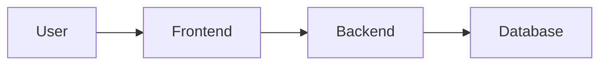

# Documentation Tools Guide

This guide explains how to use the documentation tools set up for Wbot: **Storybook** for component documentation and **Docusaurus** for project documentation.

---

## Quick Start

```bash
# Start Storybook (component docs) - http://localhost:6006
pnpm storybook

# Start Docusaurus (project docs) - http://localhost:3001
pnpm docs
```

---

## Storybook

Storybook is used to develop, test, and document React components in isolation.

### Location

```
packages/storybook/
├── .storybook/
│   ├── main.ts        # Storybook configuration
│   └── preview.ts     # Global decorators and styles
├── stories/
│   ├── buttons/       # Icon component stories
│   └── interactive/   # Complex component stories
├── package.json
└── tsconfig.json
```

### Running Storybook

```bash
# Development mode (with hot reload)
pnpm storybook

# Build static version for deployment
pnpm storybook:build
```

### Writing Stories

Stories are files that describe the different states of a component. They live in `packages/storybook/stories/`.

#### Basic Story Structure

```tsx
// packages/storybook/stories/MyComponent.stories.tsx
import type { Meta, StoryObj } from '@storybook/react';
import { MyComponent } from '@/components/MyComponent/MyComponent';

// Metadata for the component
const meta: Meta<typeof MyComponent> = {
  title: 'Category/MyComponent', // Sidebar location
  component: MyComponent,
  parameters: {
    layout: 'centered', // 'centered' | 'fullscreen' | 'padded'
  },
  // Define controls for props
  argTypes: {
    variant: {
      control: 'select',
      options: ['primary', 'secondary'],
    },
  },
  // Default prop values
  args: {
    children: 'Click me',
  },
};

export default meta;
type Story = StoryObj<typeof MyComponent>;

// Individual stories (variants)
export const Primary: Story = {
  args: {
    variant: 'primary',
  },
};

export const Secondary: Story = {
  args: {
    variant: 'secondary',
  },
};
```

#### Story with Custom Render

```tsx
export const CustomLayout: Story = {
  render: () => (
    <div style={{ display: 'flex', gap: '16px' }}>
      <MyComponent variant="primary">First</MyComponent>
      <MyComponent variant="secondary">Second</MyComponent>
    </div>
  ),
};
```

#### Story with Actions

```tsx
import { fn } from '@storybook/test';

const meta: Meta<typeof Button> = {
  // ...
  args: {
    onClick: fn(), // Creates a logged action
  },
};
```

### Importing Components

The Storybook config includes path aliases so you can import components like this:

```tsx
// Import from web app using @ alias
import { BreathingExercise } from '@/components/BreathingExercise/BreathingExercise';

// Import from shared package
import type { Message } from '@wbot/shared';
```

### Adding Documentation

Use JSDoc comments and the `docs` parameter:

````tsx
/**
 * A button component that triggers actions.
 *
 * ## Usage
 * ```tsx
 * <Button onClick={handleClick}>Click me</Button>
 * ```
 */
const meta: Meta<typeof Button> = {
  title: 'Components/Button',
  component: Button,
  parameters: {
    docs: {
      description: {
        component: 'Primary UI button for user actions.',
      },
    },
  },
};

export const Primary: Story = {
  parameters: {
    docs: {
      description: {
        story: 'The primary button style for main actions.',
      },
    },
  },
};
````

### Existing Stories

| Story File                                  | Components Covered                                                                                                        |
| ------------------------------------------- | ------------------------------------------------------------------------------------------------------------------------- |
| `buttons/Icons.stories.tsx`                 | MenuIcon, CloseIcon, ChevronLeftIcon, ChevronRightIcon, ChevronDownIcon, NewChatIcon, LogoutIcon, HistoryIcon, SearchIcon |
| `interactive/BreathingExercise.stories.tsx` | BreathingExercise with all 4 techniques                                                                                   |

---

## Docusaurus

Docusaurus is used for project documentation, architecture guides, and API references.

### Location

```
packages/docs/
├── docs/                    # Markdown documentation
│   ├── intro.md
│   ├── architecture/
│   ├── api-guides/
│   ├── database/
│   └── integration/
├── src/
│   └── css/
│       └── custom.css       # Theme customization
├── static/                  # Static assets (images, etc.)
├── docusaurus.config.ts     # Site configuration
├── sidebars.ts              # Navigation structure
└── package.json
```

### Running Docusaurus

```bash
# Development mode (with hot reload)
pnpm docs

# Build static version for deployment
pnpm docs:build

# Preview production build locally
cd packages/docs && pnpm serve
```

### Writing Documentation

Documentation files are Markdown (`.md`) or MDX (`.mdx`) files in the `docs/` folder.

#### Basic Document Structure

```markdown
---
sidebar_position: 1
---

# Page Title

Introduction paragraph.

## Section Heading

Content here...

### Subsection

More content...
```

#### Frontmatter Options

```yaml
---
sidebar_position: 1 # Order in sidebar
sidebar_label: 'Custom' # Override sidebar text
title: 'Page Title' # Browser title
description: 'SEO desc' # Meta description
slug: /custom-url # Custom URL path
---
```

### Using Mermaid Diagrams

Docusaurus is configured to render Mermaid diagrams:

````markdown

````

Supported diagram types:

- `graph` / `flowchart` - Flow diagrams
- `sequenceDiagram` - Sequence diagrams
- `erDiagram` - Entity relationship diagrams
- `classDiagram` - Class diagrams
- `stateDiagram` - State diagrams

### Adding New Pages

1. Create a new `.md` file in the appropriate folder:

```bash
# Example: Add a new guide
touch packages/docs/docs/integration/memory-system.md
```

2. Add frontmatter and content:

```markdown
---
sidebar_position: 3
---

# Memory System

How the semantic memory system works...
```

3. Update `sidebars.ts` if needed (auto-discovery usually works):

```typescript
// packages/docs/sidebars.ts
const sidebars = {
  docsSidebar: [
    'intro',
    {
      type: 'category',
      label: 'Integration',
      items: [
        'integration/authentication',
        'integration/activities',
        'integration/memory-system', // Add new page
      ],
    },
  ],
};
```

### Adding Images

1. Place images in `packages/docs/static/img/`
2. Reference them in Markdown:

```markdown

```

### Code Blocks with Syntax Highlighting

````markdown
```typescript title="example.ts"
function greet(name: string): string {
  return `Hello, ${name}!`;
}
```
````

Supported languages: `typescript`, `javascript`, `python`, `sql`, `bash`, `json`, `css`, and more.

### Admonitions (Callouts)

```markdown
:::tip
This is a helpful tip!
:::

:::warning
Be careful about this.
:::

:::danger
This could cause problems!
:::

:::info
Additional information here.
:::
```

### Existing Documentation

| Section         | Files                                |
| --------------- | ------------------------------------ |
| Getting Started | `intro.md`                           |
| Architecture    | `overview.md`, `data-flow.md`        |
| API Guides      | `langgraph.md`, `supabase.md`        |
| Database        | `schema.md`, `migrations.md`         |
| Integration     | `authentication.md`, `activities.md` |

---

## Deployment

Both tools generate static files that can be deployed to any static hosting service.

### Vercel (Recommended)

1. Create a new Vercel project
2. Set the root directory to `packages/storybook` or `packages/docs`
3. Build command: `pnpm build`
4. Output directory: `dist` (Storybook) or `build` (Docusaurus)

### GitHub Pages

Add a workflow file at `.github/workflows/docs.yml`:

```yaml
name: Deploy Documentation

on:
  push:
    branches: [main]
    paths:
      - 'packages/docs/**'
      - 'packages/storybook/**'

jobs:
  deploy-docs:
    runs-on: ubuntu-latest
    steps:
      - uses: actions/checkout@v4
      - uses: pnpm/action-setup@v4
        with:
          version: 9.15.1
      - uses: actions/setup-node@v4
        with:
          node-version: 20
          cache: 'pnpm'
      - run: pnpm install
      - run: pnpm docs:build
      - uses: peaceiris/actions-gh-pages@v4
        with:
          github_token: ${{ secrets.GITHUB_TOKEN }}
          publish_dir: ./packages/docs/build
```

### Netlify

1. Connect your repository
2. Set build command: `cd packages/docs && pnpm build`
3. Set publish directory: `packages/docs/build`

---

## Workflow Recommendations

### When to Update Documentation

1. **New Feature**: Add to relevant Docusaurus section
2. **New Component**: Create Storybook stories
3. **API Changes**: Update API guides in Docusaurus
4. **Schema Changes**: Update database docs and regenerate types

### Documentation Checklist

When adding a new feature:

- [ ] Add component stories to Storybook (if UI component)
- [ ] Update architecture docs if system changes
- [ ] Add API documentation for new endpoints
- [ ] Update integration guides if workflow changes
- [ ] Add code examples showing usage

### Keeping Docs in Sync

Run both tools during development to catch issues:

```bash
# Terminal 1: Web app
pnpm dev:web

# Terminal 2: Storybook
pnpm storybook

# Terminal 3: Docusaurus
pnpm docs
```

---

## Troubleshooting

### Storybook Issues

**Component not rendering:**

- Check import paths (use `@/` alias)
- Verify CSS modules are being imported
- Check browser console for errors

**Styles missing:**

- Ensure `variables.css` is imported in `preview.ts`
- Check that CSS module class names match

**Hot reload not working:**

- Restart Storybook: `Ctrl+C` then `pnpm storybook`

### Docusaurus Issues

**Page not appearing in sidebar:**

- Check `sidebar_position` in frontmatter
- Verify file is in correct directory
- Update `sidebars.ts` if using manual configuration

**Mermaid diagram not rendering:**

- Check syntax (use Mermaid live editor to validate)
- Ensure diagram is in fenced code block with `mermaid` language

**Build errors:**

- Run `cd packages/docs && pnpm clear` to clear cache
- Check for broken links with `pnpm docs:build`

### General Issues

**Dependencies out of sync:**

```bash
pnpm install
```

**TypeScript errors:**

```bash
pnpm exec tsc --noEmit
```

---

## Resources

- [Storybook Documentation](https://storybook.js.org/docs)
- [Docusaurus Documentation](https://docusaurus.io/docs)
- [Mermaid Diagram Syntax](https://mermaid.js.org/syntax/flowchart.html)
- [MDX Documentation](https://mdxjs.com/docs/)
