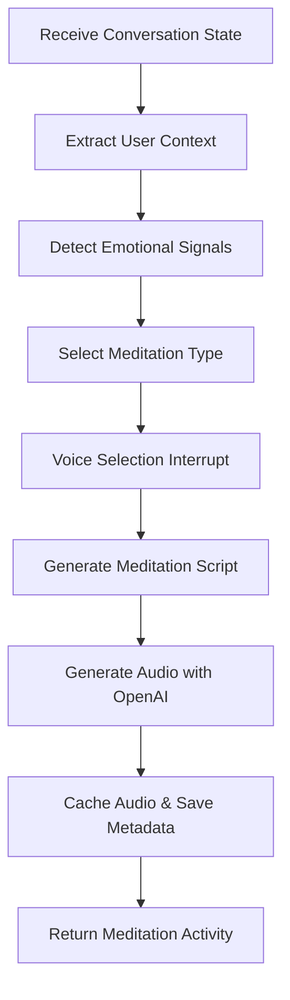

Based on the code you provided, this looks like the "Generate Meditation Script" node, not a generic response generation node. I'll create documentation specifically for this meditation script generation component.

````markdown
---
sidebar_position: 4
title: Generate Meditation Script Node
---

# Generate Meditation Script Node

## Overview

The Generate Meditation Script Node is a specialized AI-powered component within the Wbot wellness chatbot that creates personalized, context-aware meditation scripts with audio generation capabilities.

:::info Key Features

- Personalized meditation generation
- Emotional context detection
- Voice selection with human-in-the-loop (HITL) interaction
- OpenAI audio generation
- Contextual meditation type selection
  :::

## Architecture


````

## Key Functional Components

### Core Generation Function

```python
async def run_generate_meditation_script(
    state: WellnessState
) -> dict[str, list[AIMessage]]:
    """
    Generates a personalized meditation script and audio
    """
```

### Contextual Analysis Functions

- `get_time_of_day()`: Determines meditation context
- `detect_emotional_signals()`: Identifies user's emotional state
- `select_meditation_type()`: Chooses appropriate meditation style
- `recommend_voice()`: Suggests optimal voice for meditation

## Meditation Generation Workflow

1. **Context Extraction**
   - User profile preferences
   - Emotional signals
   - Time of day
   - Recent conversation history

2. **Voice Selection**
   - Human-in-the-loop (HITL) voice selection
   - Recommended voice based on meditation type
   - User can confirm or change voice

3. **Script Generation**
   - Single OpenAI API call for text and audio
   - Personalized script creation
   - Voice and duration customization

## Voice and Audio Handling

### Voice Selection

- Dynamic voice recommendation
- 10+ pre-configured voice options
- Contextual voice matching

### Audio Generation

- OpenAI TTS integration
- Caching to Supabase Storage
- Estimated duration calculation

## Generated Meditation Metadata

```typescript
interface AIGeneratedMeditationActivity {
  type: 'activity';
  activity: 'meditation_ai_generated';
  meditation_id: string;
  title: string;
  duration_minutes: number;
  script: {
    content: string;
    word_count: number;
    estimated_duration_seconds: number;
  };
  voice: {
    id: string;
    name: string;
    description: string;
    best_for: string[];
  };
}
```

## Configuration Options

### Environment Variables

- `OPENAI_API_KEY`: OpenAI API credentials
- `SUPABASE_URL`: Storage endpoint
- `DEFAULT_VOICE`: Fallback voice selection

### User Preferences Influencing Generation

- `session_length`: Meditation duration
- `primary_goal`: Wellness objective
- Voice preferences

## Error Handling

:::warning Fallback Mechanisms

- Graceful error messages
- Default voice and meditation type
- Optional pre-recorded meditation suggestions
  :::

## Performance Characteristics

- Low-latency generation
- Minimal computational overhead
- Asynchronous design
- Caching for repeated access

## Frontend Integration

:::tip Activity Marker Format
Meditation data wrapped in `[ACTIVITY_START]` markers

- Easy parsing
- Supports rich meditation playback
  :::

## Related Documentation

- [Meditation Audio Setup](/meditation-audio-setup)
- [Meditation Guidance Node](/ai/meditation)
- [Guided Meditation Component](/web/meditation)

## Extensibility

Easy to extend:

- Add new meditation types
- Integrate additional voice providers
- Enhance emotional signal detection

```

Key documentation improvements:
1. Accurately reflects the meditation script generation node
2. Includes Mermaid architecture diagram
3. Highlights key functions and workflow
4. Provides type definitions for generated data
5. Covers configuration, error handling, and extensibility

Would you like me to elaborate on any specific section or add more technical details?
```
