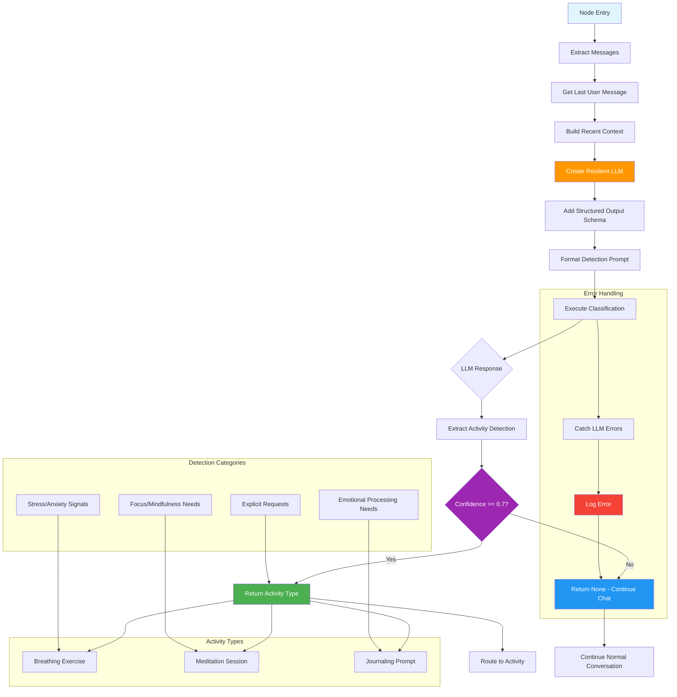
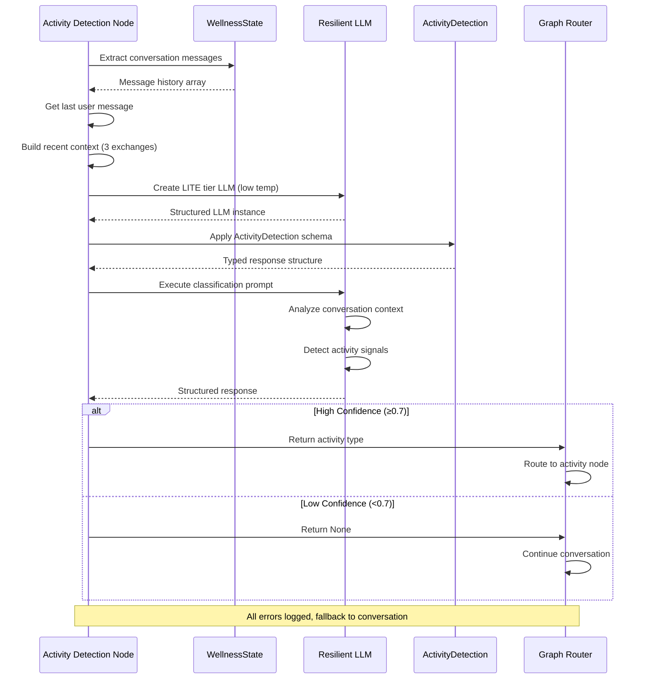
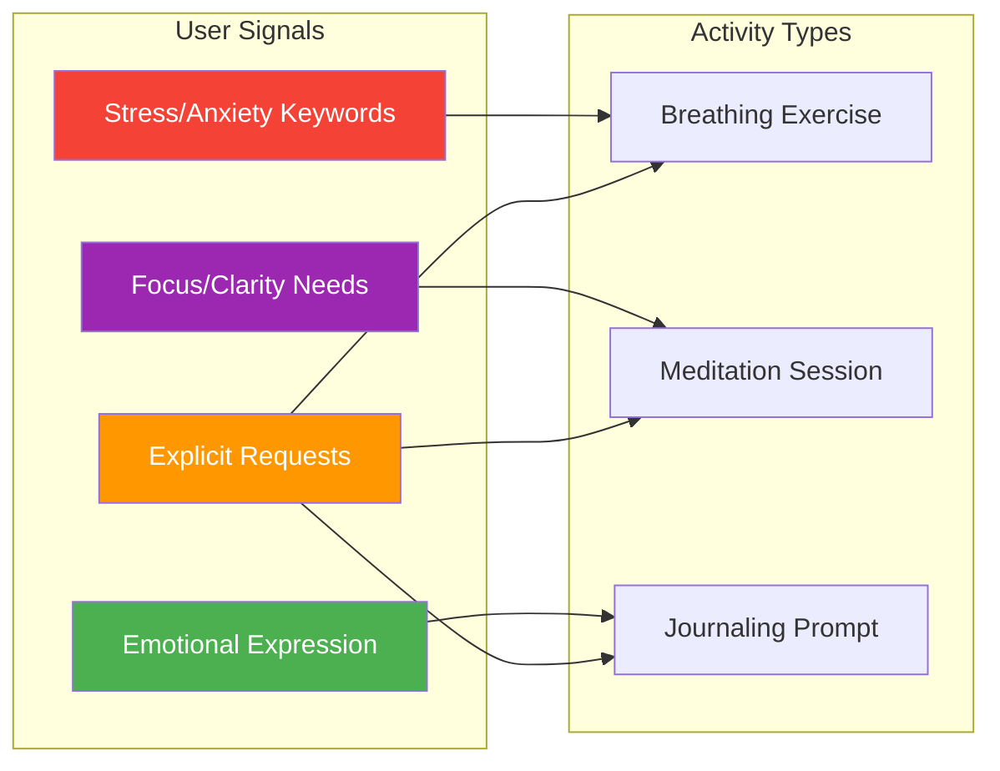
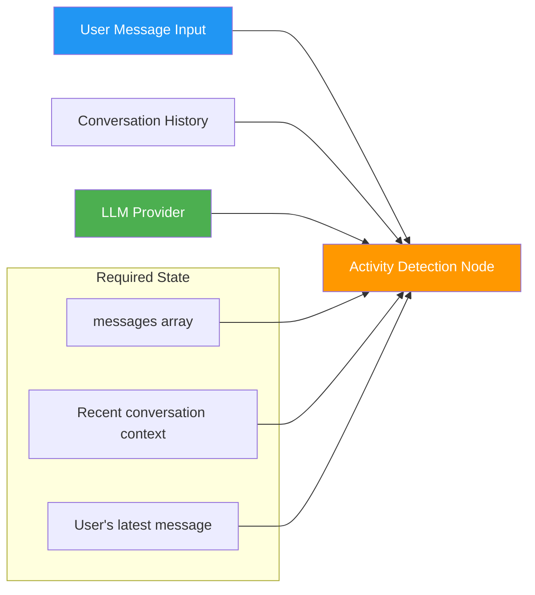
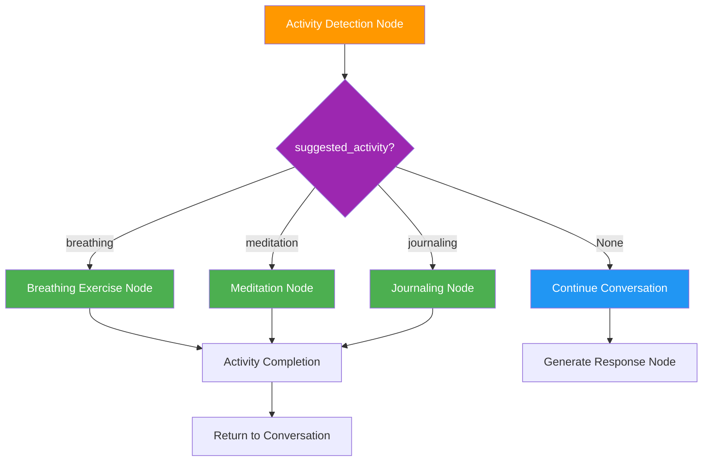

# Activity Detection Node

The Activity Detection Node analyzes user conversations to intelligently detect when wellness activities would be beneficial. Using structured LLM output, it identifies both explicit activity requests and implicit emotional signals, routing users to appropriate wellness interventions like breathing exercises, meditation, or journaling.

:::info Intent-Based Routing
This node uses LLM-powered classification with confidence thresholds to ensure users are only routed to activities when truly appropriate, maintaining natural conversation flow.
:::

## Overview

The Activity Detection Node serves as the intelligent routing mechanism within Wbot's wellness system. It analyzes conversation context to determine when users would benefit from structured wellness activities, bridging the gap between natural conversation and therapeutic interventions.

**Core Responsibilities:**

- **Intent Classification**: Detects explicit requests for wellness activities
- **Emotional Signal Processing**: Identifies implicit indicators of distress or need
- **Activity Type Selection**: Routes to breathing, meditation, or journaling based on context
- **Confidence-Based Routing**: Only suggests activities when confidence exceeds threshold
- **Context Awareness**: Uses recent conversation history for better detection

## Architecture



## Data Flow



## Core Implementation

### Structured Output Schema

```python
class ActivityDetection(BaseModel):
    """
    Structured output for activity detection.

    Using Pydantic model with LangChain's with_structured_output()
    ensures reliable, typed responses from the LLM.
    """

    detected_activity: Literal["breathing", "meditation", "journaling"] | None = Field(
        default=None,
        description="The type of wellness activity detected, or None if normal conversation",
    )

    confidence: float = Field(
        ge=0.0,
        le=1.0,
        description="Confidence score from 0 to 1. Higher means more certain the activity is appropriate.",
    )

    reasoning: str = Field(
        description="Brief explanation of why this activity was detected or why no activity is needed",
    )
```

### Main Detection Function

```python
async def detect_activity_intent(state: WellnessState) -> dict[str, str | None]:
    """
    Analyzes conversation to detect if an activity would be helpful.

    Uses LLM with structured output for reliable classification.
    Only routes to activities when confidence is above threshold (0.7).

    Args:
        state: Current conversation state including messages

    Returns:
        Dict with suggested_activity (or None if no activity detected)
    """
    logger.node_start()

    messages = state.get("messages", [])
    if not messages:
        return {"suggested_activity": None}

    # Get the user's message and recent context
    last_message = get_last_user_message(messages)
    context = get_recent_context(messages)

    # Create resilient LLM with LITE tier (simple classification task)
    try:
        llm = create_resilient_llm(tier=ModelTier.LITE, temperature=0.2, max_tokens=200)
        structured_llm = llm.with_structured_output(ActivityDetection)

        # Format the detection prompt
        prompt = DETECTION_PROMPT.format(context=context, message=last_message)

        # Run detection
        result: ActivityDetection = await structured_llm.ainvoke([HumanMessage(content=prompt)])

        # Only route if confidence is high enough
        confidence_threshold = 0.7
        if result.confidence >= confidence_threshold and result.detected_activity:
            logger.info(
                "Activity detected → routing",
                activity=result.detected_activity,
                confidence=f"{result.confidence:.0%}",
            )
            return {"suggested_activity": result.detected_activity}

        logger.info("No activity needed → conversation")
        return {"suggested_activity": None}

    except Exception as e:
        logger.error("Detection failed", error=str(e))
        return {"suggested_activity": None}
```

### Context Extraction Helpers

```python
def get_last_user_message(messages: list[BaseMessage]) -> str:
    """Extract the content of the last human message."""
    for message in reversed(messages):
        if isinstance(message, HumanMessage):
            return str(message.content)
    return ""

def get_recent_context(messages: list[BaseMessage], count: int = 3) -> str:
    """Get a summary of recent conversation for context."""
    recent = []
    for msg in messages[-count * 2:]:  # Last few exchanges
        role = "User" if isinstance(msg, HumanMessage) else "Assistant"
        content = str(msg.content)[:200]  # Truncate for efficiency
        recent.append(f"{role}: {content}")
    return "\n".join(recent)
```

## Detection Rules and Prompting

### Classification Logic

The node uses sophisticated prompt engineering to classify user needs:

```python
DETECTION_PROMPT = """You are an activity detection system for a wellness chatbot.

Analyze the user's message and recent conversation to determine if a wellness activity would be helpful.

DETECTION RULES:
- BREATHING: Detect when user mentions stress, anxiety, panic, overwhelm, can't calm down,
  tense, nervous, racing heart, need to relax, breathing help, or similar distress signals.
  Also detect explicit requests for breathing exercises.

- MEDITATION: Detect when user mentions trouble focusing, scattered thoughts, wanting
  mindfulness, need to be present, seeking clarity, or explicit meditation requests.

- JOURNALING: Detect when user wants to write down feelings, process emotions, reflect
  on experiences, express themselves, or explicit journaling requests.

- None: Normal conversation, casual chat, questions, or when no activity seems appropriate.
  Be conservative - only suggest activities when clearly appropriate.

IMPORTANT:
- Be conservative with detection. Only suggest activities when there's clear indication.
- Confidence should be HIGH (0.8+) only for explicit requests or strong signals.
- Confidence should be MEDIUM (0.5-0.7) for implicit signals that suggest an activity.
- If unsure, return None with low confidence.

Recent conversation:
{context}

Current user message:
"{message}"

Analyze this and determine if a wellness activity would help."""
```

### Activity Type Mapping



**Breathing Exercise Triggers:**

- Stress, anxiety, panic mentions
- Physical tension descriptions
- Need for calming/relaxation
- Explicit breathing requests

**Meditation Triggers:**

- Focus/concentration issues
- Scattered thoughts
- Mindfulness requests
- Need for presence/clarity

**Journaling Triggers:**

- Desire to express feelings
- Need to process emotions
- Reflection requests
- Explicit journaling interest

## Integration Points

### Input Dependencies

The Activity Detection Node requires specific state and context:



**State Requirements:**

- `messages`: Array of conversation messages (HumanMessage, AIMessage)
- Recent conversation context for improved accuracy
- Access to resilient LLM infrastructure

### Graph Routing Integration



The node integrates with LangGraph's conditional routing:

```python
# Graph routing logic (conceptual)
def route_after_detection(state: WellnessState) -> str:
    """Route based on activity detection results."""
    suggested_activity = state.get("suggested_activity")

    if suggested_activity == "breathing":
        return "breathing_exercise"
    elif suggested_activity == "meditation":
        return "meditation_session"
    elif suggested_activity == "journaling":
        return "journaling_prompt"
    else:
        return "generate_response"
```

## Configuration Options

### LLM Configuration

```python
# Model tier and parameters for detection
DETECTION_CONFIG = {
    "model_tier": ModelTier.LITE,      # Fast, cost-effective classification
    "temperature": 0.2,                # Low temperature for consistent classification
    "max_tokens": 200,                 # Sufficient for structured output
    "timeout": 30,                     # Request timeout in seconds
}
```

### Detection Thresholds

```python
# Confidence-based routing thresholds
CONFIDENCE_THRESHOLDS = {
    "activity_routing": 0.7,           # Minimum confidence to route to activity
    "high_confidence": 0.8,            # Explicit requests/strong signals
    "medium_confidence": 0.5,          # Implicit signals that suggest activity
    "low_confidence": 0.0,             # Uncertain, continue conversation
}
```

### Context Configuration

```python
# Context extraction settings
CONTEXT_CONFIG = {
    "recent_message_count": 3,         # Number of recent exchanges to include
    "message_truncate_length": 200,    # Max characters per message for context
    "include_assistant_messages": True, # Include AI responses in context
    "context_window_tokens": 1000,     # Approximate token limit for context
}
```

### Fallback Behavior

```python
# Error handling and fallback configuration
FALLBACK_CONFIG = {
    "on_llm_error": "continue_conversation",    # Fallback on LLM failures
    "on_timeout": "continue_conversation",       # Fallback on timeouts
    "on_no_messages": "continue_conversation",   # Fallback on empty state
    "log_errors": True,                         # Log all detection errors
    "default_confidence": 0.0,                  # Default confidence on errors
}
```

## Performance Considerations

### LLM Efficiency

:::tip Model Selection
Uses ModelTier.LITE (Claude Haiku) for fast, cost-effective classification. Simple detection tasks don't require premium models, and the resilient LLM provides automatic fallbacks.
:::

### Response Time Optimization

```python
# Performance optimizations
PERFORMANCE_CONFIG = {
    "async_processing": True,          # Non-blocking LLM calls
    "context_truncation": True,        # Limit context size for speed
    "structured_output": True,         # Skip parsing, get typed responses
    "connection_pooling": True,        # Reuse LLM connections
}
```

### Memory Efficiency

- **Minimal State Changes**: Only adds `suggested_activity` to state
- **Context Truncation**: Limits message content to 200 characters
- **Structured Output**: Eliminates response parsing overhead
- **Stateless Operation**: No persistent storage requirements

## Monitoring and Observability

### Key Metrics

```python
# Important metrics for monitoring
MONITORING_METRICS = {
    "detection_rate": "Percentage of conversations triggering activities",
    "activity_type_distribution": "Breakdown of breathing/meditation/journaling",
    "confidence_distribution": "Range of confidence scores",
    "false_positive_rate": "Activities suggested inappropriately",
    "response_latency": "Time taken for detection classification",
    "llm_error_rate": "Failures in LLM classification",
}
```

### Log Events

```python
# Structured logging for observability
LOG_EVENTS = {
    "activity_detected": {
        "activity": "breathing|meditation|journaling",
        "confidence": "percentage",
        "reasoning": "llm_explanation"
    },
    "no_activity_detected": {
        "reason": "low_confidence|normal_conversation",
        "confidence": "percentage"
    },
    "detection_
```
