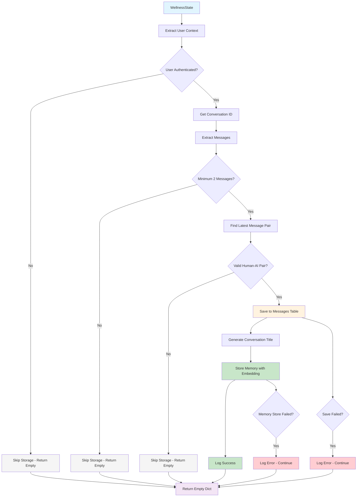
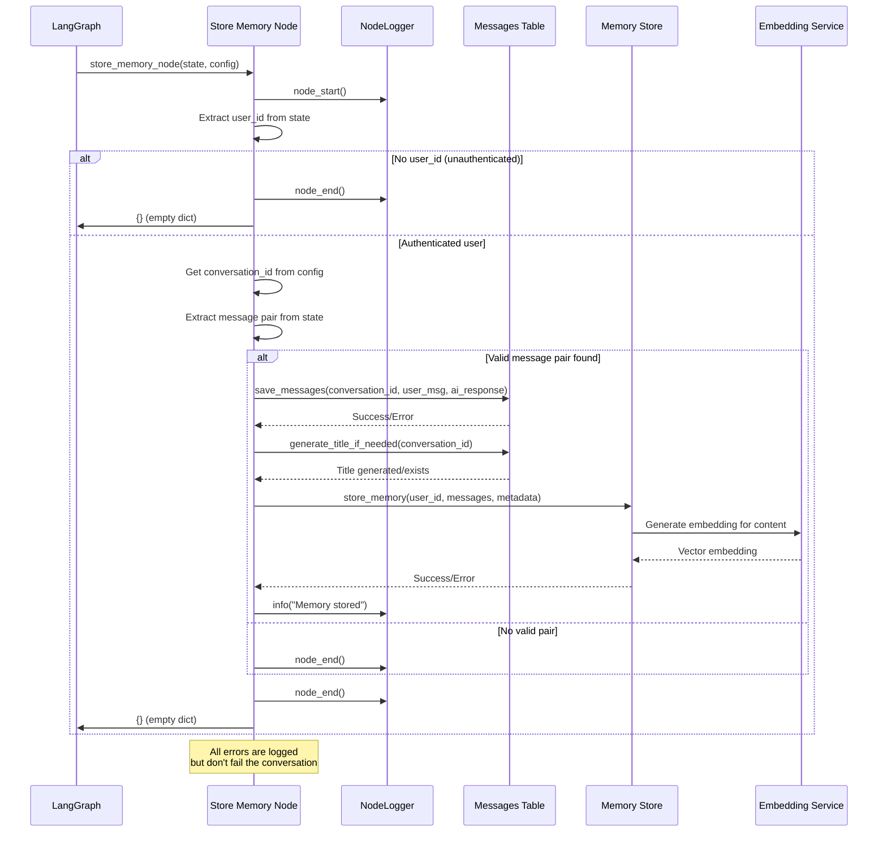
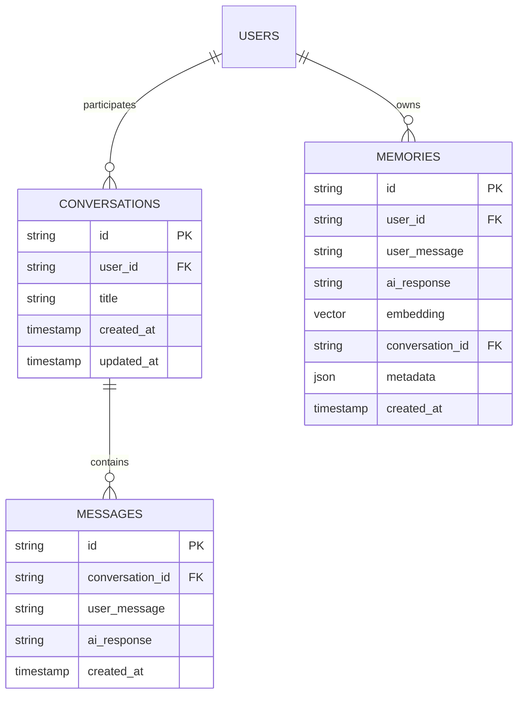
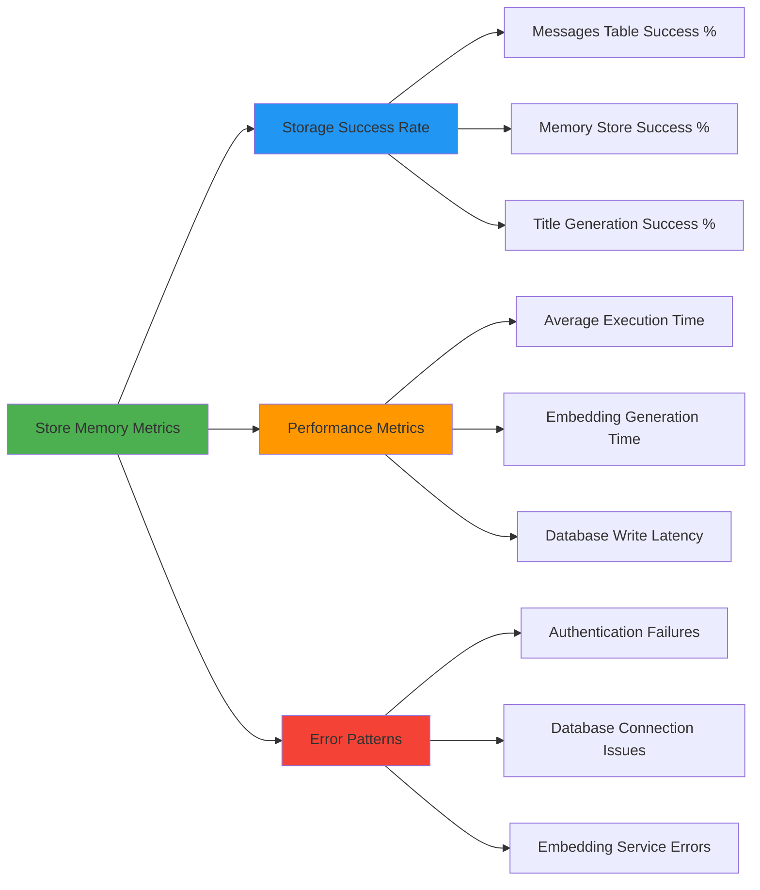

# Store Memory Node

The Store Memory Node handles post-conversation persistence by storing user-AI message pairs both for conversation history retrieval and semantic search. This node operates as the final step in the conversation flow, ensuring that meaningful interactions are preserved for future reference.

## Overview

The Store Memory Node is a critical persistence component that runs after response generation completes. It extracts the latest conversation pair (user message + AI response) and stores it in two ways:

1. **Conversation History**: Direct storage in the messages table for chronological conversation retrieval
2. **Semantic Memory**: Storage with embeddings for intelligent context retrieval in future conversations

**Key Characteristics:**

- **Fire-and-forget execution**: Errors don't block response delivery to users
- **Post-response timing**: Runs after streaming completes to avoid response delays
- **Dual storage pattern**: Serves both conversation history and semantic search use cases
- **User-scoped**: Only stores data for authenticated users

:::info Execution Model
This is a side-effect node that doesn't modify conversation state. It performs persistence operations while the user has already received their response, ensuring optimal user experience.
:::

## Architecture



## Core Implementation

### Main Node Function

```python
async def store_memory_node(state: WellnessState, config: RunnableConfig) -> dict[str, object]:
    """
    Stores the latest conversation pair as a memory.

    Extracts the most recent user message + AI response pair from the
    conversation and:
    1. Saves to messages table (for conversation history retrieval)
    2. Stores with embedding (for semantic search)

    This is a side-effect node that doesn't modify state - it just
    persists the conversation to the database.

    Args:
        state: Current conversation state after response generation
        config: LangGraph config containing thread_id (conversation_id)

    Returns:
        Empty dict (no state changes, side-effect only)
    """
```

### Message Pair Extraction Logic

```python
# Find the latest user message and AI response pair
# Messages are in order, so we look for: [..., HumanMessage, AIMessage]
user_message = None
ai_response = None

# Walk backwards through messages to find the most recent pair
for i in range(len(messages) - 1, 0, -1):
    if isinstance(messages[i], AIMessage) and isinstance(messages[i - 1], HumanMessage):
        user_message = messages[i - 1].content
        ai_response = messages[i].content
        break
```

:::tip Message Pair Logic
The node walks backwards through the message list to find the most recent Human→AI message sequence. This handles cases where there might be multiple conversation turns or system messages in the state.
:::

## Data Flow



## Integration Points

### Wellness State Integration

The node integrates with the conversation state through well-defined interfaces:

```python
# Required state structure
state_requirements = {
    "user_context": {
        "user_id": str,  # Required for memory storage
        # Other user context fields...
    },
    "messages": [
        # List of langchain_core.messages
        # Must contain at least one HumanMessage + AIMessage pair
    ]
}

# Config requirements
config_requirements = {
    "configurable": {
        "thread_id": str,  # Used as conversation_id
        # Other LangGraph config...
    }
}
```

### Memory Store Integration

The node interfaces with two storage systems:

#### 1. Messages Table (Conversation History)

```python
# Direct conversation storage
save_messages(
    conversation_id=conversation_id,
    user_message=user_message,
    ai_response=ai_response,
)

# Automatic title generation for conversation organization
generate_title_if_needed(conversation_id)
```

#### 2. Semantic Memory Store

```python
# Memory storage with embedding for semantic search
await store_memory(
    user_id=user_id,
    user_message=user_message,
    ai_response=ai_response,
    conversation_id=conversation_id,
    metadata={
        "source": "wellness_chat",
    },
)
```

### Database Schema Integration



## Error Handling and Resilience

### Fire-and-Forget Pattern

The node implements a robust error handling pattern that ensures user experience isn't impacted by storage failures:

```python
# Messages table storage with error isolation
if conversation_id:
    try:
        save_messages(
            conversation_id=conversation_id,
            user_message=user_message,
            ai_response=ai_response,
        )
        generate_title_if_needed(conversation_id)
    except Exception as e:
        logger.error("Failed to save messages", error=str(e))
        # Continue execution - don't fail the conversation

# Memory storage with error isolation
try:
    await store_memory(
        user_id=user_id,
        user_message=user_message,
        ai_response=ai_response,
        conversation_id=conversation_id,
        metadata={"source": "wellness_chat"},
    )
    logger.info("Memory stored")
except Exception as e:
    # Log but don't fail - user already has their response
    logger.error("Failed to store memory", error=str(e))
```

:::warning Error Handling Philosophy
Storage failures are logged for monitoring but never propagate to the user. This ensures that database issues don't impact the conversational experience, while providing visibility for system health monitoring.
:::

### Graceful Degradation

The node handles various edge cases gracefully:

| Condition             | Behavior                 | Rationale                                                  |
| --------------------- | ------------------------ | ---------------------------------------------------------- |
| No user_id            | Skip storage entirely    | Can't store memories without user association              |
| No conversation_id    | Skip messages table only | Memory storage can still work without conversation context |
| Insufficient messages | Skip storage entirely    | Need at least one complete Human→AI pair                   |
| No valid message pair | Skip storage entirely    | Only store meaningful conversation exchanges               |
| Database errors       | Log and continue         | Don't fail user experience for storage issues              |

## Configuration Options

### Storage Behavior Configuration

```python
# Memory storage metadata
MEMORY_METADATA = {
    "source": "wellness_chat",          # Identifies memory source
    "auto_generated": True,             # Marks as system-generated
    "storage_version": "v1",            # Schema version for migrations
}

# Error handling configuration
ERROR_HANDLING = {
    "log_storage_failures": True,       # Log all storage errors
    "fail_on_storage_error": False,     # Never fail conversation for storage
    "retry_on_temporary_failure": False, # No retries (fire-and-forget)
}
```

### Conversation Title Generation

```python
# Title generation behavior
TITLE_GENERATION = {
    "auto_generate_titles": True,        # Generate titles for new conversations
    "title_max_length": 50,             # Maximum title length
    "title_from_first_message": True,   # Base title on initial user message
    "update_existing_titles": False,    # Don't overwrite existing titles
}
```

### Message Filtering

```python
# Message content filtering
MESSAGE_FILTERING = {
    "min_message_length": 1,            # Minimum characters to store
    "max_message_length": 10000,        # Maximum characters to store
    "filter_empty_responses": True,     # Skip empty AI responses
    "filter_error_messages": True,      # Skip system error messages
}
```

## Performance Considerations

### Asynchronous Operations

The memory storage operation is asynchronous to handle embedding generation efficiently:

```python
# Embedding generation is I/O intensive
await store_memory(
    user_id=user_id,
    user_message=user_message,
    ai_response=ai_response,
    # ... other params
)
```

### Database Connection Management

```python
# Connection pooling and transaction management
async def store_memory_with_connection_handling():
    """
    Memory storage with proper connection lifecycle management.

    The store_memory function handles:
    - Connection pool acquisition
    - Transaction management
    - Embedding generation
    - Cleanup on success/failure
    """
    # Implementation handled in memory.store module
```

### Memory Usage Optimization

```python
# Efficient message extraction without copying large state
def extract_latest_pair(messages: list) -> tuple[str, str] | None:
    """
    Extract latest Human→AI pair without state mutation.

    Walks backwards through message list for efficiency,
    stops at first valid pair found.
    """
    for i in range(len(messages) - 1, 0, -1):
        if isinstance(messages[i], AIMessage) and isinstance(messages[i - 1], HumanMessage):
            return messages[i - 1].content, messages[i].content
    return None
```

## Monitoring and Observability

### Logging Structure

```python
# Structured logging for observability
logger.node_start()                    # Node execution tracking
logger.info("Memory stored")           # Success events
logger.error("Failed to save messages", error=str(e))  # Error tracking
logger.node_end()                      # Execution completion
```

### Key Metrics to Monitor



**Critical Metrics:**

- **Storage Success Rate**: Percentage of successful memory storage operations
- **Error Distribution**: Types and frequency of storage failures
- **Performance Impact**: Node execution time impact on overall response latency
- **Data Quality**: Validation of stored message pairs and metadata

### Alerting Thresholds

```python
# Monitoring thresholds for operational alerts
MONITORING_THRESHOLDS = {
    "storage_failure_rate": 0.05,      # Alert if >5% of storage attempts fail
    "avg_execution_time": 500,         # Alert if average time >500ms
    "embedding_generation_time": 2000, # Alert if embedding takes >2s
    "consecutive_failures": 10,        # Alert after 10 consecutive failures
}
```

## Testing Strategy

### Unit Testing

```python
async def test_store_memory_node_success():
    """Test successful memory storage with valid message pair."""
    state = create_test_state_with_message_pair()
    config = create_test_config_with_thread_id()

    result = await store_memory_node(state, config)

    # Should return empty dict (no state changes)
    assert result == {}

    # Verify storage calls were made (mock verification)
    assert_save_messages_called()
    assert_store_memory_called()

async def test_unauthenticated_user_skip():
    """Test that unauthenticated users don't trigger storage."""
    state_no_user = create_state_without_user_id()
    config = create_test_config()

    result = await store_memory_node(state_no_user, config)

    assert result == {}
    assert_no_storage_calls_made()

async def test_insufficient_messages_skip():
    """Test graceful handling of insufficient message history."""
    state_single_message = create_state_with_single_message()
    config = create_test_config()

    result = await store_memory_node(state_single_message, config)

    assert result == {}
    assert_no_storage_calls_made()

async def test_error_handling_resilience():
    """Test that storage errors don't fail the node."""
    state = create_test_state_with_message_pair()
    config = create_test_config()

    with mock_storage_failure():
        result = await store_memory_node(state, config)

        # Should still return empty dict despite errors
        assert result == {}
        # Error should be logged
        assert_error_logged()
```

### Integration Testing

```python
async def test_end_to_end_storage_flow():
    """Test complete storage flow with real database."""
    # Setup test conversation
    user_id = create_test_user()
    conversation_id = create_test_conversation(user_id)

    state = create_wellness_state(
        user_context
```
