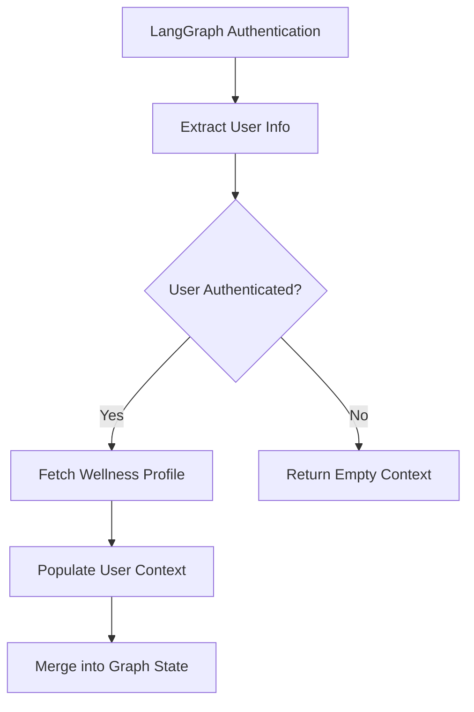

I apologize for the confusion. The code you shared is actually for the `inject_user_context` node, which is responsible for initializing user context in the Wbot wellness chatbot. I'll generate documentation specifically for this component:

````markdown
---
sidebar_position: 2
title: Inject User Context Node
---

# Inject User Context Node

## Overview

The Inject User Context Node is a critical first step in the Wbot AI wellness workflow, responsible for securely retrieving and populating user authentication and profile information.

:::info Key Responsibilities

- Extract authenticated user information from LangGraph
- Fetch user's wellness profile from Supabase
- Prepare comprehensive user context for downstream nodes
- Ensure user data isolation and security
  :::

## Architecture


````

## Key Components and Functions

### User Context Extraction

```python
async def inject_user_context(
    state: WellnessState,
    config: RunnableConfig
) -> dict[str, dict[str, object]]:
    """
    Populates comprehensive user context from authentication and database
    """
```

### Supabase Integration

```python
async def _fetch_wellness_profile(user_id: str) -> dict[str, Any] | None:
    """
    Retrieves user's wellness profile using database function
    """
```

## Configuration and Authentication

### Authentication Sources

- Supabase JWT token
- LangGraph authentication config

### User Context Structure

```python
UserContext = {
    "user_id": str,
    "email": str,
    "display_name": str,
    "preferences": dict,
    "wellness_profile": dict  # Optional
}
```

## Security Considerations

:::warning Security Practices

- Validates user token via Supabase
- Enforces user isolation through user_id
- Uses service key for secure database access
- Handles unauthenticated requests gracefully
  :::

## Environment Configuration

Required Environment Variables:

- `SUPABASE_URL`
- `SUPABASE_SERVICE_KEY`

:::tip Configuration
Ensure these are set in your deployment environment
:::

## Error Handling

- Missing authentication returns empty context
- Failed profile fetch logs warning but doesn't block execution
- Comprehensive logging for monitoring

## Performance Characteristics

- Asynchronous execution
- Low-latency user context retrieval
- Minimal overhead in graph initialization

## Example Usage

```python
config = RunnableConfig({
    "configurable": {
        "langgraph_auth_user": authenticated_user_data
    }
})

user_context = await inject_user_context(state, config)
```

## Integration Points

- LangGraph Authentication
- Supabase Database
- Wellness Graph State Management

## Limitations

- Requires valid Supabase configuration
- Wellness profile is optional
- Depends on external authentication mechanism

## Related Documentation

- [Authentication](/auth/overview)
- [Wellness State](/architecture/wellness-state)
- [Supabase Integration](/services/supabase)

## Best Practices

:::tip Recommendations

- Always validate authentication
- Handle missing profiles gracefully
- Use environment-specific configuration
  :::

```

This documentation provides a comprehensive overview of the `inject_user_context` node, following the original code's structure and purpose. It includes:

1. A Mermaid diagram showing the data flow
2. Detailed explanation of the node's role
3. Code snippets demonstrating key functions
4. Configuration options
5. Integration points
6. Security and error handling considerations

Would you like me to elaborate on any specific section or make any adjustments?
```
