# Retrieve Memories Node

The Retrieve Memories Node performs semantic search against stored conversation history to find relevant context before generating responses. This node enables the AI to reference past conversations, creating continuity and personalized interactions based on the user's history.

## Overview

The Retrieve Memories Node is a context enrichment component that runs early in the conversation flow, operating in parallel with other startup nodes. It searches the memory store using semantic similarity to find past conversations that may be relevant to the current user message.

**Key Characteristics:**

- **Parallel execution**: Runs at START alongside `inject_user_context` and `detect_activity`
- **Semantic search**: Uses vector embeddings to find topically relevant memories
- **Direct auth access**: Retrieves user_id from LangGraph auth config for parallel execution
- **Fault-tolerant**: Memory retrieval failures don't block conversation flow
- **Performance optimized**: Configurable limits and similarity thresholds

:::info Execution Timing
This node runs before response generation to ensure retrieved memories are available for context. It executes in parallel with other startup nodes by accessing user authentication directly rather than waiting for state population.
:::

## Architecture


## Core Implementation

### Main Node Function

```python
async def retrieve_memories(
    state: WellnessState, config: RunnableConfig
) -> dict[str, list[dict[str, str | float]]]:
    """
    Retrieves relevant memories based on the user's message.

    Performs semantic search against the memory store to find past
    conversations that may be relevant to the current discussion.
    Results are ordered by similarity.

    This node runs at START in parallel with inject_user_context and
    detect_activity. It gets user_id directly from the LangGraph auth
    config rather than waiting for inject_user_context to populate state.

    Args:
        state: Current conversation state with messages
        config: LangGraph config containing langgraph_auth_user

    Returns:
        Dict with retrieved_memories field to merge into state.
        Each memory contains:
        - id: Memory ID
        - user_message: What the user said
        - ai_response: What the AI responded
        - similarity: Relevance score (0-1)

    Note:
        - Returns empty list if no user_id (unauthenticated)
        - Returns empty list if no user messages yet
        - Errors are logged but don't fail the conversation
    """
```

### Authentication and User Context

```python
# Direct access to LangGraph auth config for parallel execution
configurable = config.get("configurable", {})
auth_user = configurable.get("langgraph_auth_user", {})
user_id = auth_user.get("identity")

if not user_id:
    # No user ID means no memories to search (unauthenticated request)
    logger.warning("No user_id in config - skipping memory retrieval")
    return {"retrieved_memories": []}
```

:::tip Parallel Execution Pattern
By accessing `user_id` directly from the auth config rather than waiting for `inject_user_context` to populate the state, this node can run in parallel at graph START, reducing overall latency.
:::

### Message Extraction Logic

```python
# Get the latest user message for semantic search
messages = state.get("messages", [])
user_messages = [m for m in messages if isinstance(m, HumanMessage)]

if not user_messages:
    # No user messages yet - nothing to search against
    return {"retrieved_memories": []}

latest_message = user_messages[-1].content
```

## Data Flow


## Memory Search Implementation

### Semantic Search Parameters

```python
# Search configuration for optimal relevance and performance
memories = await search_memories(
    user_id=user_id,
    query=latest_message,
    limit=3,                    # Top 3 most relevant memories
    similarity_threshold=0.5,   # Only reasonably similar matches
)
```

### Memory Data Structure

```python
# Memory objects returned from search
class Memory:
    id: str                    # Unique memory identifier
    user_message: str          # Original user input
    ai_response: str          # AI's response to that input
    similarity: float         # Cosine similarity score (0-1)
    conversation_id: str      # Source conversation
    created_at: datetime      # When memory was stored
    metadata: dict           # Additional context

# Converted to state-safe dictionaries
memory_dicts = [
    {
        "id": m.id,
        "user_message": m.user_message,
        "ai_response": m.ai_response,
        "similarity": m.similarity,
    }
    for m in memories
]
```

### Similarity Scoring

```mermaid
graph LR
    A[User Query] --> B[Generate Embedding]
    B --> C[Vector Search]
    C --> D[Cosine Similarity]
    D --> E{Similarity ≥ 0.5?}
    E -->|Yes| F[Include in Results]
    E -->|No| G[Filter Out]
    F --> H[Rank by Score]
    G --> I[Discard]
    H --> J[Return Top 3]

    style A fill:#e3f2fd
    style C fill:#fff3e0
    style F fill:#e8f5e8
    style G fill:#ffebee
```



**Similarity Thresholds:**

- **> 0.8**: Highly relevant, likely discussing same topic
- **0.5 - 0.8**: Moderately relevant, related concepts or themes
- **< 0.5**: Low relevance, filtered out to avoid noise

## Integration Points

### Wellness State Integration

The node reads from and writes to specific state fields:

```python
# Input requirements
state_inputs = {
    "messages": [
        # List of langchain_core.messages.BaseMessage
        # Must contain at least one HumanMessage for search
    ]
}

# Output format
state_outputs = {
    "retrieved_memories": [
        {
            "id": str,              # Memory unique identifier
            "user_message": str,    # Past user input
            "ai_response": str,     # Past AI response
            "similarity": float,    # Relevance score (0-1)
        }
        # ... up to 3 memories
    ]
}
```

### Memory Store Integration

```python
# Memory store interface
from src.memory.store import search_memories

# Search function signature
async def search_memories(
    user_id: str,              # User to search memories for
    query: str,                # Semantic search query
    limit: int = 10,           # Maximum results to return
    similarity_threshold: float = 0.0,  # Minimum similarity score
) -> list[Memory]:
    """
    Performs semantic search against user's stored memories.

    Returns memories ordered by similarity score (highest first).
    Includes only memories above the similarity threshold.
    """
```

### LangGraph Configuration Integration

```python
# Required config structure for parallel execution
config_requirements = {
    "configurable": {
        "langgraph_auth_user": {
            "identity": str,        # User ID for memory search
            # Other auth fields...
        },
        # Other LangGraph config...
    }
}
```

## Error Handling and Resilience

### Graceful Failure Pattern

The node implements comprehensive error handling that prioritizes conversation continuity:

```python
try:
    memories = await search_memories(
        user_id=user_id,
        query=latest_message,
        limit=3,
        similarity_threshold=0.5,
    )

    memory_dicts = [
        {
            "id": m.id,
            "user_message": m.user_message,
            "ai_response": m.ai_response,
            "similarity": m.similarity,
        }
        for m in memories
    ]

    if memory_dicts:
        logger.info("Found relevant memories", count=len(memory_dicts))

    return {"retrieved_memories": memory_dicts}

except Exception as e:
    # Log error but don't fail the conversation
    # User should still get a response even if memory retrieval fails
    logger.error("Memory search failed", error=str(e))
    return {"retrieved_memories": []}
```

:::warning Error Handling Philosophy
Memory retrieval failures are logged for monitoring but never block the conversation. The AI can still generate helpful responses without historical context, ensuring robust user experience even during system issues.
:::

### Fallback Behaviors

| Condition                  | Behavior                         | Impact on Conversation                     |
| -------------------------- | -------------------------------- | ------------------------------------------ |
| No user authentication     | Return empty memories            | No historical context, still functional    |
| No user messages           | Return empty memories            | Nothing to search against yet              |
| Memory store unavailable   | Return empty memories, log error | Conversation continues without history     |
| Embedding service down     | Return empty memories, log error | No semantic search, conversation continues |
| Database connection failed | Return empty memories, log error | No retrieval, core functionality preserved |

## Configuration Options

### Search Parameters

```python
# Memory retrieval configuration
MEMORY_SEARCH_CONFIG = {
    "max_memories": 3,              # Maximum memories to retrieve
    "similarity_threshold": 0.5,    # Minimum relevance score
    "search_timeout_ms": 5000,      # Max search time
    "enable_semantic_search": True, # Use vector similarity
}
```

### Performance Tuning

```python
# Performance optimization settings
PERFORMANCE_CONFIG = {
    "embedding_cache_ttl": 300,     # Cache embeddings for 5 minutes
    "max_query_length": 1000,       # Truncate long queries
    "parallel_search": False,       # Sequential search for now
    "connection_pool_size": 10,     # Database connection pool
}
```

### Content Filtering

```python
# Memory content filtering
CONTENT_FILTER_CONFIG = {
    "min_message_length": 5,        # Skip very short messages
    "max_message_length": 2000,     # Truncate very long messages
    "filter_system_messages": True, # Exclude system-generated content
    "filter_error_responses": True, # Exclude error messages
}
```

### Logging and Monitoring

```python
# Observability configuration
MONITORING_CONFIG = {
    "log_search_queries": True,     # Log what users search for
    "log_similarity_scores": True,  # Track relevance quality
    "track_retrieval_latency": True,# Monitor performance
    "alert_on_failures": True,      # Alert on search failures
}
```

## Performance Considerations

### Latency Optimization


**Performance Targets:**

- **Total retrieval time**: < 100ms for good user experience
- **Embedding generation**: < 50ms using cached or fast embedding models
- **Vector search**: < 30ms with proper indexing
- **Result processing**: < 10ms for serialization and filtering

### Memory Usage

```python
# Efficient memory management
def process_search_results(memories: list[Memory]) -> list[dict]:
    """
    Convert memory objects to state-safe dicts without copying large data.

    Only extracts needed fields to minimize state size.
    """
    return [
        {
            "id": m.id,
            "user_message": m.user_message[:500],    # Truncate long messages
            "ai_response": m.ai_response[:500],      # Limit response length
            "similarity": round(m.similarity, 3),   # Reduce precision
        }
        for m in memories[:3]  # Hard limit on results
    ]
```

### Database Optimization

```python
# Vector database indexing strategy
INDEX_STRATEGY = {
    "vector_index_type": "hnsw",     # Hierarchical NSW for fast similarity search
    "index_parameters": {
        "ef_construction": 200,       # Build-time parameter
        "M": 16,                     # Max connections per node
    },
    "query_parameters": {
        "ef": 100,                   # Search-time parameter
    }
}
```

## Monitoring and Observability

### Key Metrics


### Logging Structure

```python
# Structured logging for observability
logger.node_start()                           # Execution tracking
logger.warning("No user_id in config - skipping")  # Auth issues
logger.info("Found relevant memories", count=len(memories))  # Success metrics
logger.error("Memory search failed", error=str(e))  # Error tracking
logger.node_end()                            # Completion tracking
```

### Alerting Thresholds

```python
# Monitoring alerts for operational issues
ALERT_THRESH
```
