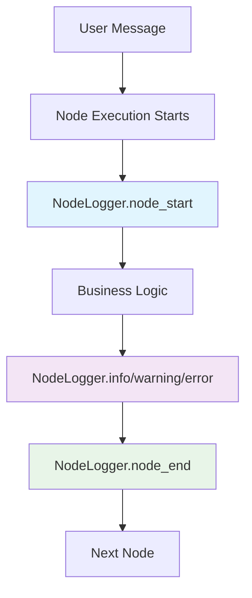

# Logging Configuration API

Custom logging setup for better readability and debugging in the Wbot AI backend. Provides clean, color-coded output with visual separators for node execution flow.

## Overview

This module configures application logging with human-readable formatting, focusing on showing only what matters - the AI agent's decision-making process while suppressing noisy framework logs.

## Classes

### `Colors`

ANSI color codes for colored terminal output.

**Constants:**

```python
RESET = "\033[0m"
BOLD = "\033[1m"
DIM = "\033[2m"

# Log levels
INFO = "\033[36m"     # Cyan
WARNING = "\033[33m"  # Yellow
ERROR = "\033[31m"    # Red
DEBUG = "\033[35m"    # Magenta

# Node lifecycle
NODE_START = "\033[32m"  # Green
NODE_END = "\033[34m"    # Blue

# Context
KEY = "\033[90m"    # Gray
VALUE = "\033[37m"  # White
```

### `ReadableFormatter`

```python
class ReadableFormatter(logging.Formatter)
```

Custom log formatter with better readability featuring colored output, clean timestamps, and context key-value pairs on separate lines.

#### `format(record: logging.LogRecord) -> str`

Format log record with colors and structure.

**Parameters:**

- `record` (`logging.LogRecord`): The log record to format

**Returns:**

- `str`: Formatted log message with colors and context

**Example output:**

```
19:15:30 | INFO     | node.detect_activity | Activity detected → routing
  activity: breathing
  confidence: 85%
```

### `NodeLogger`

```python
class NodeLogger
```

Specialized logger for LangGraph nodes with better formatting. Provides convenient methods for logging node execution with clear visual separation and context information.

#### `__init__(node_name: str) -> None`

Initialize node logger with specific node name.

**Parameters:**

- `node_name` (`str`): Name of the LangGraph node

#### `node_start(**context: object) -> None`

Log node execution start with visual separator.

**Parameters:**

- `**context` (`object`): Optional context key-value pairs

**Example:**

```python
logger = NodeLogger("detect_activity")
logger.node_start(user_input="I need help with anxiety")
```

**Output:**

```
──────────────────────────────────────────────────────────────────────
▶ DETECT_ACTIVITY
  user_input: I need help with anxiety
```

#### `node_end(**context: object) -> None`

Log node execution end with visual separator.

**Parameters:**

- `**context` (`object`): Optional context key-value pairs

#### `info(message: str, **context: object) -> None`

Log info message with node context.

**Parameters:**

- `message` (`str`): Log message
- `**context` (`object`): Optional context key-value pairs

**Example:**

```python
logger.info("Activity detected", activity="breathing", confidence="85%")
```

#### `debug(message: str, **context: object) -> None`

Log debug message with node context.

**Parameters:**

- `message` (`str`): Debug message
- `**context` (`object`): Optional context key-value pairs

#### `warning(message: str, **context: object) -> None`

Log warning message with node context.

**Parameters:**

- `message` (`str`): Warning message
- `**context` (`object`): Optional context key-value pairs

#### `error(message: str, **context: object) -> None`

Log error message with node context.

**Parameters:**

- `message` (`str`): Error message
- `**context` (`object`): Optional context key-value pairs

## Functions

### `configure_logging(dev_mode: bool = True) -> None`

Configure application logging with readable formatting.

**Parameters:**

- `dev_mode` (`bool`, optional): If True, uses human-readable console output with colors. If False, uses simple text formatting. Defaults to True.

**Example:**

```python
from src.logging_config import configure_logging

# Development mode (colored output)
configure_logging(dev_mode=True)

# Production mode (plain text)
configure_logging(dev_mode=False)
```

:::info Auto-Configuration
This function is called automatically when the module is imported, so manual configuration is typically not needed.
:::

## Usage Example

```python
from src.logging_config import NodeLogger

# Create logger for your node
logger = NodeLogger("wellness_coach")

async def wellness_coach_node(state: WellnessState) -> dict:
    logger.node_start(user_mood="anxious", session_id="123")

    try:
        # Your node logic here
        advice = generate_wellness_advice(state)

        logger.info("Generated advice",
                   technique="breathing",
                   duration_minutes=5)

        logger.node_end(status="success")
        return {"advice": advice}

    except Exception as e:
        logger.error("Failed to generate advice", error=str(e))
        logger.node_end(status="error")
        raise
```

## Suppressed Loggers

The following third-party loggers are suppressed to ERROR level only:

- `httpx` - HTTP client logs
- `httpcore` - HTTP core logs
- `langgraph_api` - LangGraph API logs
- `langgraph_runtime` - LangGraph runtime logs
- `langgraph_runtime_inmem` - In-memory runtime logs
- `browser_opener` - Browser opening logs

:::tip Custom Logger Levels
Only `node.*` loggers are set to INFO level by default. This ensures you see the AI agent's decision flow without framework noise.
:::

## Log Flow Visualization


