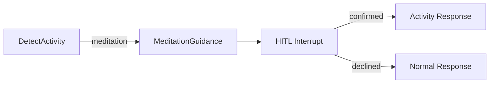

# Meditation Guidance Node

The `meditation_guidance` node guides users through guided meditation sessions, selecting appropriate tracks based on conversation context and handling the HITL (Human-in-the-Loop) confirmation flow.

## Overview

```
apps/ai/src/nodes/meditation_guidance/
└── node.py   # Main node implementation
```

## Graph Integration

The meditation node is triggered when `detect_activity_intent` identifies a meditation request:



## Detection Signals

The `detect_activity_intent` node looks for meditation signals:

- **Explicit**: "guided meditation", "meditation", "body scan", "mindfulness"
- **Implicit**: "trouble focusing", "scattered thoughts", "need to relax deeply"
- **Emotional**: "lonely", "self-critical", "anxious", "can't sleep"

### Breathing vs Meditation

| Breathing Exercise     | Guided Meditation          |
| ---------------------- | -------------------------- |
| Quick relief (2-5 min) | Longer practice (5-15 min) |
| Active participation   | Passive listening          |
| Physical calming       | Emotional processing       |
| Acute stress           | Deeper relaxation          |

## Node Function

```python
async def run_meditation_guidance(state: WellnessState) -> dict[str, list[AIMessage]]:
    """
    Flow:
    1. Select track using LLM based on context
    2. interrupt() for HITL confirmation
    3. Handle user's decision
    4. Return activity data for frontend
    """
```

## Track Selection

The node uses an LLM call to select the most appropriate track:

```python
MEDITATION_TRACKS = {
    "body_scan_short": {...},    # 3 min - quick tension release
    "body_scan_medium": {...},   # 9 min - deep relaxation
    "breathing_focus": {...},    # 5 min - beginners, focus
    "loving_kindness": {...},    # 9 min - compassion, emotions
    "anxiety_relief": {...},     # 7 min - difficult emotions
}
```

### Selection Guidelines

| User Signal                     | Recommended Track |
| ------------------------------- | ----------------- |
| Physical tension, stress        | body_scan         |
| Anxiety, difficult emotions     | anxiety_relief    |
| Self-criticism, loneliness      | loving_kindness   |
| Need focus, general mindfulness | breathing_focus   |
| Quick break (short preference)  | body_scan_short   |

## HITL Confirmation

The node uses `interrupt()` to pause and get user confirmation:

```python
confirmation_data: MeditationConfirmation = {
    "type": "meditation_confirmation",
    "proposed_track": selected_track,
    "message": f"I'd suggest a {selected_track['name']} meditation for you.",
    "available_tracks": available_tracks,
    "options": ["start", "change_track", "not_now"],
}
user_response = interrupt(confirmation_data)
```

### User Responses

- **start**: Begin meditation with selected track
- **change_track**: User selects a different track
- **not_now**: User declines, return friendly message

## Activity Data Format

The node returns JSON wrapped in activity markers:

```json
[ACTIVITY_START]{
  "type": "activity",
  "activity": "meditation",
  "status": "ready",
  "track": {
    "id": "breathing_focus",
    "name": "Breathing Meditation",
    "type": "breathing_focus",
    "durationSeconds": 300,
    "durationPreset": "short",
    "description": "...",
    "audioUrl": "https://...",
    "narrator": "Diana Winston",
    "language": "en",
    "bestFor": ["focus", "calm"],
    "attribution": "UCLA MARC..."
  },
  "introduction": "Let's take 5 minutes to..."
}[ACTIVITY_END]
```

## Introduction Generation

Personalized introductions are generated based on track type:

```python
def generate_introduction(track: MeditationTrack, user_name: str) -> str:
    """
    - Body scan: Focus on releasing physical tension
    - Breathing: Breath as anchor for presence
    - Loving kindness: Cultivating compassion
    - Anxiety relief: Working with difficult emotions
    """
```

## Audio Source

All tracks are from **UCLA Mindful Awareness Research Center (MARC)**:

- **License**: CC BY-NC-ND 4.0
- **Narrator**: Diana Winston
- **Languages**: English (more in Phase 3)

### Attribution Requirement

When using UCLA MARC content, display:

> Meditation by Diana Winston, UCLA Mindful Awareness Research Center (MARC). Licensed under CC BY-NC-ND 4.0.

## Configuration

Audio URLs are constructed from environment variable:

```python
SUPABASE_URL = os.getenv("SUPABASE_URL", "")
AUDIO_BASE_URL = f"{SUPABASE_URL}/storage/v1/object/public/meditation-audio"
```

## Error Handling

- **LLM selection fails**: Default to `breathing_focus`
- **User declines**: Return friendly message, no activity
- **Invalid track ID**: Fall back to default track

## Testing

```python
# apps/ai/tests/integration/test_meditation_node.py

class TestMeditationGuidanceNode:
    async def test_detects_meditation_intent(self):
        """Meditation detected from 'need to focus' message"""

    async def test_selects_appropriate_track(self):
        """Body scan selected for physical tension"""

    async def test_returns_valid_activity_data(self):
        """Activity markers and JSON parse correctly"""
```

## Future Enhancements (Phase 2-4)

- Ambient sound mixer during meditation
- TTS-generated custom meditations
- Multi-language track support
- Meditation history and recommendations
- Streak tracking
