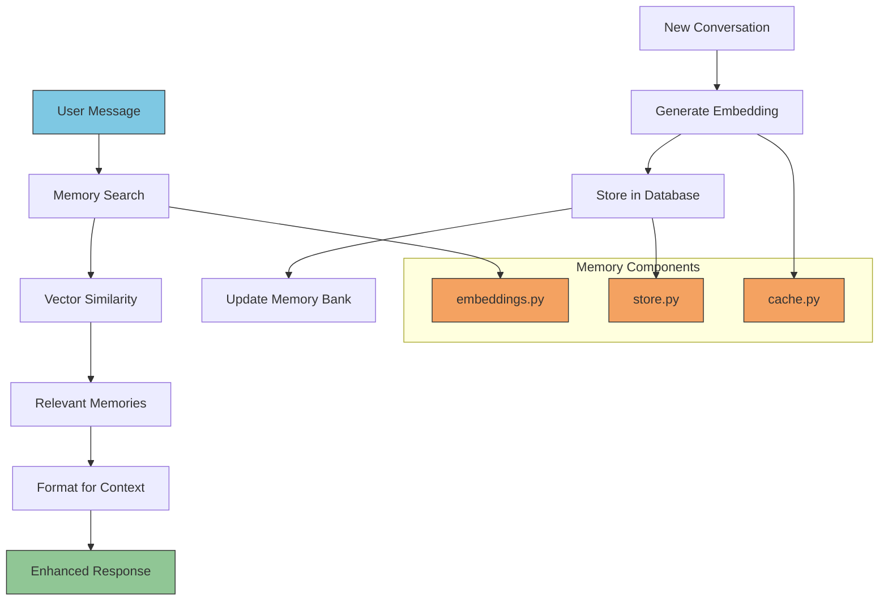
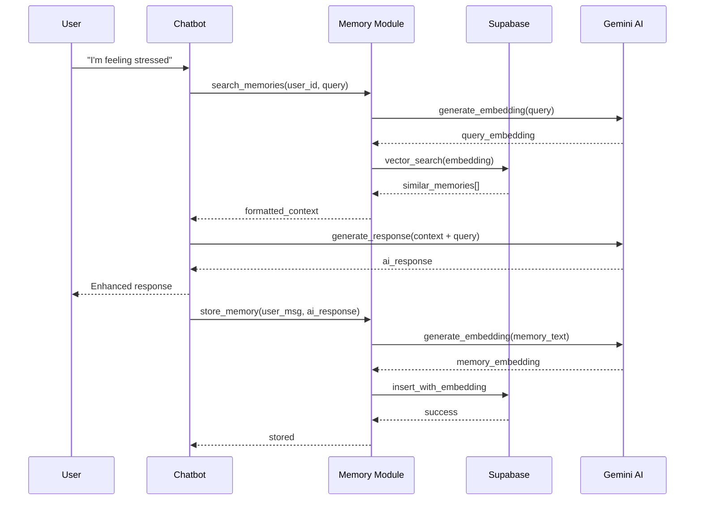

# Memory Module API

The memory module provides semantic memory storage and retrieval capabilities for the Wbot wellness chatbot, enabling contextually-aware conversations through persistent memory of past interactions.



## Overview

The memory module consists of three core components:

- **Embeddings**: Vector generation using Gemini AI for semantic similarity
- **Store**: Supabase-based storage and retrieval with vector search capabilities
- **Cache**: Redis-based caching to optimize performance and reduce API calls

## Quick Start

```python
from src.memory import store_memory, search_memories, format_memories_for_prompt

# Store a conversation pair
await store_memory(
    user_id="user-123",
    user_message="I've been feeling anxious lately",
    ai_response="I understand anxiety can be challenging. Let's explore some coping strategies..."
)

# Search for relevant memories when user asks related question
memories = await search_memories(
    user_id="user-123",
    query="how to deal with stress",
    limit=3
)

# Format memories for AI context
context = format_memories_for_prompt(memories)
print(f"Found {len(memories)} relevant memories for context")
```

## Exported Components

### Classes

#### Memory

Data class representing a stored memory entry.

```python
@dataclass
class Memory:
    id: str
    user_id: str
    user_message: str
    ai_response: str
    timestamp: datetime
    embedding: list[float] | None = None
```

**Fields:**

- `id` (str): Unique identifier for the memory
- `user_id` (str): ID of the user who owns this memory
- `user_message` (str): Original user message
- `ai_response` (str): AI's response to the user message
- `timestamp` (datetime): When the memory was created
- `embedding` (list[float] | None): Vector embedding (may be None if not loaded)

### Core Functions

#### store_memory()

Stores a conversation pair in the memory system with automatic embedding generation.

```python
async def store_memory(
    user_id: str,
    user_message: str,
    ai_response: str
) -> bool
```

**Parameters:**

- `user_id` (str): Unique identifier for the user
- `user_message` (str): The user's message to remember
- `ai_response` (str): The AI's response to remember

**Returns:**

- `bool`: True if storage succeeded, False otherwise

**Example:**

```python
from src.memory import store_memory

# After AI generates a response, store the conversation
success = await store_memory(
    user_id="user-456",
    user_message="I'm struggling with sleep issues",
    ai_response="Sleep problems are common. Here are some evidence-based strategies: maintain a consistent bedtime routine, limit screen time before bed, and create a comfortable sleep environment."
)

if success:
    print("✓ Conversation stored for future reference")
else:
    print("✗ Failed to store memory")
```

#### search_memories()

Searches for semantically similar memories using vector similarity.

```python
async def search_memories(
    user_id: str,
    query: str,
    limit: int = 5,
    similarity_threshold: float = 0.7
) -> list[Memory]
```

**Parameters:**

- `user_id` (str): User ID to search memories for
- `query` (str): Search query to find similar memories
- `limit` (int, optional): Maximum number of memories to return (default: 5)
- `similarity_threshold` (float, optional): Minimum similarity score (default: 0.7)

**Returns:**

- `list[Memory]`: List of similar memories, ordered by relevance

**Example:**

```python
from src.memory import search_memories

# When user asks about a topic, search for related past conversations
related_memories = await search_memories(
    user_id="user-456",
    query="dealing with work stress",
    limit=3,
    similarity_threshold=0.6
)

print(f"Found {len(related_memories)} related conversations:")
for memory in related_memories:
    print(f"- {memory.user_message[:50]}... ({memory.timestamp.strftime('%Y-%m-%d')})")
```

#### format_memories_for_prompt()

Formats retrieved memories into a structured string for AI context.

```python
def format_memories_for_prompt(memories: list[Memory]) -> str
```

**Parameters:**

- `memories` (list[Memory]): List of memories to format

**Returns:**

- `str`: Formatted string ready for inclusion in AI prompts

**Format Structure:**

```
Previous relevant conversations:

Memory 1 (2024-01-15):
User: I've been having trouble sleeping
AI: Sleep issues can significantly impact your wellbeing...

Memory 2 (2024-01-10):
User: Work has been really stressful
AI: Workplace stress is a common challenge...
```

**Example:**

```python
from src.memory import search_memories, format_memories_for_prompt

# Complete workflow: search and format for AI context
memories = await search_memories(
    user_id="user-456",
    query="anxiety and sleep problems",
    limit=2
)

if memories:
    context = format_memories_for_prompt(memories)

    # Add to system prompt
    enhanced_prompt = f"""You are a wellness AI assistant.

{context}

Please provide personalized advice based on the user's history above and their current question."""

    print("Enhanced prompt with memory context ready")
else:
    print("No relevant memories found")
```

### Embedding Functions

#### generate_embedding()

Generates a vector embedding for text using Gemini AI.

```python
async def generate_embedding(text: str) -> list[float]
```

**Parameters:**

- `text` (str): Text to generate embedding for

**Returns:**

- `list[float]`: 768-dimensional embedding vector

**Example:**

```python
from src.memory import generate_embedding

# Generate embedding for similarity search
user_query = "I'm feeling overwhelmed with work"
query_embedding = await generate_embedding(user_query)

print(f"Generated {len(query_embedding)}-dimensional vector")
# Output: Generated 768-dimensional vector
```

#### format_memory_text()

Formats a memory's content for consistent embedding generation.

```python
def format_memory_text(user_message: str, ai_response: str) -> str
```

**Parameters:**

- `user_message` (str): User's original message
- `ai_response` (str): AI's response

**Returns:**

- `str`: Formatted text combining both messages

**Format:**

```
User: [user_message]
AI: [ai_response]
```

**Example:**

```python
from src.memory import format_memory_text

# Prepare text for embedding (used internally by store_memory)
formatted = format_memory_text(
    user_message="I can't stop worrying about my presentation",
    ai_response="It's natural to feel nervous. Try these preparation strategies..."
)

print(formatted)
# Output:
# User: I can't stop worrying about my presentation
# AI: It's natural to feel nervous. Try these preparation strategies...
```

## Complete Integration Example

Here's how to integrate the memory system into a chatbot conversation flow:

```python
from src.memory import store_memory, search_memories, format_memories_for_prompt

async def enhanced_chatbot_response(user_id: str, user_message: str) -> str:
    """Generate AI response with memory-enhanced context."""

    # 1. Search for relevant memories
    memories = await search_memories(
        user_id=user_id,
        query=user_message,
        limit=3,
        similarity_threshold=0.6
    )

    # 2. Build context-aware prompt
    base_prompt = "You are a helpful wellness AI assistant."

    if memories:
        memory_context = format_memories_for_prompt(memories)
        enhanced_prompt = f"""{base_prompt}

{memory_context}

Consider the user's conversation history above when responding to their current message."""
    else:
        enhanced_prompt = base_prompt

    # 3. Generate AI response (your AI logic here)
    ai_response = await generate_ai_response(enhanced_prompt, user_message)

    # 4. Store new conversation for future reference
    memory_stored = await store_memory(
        user_id=user_id,
        user_message=user_message,
        ai_response=ai_response
    )

    if not memory_stored:
        print("⚠️  Warning: Failed to store conversation in memory")

    return ai_response

# Usage example
async def chat_session():
    user_id = "user-789"

    # First conversation
    response1 = await enhanced_chatbot_response(
        user_id,
        "I've been having trouble sleeping lately"
    )
    print(f"AI: {response1}")

    # Later conversation - will reference sleep discussion
    response2 = await enhanced_chatbot_response(
        user_id,
        "My anxiety is getting worse"
    )
    print(f"AI: {response2}")  # May reference sleep issues if related
```

## Data Flow



## Configuration Requirements

### Environment Variables

```bash
# Required for memory storage
SUPABASE_URL="https://your-project.supabase.co"
SUPABASE_ANON_KEY="your-anon-key"

# Required for embeddings
GEMINI_API_KEY="your-gemini-api-key"

# Optional for caching (improves performance)
REDIS_URL="redis://localhost:6379"
```

### Database Schema

The memory system expects a `memories` table in Supabase:

```sql
CREATE TABLE memories (
    id UUID PRIMARY KEY DEFAULT gen_random_uuid(),
    user_id TEXT NOT NULL,
    user_message TEXT NOT NULL,
    ai_response TEXT NOT NULL,
    timestamp TIMESTAMPTZ DEFAULT NOW(),
    embedding VECTOR(768)
);

-- Enable vector similarity search
CREATE INDEX ON memories USING ivfflat (embedding vector_cosine_ops);
```

:::tip Performance Optimization

- Enable Redis caching to reduce Gemini API calls by 60-80%
- Use appropriate similarity thresholds to balance relevance vs. recall
- Consider batch operations for bulk memory storage
- Monitor embedding API usage to stay within rate limits
  :::

:::warning Privacy Considerations

- User memories are isolated by `user_id` - ensure proper authentication
- Consider data retention policies for stored conversations
- Embeddings may contain semantic information about sensitive topics
- Implement proper access controls in your Supabase setup
  :::

## Error Handling

All memory functions are designed to fail gracefully:

```python
from src.memory import store_memory, search_memories

async def robust_memory_usage():
    """Example of robust error handling."""

    try:
        # Storage failures don't break the conversation
        stored = await store_memory(
            user_id="user-123",
            user_message="test message",
            ai_response="test response"
        )
        if not stored:
            print("⚠️  Memory storage failed, but conversation continues")

        # Search failures return empty list
        memories = await search_memories(
            user_id="user-123",
            query="test query"
        )
        # memories will be [] if search fails

        if memories:
            print(f"Found {len(memories)} memories")
        else:
            print("No memories found or search failed")

    except Exception as e:
        print(f"Unexpected error: {e}")
        # Your chatbot can still function without memory
```

## Related Documentation

- [Memory Store API](./store) - Detailed storage and retrieval functions
- [Embeddings API](./embeddings) - Vector generation and caching
- [Embedding Cache API](./cache) - Redis-based performance optimization
- [Configuration Guide](../setup/configuration) - Environment setup
- [Database Schema](../setup/database) - Supabase table structure
