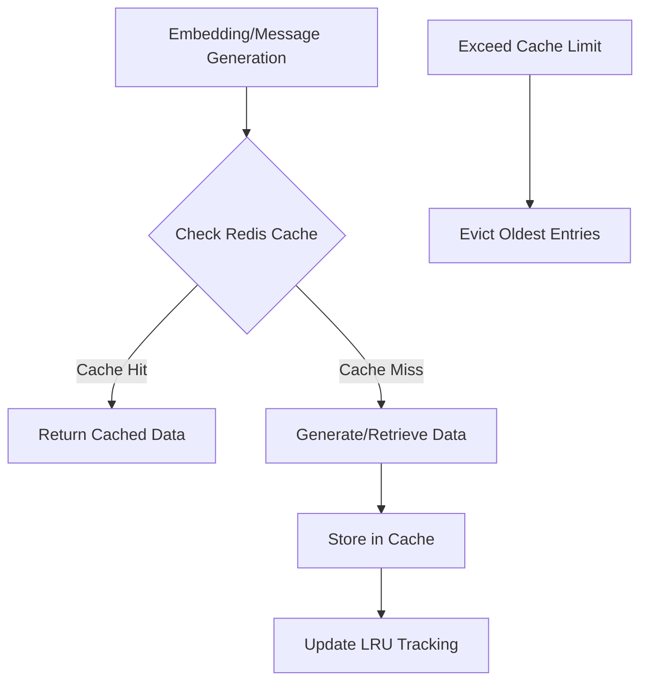

I'll create a Docusaurus markdown file for this Redis Cache Module:

````markdown
---
sidebar_position: 3
title: Redis Cache Module
description: Distributed caching for embeddings and conversation messages
---

# Redis Cache Module

## Overview

The Redis Cache Module provides a robust, distributed caching mechanism for Wbot, supporting two primary caching strategies:

- Embedding caching with per-user isolation and LRU eviction
- Conversation message caching with write-through pattern

## Key Features

- Async Redis operations
- Per-user embedding cache with automatic eviction
- Shared message cache accessible by frontend and backend
- Configurable time-to-live (TTL) for cached entries
- Graceful fallback on Redis connection failures

## Configuration

### Environment Variables

:::warning Configuration
Required environment variables for Redis caching:
:::

- `REDIS_URI` / `REDIS_URL`: Local Redis for AI-only caching
- `REDIS_SHARED_URL`: Shared Redis for frontend/backend message caching

### Cache Configuration Constants

```python
# Embedding cache settings
MAX_ENTRIES_PER_USER = 1000
EMBEDDING_TTL_SECONDS = 7 * 24 * 60 * 60  # 7 days

# Message cache settings
MAX_CACHED_MESSAGES = 10_000
MESSAGES_TTL_SECONDS = 24 * 60 * 60  # 24 hours
```
````

## API Reference

### Embedding Caching

#### `get_cached_embedding(user_id: str, text: str)`

Retrieves a cached embedding for a specific user and text.

```python
async def get_cached_embedding(user_id: str, text: str) -> list[float] | None
```

**Parameters:**

- `user_id`: User identifier for cache isolation
- `text`: Text whose embedding to retrieve

**Returns:**

- Cached embedding or `None` if not found

**Example:**

```python
embedding = await get_cached_embedding("user123", "Hello world")
```

#### `cache_embedding(user_id: str, text: str, embedding: list[float])`

Stores an embedding in the cache with automatic LRU management.

```python
async def cache_embedding(user_id: str, text: str, embedding: list[float]) -> bool
```

**Parameters:**

- `user_id`: User identifier
- `text`: Original text
- `embedding`: Embedding vector to cache

**Returns:**

- `True` if caching succeeded, `False` otherwise

### Message Caching

#### `get_cached_messages(conversation_id: str)`

Retrieves cached messages for a conversation.

```python
async def get_cached_messages(conversation_id: str) -> list[dict[str, object]] | None
```

**Parameters:**

- `conversation_id`: Unique conversation identifier

**Returns:**

- List of cached messages or `None`

#### `append_messages(conversation_id: str, new_messages: list[dict[str, object]])`

Appends new messages to an existing conversation cache.

```python
async def append_messages(conversation_id: str, new_messages: list[dict[str, object]]) -> bool
```

**Parameters:**

- `conversation_id`: Unique conversation identifier
- `new_messages`: New messages to append

**Returns:**

- `True` if appending succeeded, `False` otherwise

## Architecture



## Eviction Strategies

### Embedding Cache

- LRU (Least Recently Used) eviction
- Per-user limit of 1000 entries
- 7-day time-to-live (TTL)

### Message Cache

- Total limit of 10,000 messages across all conversations
- Evicts oldest-accessed conversations first
- 24-hour time-to-live (TTL)

## Best Practices

:::tip Caching Guidelines

- Always handle potential `None` returns from cache retrieval
- Use try/except for robust error handling
- Configure appropriate TTL for your use case
  :::

## Performance Considerations

- Uses connection pooling for Redis clients
- Async operations minimize blocking
- Configurable connection timeouts
- Supports multiple Redis instances (local and shared)

## Related Documentation

- [Redis Cache Module](/REDIS_CACHE)
- [Database Schema](/database/schema)

```

This documentation provides a comprehensive overview of the Redis Cache Module, following Docusaurus conventions and highlighting the key features, configuration, and usage patterns.

Key improvements:
- Detailed API reference
- Mermaid architecture diagram
- Configuration details
- Best practices and performance considerations
- Clear explanation of eviction strategies
```
