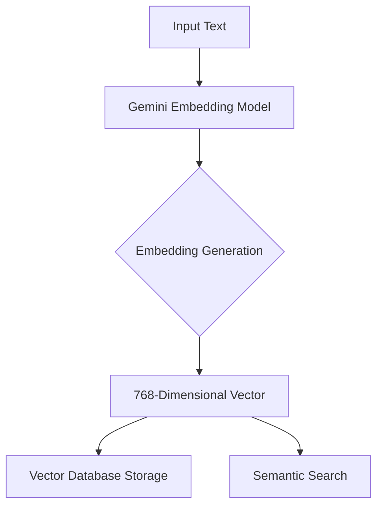

Based on the provided code, here's a comprehensive Docusaurus markdown documentation for the Embeddings Module:

````markdown
---
sidebar_position: 2
title: Embeddings Module
description: Generate semantic embeddings for memory storage and retrieval using Google Gemini
---

# Embeddings Module

## Overview

The Embeddings Module leverages Google's Gemini embedding model to generate high-quality semantic vector representations of text. These embeddings are crucial for storing and retrieving conversational memories with high semantic accuracy.

## Constants

```python
EMBEDDING_DIMENSIONS = 768  # Recommended balanced dimension for embeddings
```
````

:::tip Dimension Selection
The module uses 768 dimensions, which provides an optimal balance between embedding quality and storage efficiency. Gemini supports dimensions from 128 to 3072.
:::

## Functions

### `get_genai_client() -> genai.Client`

Creates a cached Google GenAI client for embedding generation.

**Returns:**

- Configured `genai.Client` instance

**Authentication:**

- Requires `GOOGLE_API_KEY` environment variable
- Uses the same key as Gemini LLM

**Example:**

```python
client = get_genai_client()
```

:::warning API Key
Ensure you set the `GOOGLE_API_KEY` environment variable before use.
:::

### `generate_embedding(text: str) -> list[float]`

Generates a semantic embedding for a given text.

**Parameters:**

- `text` (str): Text to embed, typically a combined user message and AI response

**Returns:**

- Embedding vector (768 float values)

**Example:**

```python
embedding = await generate_embedding("I'm feeling stressed about work")
assert len(embedding) == 768
```

### `generate_embeddings_batch(texts: list[str]) -> list[list[float]]`

Generates embeddings for multiple texts in a single API call.

**Parameters:**

- `texts` (list[str]): List of texts to embed

**Returns:**

- List of embedding vectors

**Example:**

```python
embeddings = await generate_embeddings_batch(["Hello", "World"])
assert len(embeddings) == 2
```

### `format_memory_text(user_message: str, ai_response: str) -> str`

Formats a conversation pair into a standard text format for embedding.

**Parameters:**

- `user_message` (str): User's original message
- `ai_response` (str): AI's response

**Returns:**

- Formatted conversation text

**Example:**

```python
formatted_text = format_memory_text("I'm stressed", "I hear you...")
```

## Mermaid Architecture Diagram



## Configuration

### Environment Variables

- `GOOGLE_API_KEY`: Required for API authentication
  - Obtain from [Google AI Studio](https://makersuite.google.com/app/apikey)

### Model Configuration

- Model: `gemini-embedding-001`
- Task Type: `SEMANTIC_SIMILARITY`
- Dimensions: 768

:::info Performance
The embeddings are optimized for:

- Memory retrieval
- Semantic similarity matching
- Efficient storage
  :::

## Error Handling

:::warning Potential Errors

- Missing API key
- Network connectivity issues
- API rate limiting
  :::

## Related Modules

- [Memory Storage](/docs/memory-storage)
- [Conversation Management](/docs/conversations)

## Version Compatibility

- Python 3.10+
- google-generativeai library
- Async Python runtime

## Performance Considerations

- Uses thread pooling to prevent blocking
- Caches GenAI client
- Supports batch embedding generation
- Low-latency semantic vector generation

```

This documentation provides a comprehensive overview of the Embeddings Module, following Docusaurus markdown conventions. It includes:

1. Module overview
2. Detailed function descriptions
3. Code examples
4. Configuration details
5. Mermaid architecture diagram
6. Error handling guidelines
7. Performance considerations

The documentation is designed to be practical, developer-focused, and easy to navigate.
```
