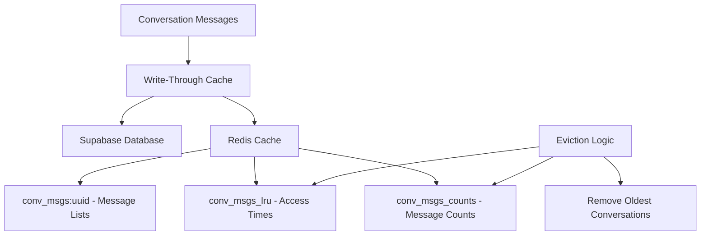
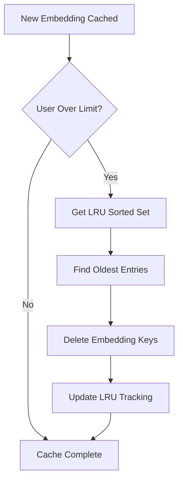
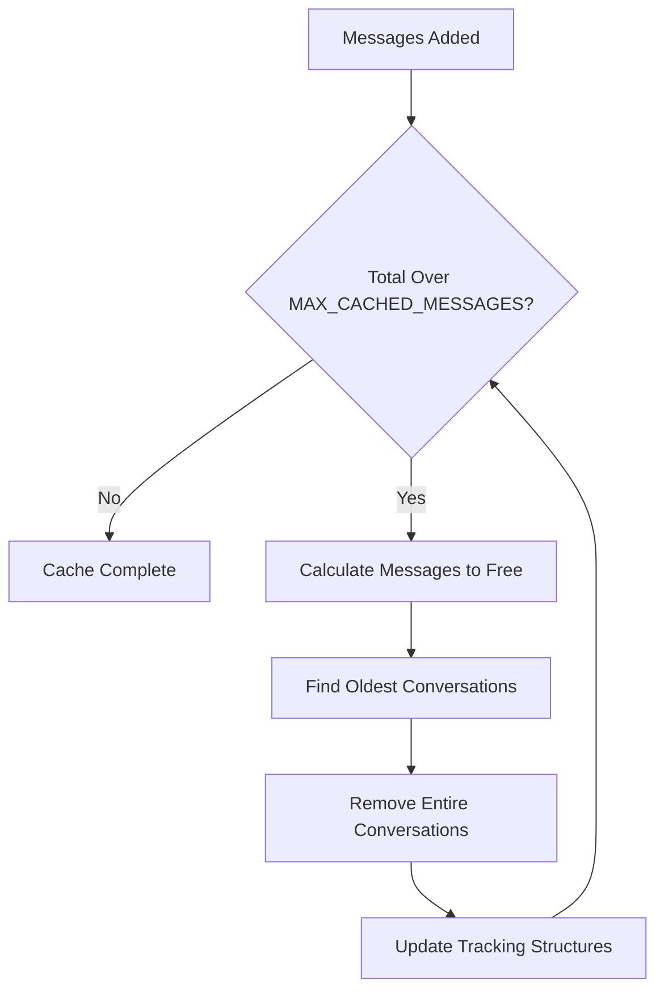

# Cache API Reference

The cache module provides Redis-based caching for embeddings and conversation messages. It implements intelligent eviction strategies, per-user isolation, and graceful fallbacks when Redis is unavailable.

## Overview

This module provides two caching systems:

1. **Embedding Cache**: Per-user isolated caching of text embeddings with LRU eviction
2. **Message Cache**: Write-through caching of conversation messages with total count-based eviction

All operations are async and degrade gracefully when Redis is unavailable.

## Configuration

### Environment Variables

```bash
# Required: Redis connection (checks REDIS_URI first, falls back to REDIS_URL)
REDIS_URI=redis://localhost:6379
# or
REDIS_URL=redis://localhost:6379
```

### Cache Constants

| Constant                | Value            | Description                             |
| ----------------------- | ---------------- | --------------------------------------- |
| `MAX_ENTRIES_PER_USER`  | 1,000            | Maximum embeddings cached per user      |
| `EMBEDDING_TTL_SECONDS` | 604,800 (7 days) | TTL for embedding cache entries         |
| `MAX_CACHED_MESSAGES`   | 10,000           | Total messages across all conversations |
| `REDIS_CONNECT_TIMEOUT` | 2.0 seconds      | Connection timeout for Redis            |

## Connection Management

### `get_redis_client()`

```python
async def get_redis_client() -> redis.Redis | None
```

Returns an async Redis client using a shared connection pool.

**Returns:**

- `redis.Redis`: Client instance or None if Redis unavailable

**Connection Pool:**

- Maximum 10 connections per pool
- Automatic health checks via ping
- Global pool reuse for efficiency

**Example:**

```python
from src.memory.cache import get_redis_client

client = await get_redis_client()
if client:
    await client.set("test_key", "test_value")
else:
    print("Redis not available - continuing without cache")
```

### `close_redis_pool()`

```python
async def close_redis_pool() -> None
```

Closes the Redis connection pool. Call during application shutdown.

**Example:**

```python
from src.memory.cache import close_redis_pool

# In your shutdown handler
await close_redis_pool()
```

## Embedding Cache Functions

The embedding cache provides per-user isolation with LRU eviction when limits are exceeded.

### `get_cached_embedding()`

```python
async def get_cached_embedding(user_id: str, text: str) -> list[float] | None
```

Retrieves a cached embedding for the given text.

**Parameters:**

- `user_id` (str): User ID for cache isolation
- `text` (str): Text whose embedding to retrieve (normalized before hashing)

**Returns:**

- `list[float]`: Cached embedding vector or None if not found

**Side Effects:**

- Updates LRU timestamp on cache hit

**Example:**

```python
from src.memory.cache import get_cached_embedding

# Try to get cached embedding
embedding = await get_cached_embedding(
    user_id="user-123",
    text="I'm feeling anxious about work"
)

if embedding:
    print(f"Cache hit! Embedding has {len(embedding)} dimensions")
else:
    print("Cache miss - need to generate embedding")
```

### `cache_embedding()`

```python
async def cache_embedding(user_id: str, text: str, embedding: list[float]) -> bool
```

Stores an embedding in the cache with automatic eviction if needed.

**Parameters:**

- `user_id` (str): User ID for cache isolation
- `text` (str): Original text that was embedded
- `embedding` (list[float]): Embedding vector to cache

**Returns:**

- `bool`: True if caching succeeded, False otherwise

**Eviction Logic:**

- Triggers when user exceeds `MAX_ENTRIES_PER_USER`
- Removes oldest entries based on LRU timestamps
- Maintains cache size automatically

**Example:**

```python
from src.memory.cache import cache_embedding
from src.embeddings import generate_embedding

async def get_embedding_with_cache(user_id: str, text: str):
    # Try cache first
    embedding = await get_cached_embedding(user_id, text)

    if embedding is None:
        # Generate and cache new embedding
        embedding = await generate_embedding(text)
        success = await cache_embedding(user_id, text, embedding)

        if success:
            print("Embedding cached successfully")
        else:
            print("Cache storage failed - Redis unavailable")

    return embedding
```

### `get_cache_stats()`

```python
async def get_cache_stats(user_id: str) -> dict[str, object]
```

Returns cache statistics for monitoring and debugging.

**Parameters:**

- `user_id` (str): User ID to get stats for

**Returns:**

- `dict`: Statistics including entry_count, oldest_entry_age, etc.

**Example:**

```python
from src.memory.cache import get_cache_stats

stats = await get_cache_stats("user-123")

print(f"Cached embeddings: {stats['entry_count']}/{stats['max_entries']}")
if stats['oldest_entry_age_seconds']:
    age_hours = stats['oldest_entry_age_seconds'] / 3600
    print(f"Oldest entry: {age_hours:.1f} hours old")
```

**Sample Output:**

```python
{
    "entry_count": 247,
    "max_entries": 1000,
    "oldest_entry_age_seconds": 86400.5  # ~1 day
}
```

## Message Cache Functions

The message cache implements a write-through pattern with conversation-level LRU eviction based on total message count.

### Cache Architecture



### `get_cached_messages()`

```python
async def get_cached_messages(conversation_id: str) -> list[dict[str, object]] | None
```

Retrieves cached messages for a conversation.

**Parameters:**

- `conversation_id` (str): Conversation UUID

**Returns:**

- `list[dict]`: Message objects `[{id, role, content, created_at}, ...]` or None if not cached

**Side Effects:**

- Updates access time in LRU index

**Example:**

```python
from src.memory.cache import get_cached_messages

# Check cache first (fast)
messages = await get_cached_messages("conversation-uuid")

if messages:
    print(f"Cache hit: {len(messages)} messages")
    for msg in messages[-2:]:  # Show last 2 messages
        print(f"{msg['role']}: {msg['content'][:50]}...")
else:
    print("Cache miss - need to query database")
```

### `cache_messages()`

```python
async def cache_messages(conversation_id: str, messages: list[dict[str, object]]) -> bool
```

Caches all messages for a conversation (full replacement).

**Parameters:**

- `conversation_id` (str): Conversation UUID
- `messages` (list[dict]): Complete list of message objects

**Returns:**

- `bool`: True if caching succeeded

**Use Case:**

- Populating cache after database read
- Full conversation refresh

**Eviction:**

- Triggers if total cached messages exceed `MAX_CACHED_MESSAGES`
- Removes oldest-accessed conversations to make room

**Example:**

```python
from src.memory.cache import cache_messages, get_cached_messages

async def get_conversation_messages(conversation_id: str):
    # Try cache first
    messages = await get_cached_messages(conversation_id)

    if messages is None:
        # Cache miss - query database
        messages = await query_database_messages(conversation_id)

        # Populate cache for future requests
        await cache_messages(conversation_id, messages)
        print(f"Cached {len(messages)} messages")

    return messages
```

### `append_messages()`

```python
async def append_messages(conversation_id: str, new_messages: list[dict[str, object]]) -> bool
```

Appends new messages to an existing cached conversation.

**Parameters:**

- `conversation_id` (str): Conversation UUID
- `new_messages` (list[dict]): New message objects to append

**Returns:**

- `bool`: True if append succeeded or cache miss (no-op)

**Write-Through Pattern:**

1. Save messages to database (source of truth)
2. Call `append_messages()` to update cache
3. Cache miss is no-op (will populate on next read)

**Example:**

```python
from src.memory.cache import append_messages
from src.memory.store import save_messages

async def handle_new_message(conversation_id: str, user_msg: str, ai_response: str):
    # 1. Save to database (source of truth)
    await save_messages(conversation_id, user_msg, ai_response)

    # 2. Update cache (write-through)
    new_messages = [
        {"role": "user", "content": user_msg, "created_at": "2024-01-15T10:30:00Z"},
        {"role": "assistant", "content": ai_response, "created_at": "2024-01-15T10:30:05Z"}
    ]

    success = await append_messages(conversation_id, new_messages)
    if success:
        print("Cache updated successfully")
```

:::info Cache Miss Behavior
If a conversation isn't in cache, `append_messages()` does nothing. This prevents partial cache states - the next read will populate the full conversation from the database.
:::

### `invalidate_conversation_cache()`

```python
async def invalidate_conversation_cache(conversation_id: str) -> bool
```

Removes a conversation from cache completely.

**Parameters:**

- `conversation_id` (str): Conversation UUID to invalidate

**Returns:**

- `bool`: True if invalidation succeeded

**Use Cases:**

- Conversation deleted
- Force cache refresh
- Data consistency issues

**Example:**

```python
from src.memory.cache import invalidate_conversation_cache

async def delete_conversation(conversation_id: str):
    # Remove from database
    await database_delete_conversation(conversation_id)

    # Invalidate cache
    await invalidate_conversation_cache(conversation_id)

    print("Conversation deleted and cache invalidated")
```

### `get_message_cache_stats()`

```python
async def get_message_cache_stats() -> dict[str, object]
```

Returns statistics about the message cache for monitoring.

**Returns:**

- `dict`: Cache statistics and utilization metrics

**Example:**

```python
from src.memory.cache import get_message_cache_stats

stats = await get_message_cache_stats()

print(f"Total messages cached: {stats['total_messages']:,}")
print(f"Conversations cached: {stats['conversation_count']}")
print(f"Cache utilization: {stats['utilization_percent']}%")

if stats.get('oldest_conversation_age_seconds'):
    age_hours = stats['oldest_conversation_age_seconds'] / 3600
    print(f"Oldest conversation: {age_hours:.1f} hours old")
```

**Sample Output:**

```python
{
    "total_messages": 7843,
    "max_messages": 10000,
    "conversation_count": 156,
    "oldest_conversation_age_seconds": 43200.0,  # 12 hours
    "utilization_percent": 78.4
}
```

## Cache Eviction Strategies

### Embedding Cache (Per-User LRU)



**Key Features:**

- Per-user isolation (users don't affect each other)
- LRU based on access time
- Configurable limits per user
- Preserves recently accessed embeddings

### Message Cache (Global Count-Based LRU)



**Key Features:**

- Global message count limit
- Conversation-level eviction (removes entire conversations)
- LRU based on last access time
- Preserves recently active conversations

## Error Handling and Fallbacks

All cache operations implement graceful degradation:

### Redis Unavailable

```python
from src.memory.cache import get_cached_embedding, cache_embedding

async def robust_embedding_workflow(user_id: str, text: str):
    # Try cache first
    embedding = await get_cached_embedding(user_id, text)

    if embedding is None:
        # Generate new embedding (this always works)
        embedding = await generate_embedding(text)

        # Try to cache (silent failure if Redis down)
        await cache_embedding(user_id, text, embedding)

    # Application continues regardless of cache state
    return embedding
```

### Connection Failures

```python
from src.memory.cache import get_redis_client

async def safe_cache_operation():
    client = await get_redis_client()

    if client is None:
        print("Redis unavailable - skipping cache operation")
        return None

    try:
        result = await client.get("some_key")
        return result
    except Exception as e:
        print(f"Cache operation failed: {e}")
        return None
```

## Integration Patterns

### Complete Embedding Cache Integration

```python
from src.memory.cache import get_cached_embedding, cache_embedding
from src.embeddings import generate_embedding

async def get_embedding_with_full_cache(user_id: str, text: str) -> list[float]:
    """Get embedding with caching - production ready"""

    # 1. Try cache first
    embedding = await get_cached_embedding(user_id, text)
    if embedding is not None:
        print(f"Cache hit for user {user_id}")
        return embedding

    # 2. Generate new embedding
    print(f"Cache miss - generating embedding for user {user_id}")
    embedding = await generate_embedding(text)

    # 3. Cache for future use (fire-and-forget)
    success = await cache_embedding(user_id, text, embedding)
    if success:
        print("Embedding cached successfully")
    else:
        print("Caching failed - continuing without cache")

    return embedding
```

### Message Cache Write-Through Pattern

```python
from src.memory.cache import get_cached_messages, append_messages
from src.memory.store import save_messages

async def complete_message_flow(conversation_id: str, user_msg: str, ai_response: str):
    """Complete message handling with write-through cache"""

    # 1. Save to database (source of truth)
    await save_messages(conversation_id, user_msg, ai_response)

    # 2. Update cache (write-through)
    new_messages = [
        {
            "role": "user",
            "content": user_msg,
            "created_at": datetime.utcnow().isoformat()
        },
        {
            "role": "assistant",
            "content": ai_response,
            "created_at": datetime.utcnow().isoformat()
        }
    ]

    await append_messages(conversation_i
```
