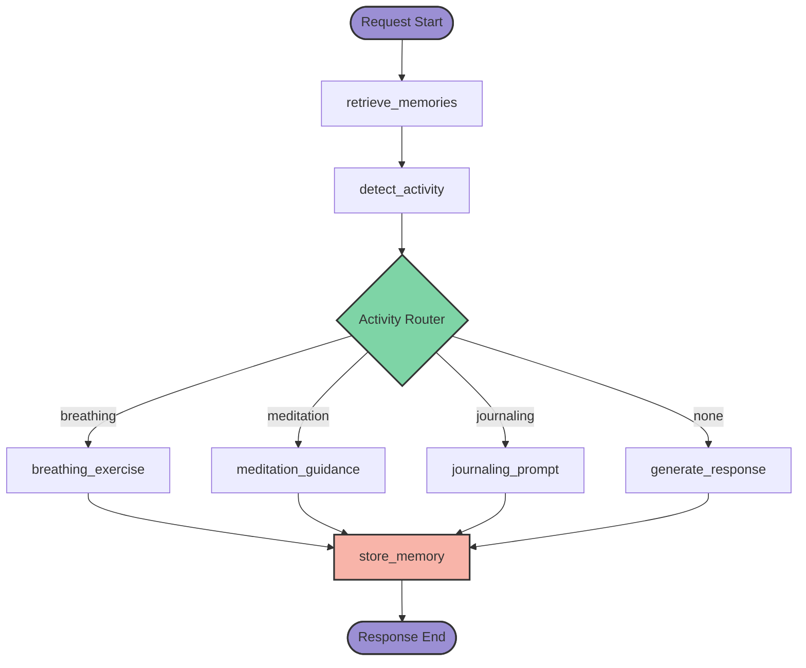
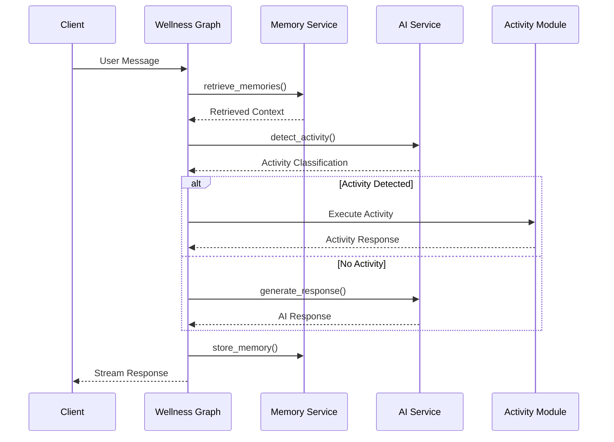
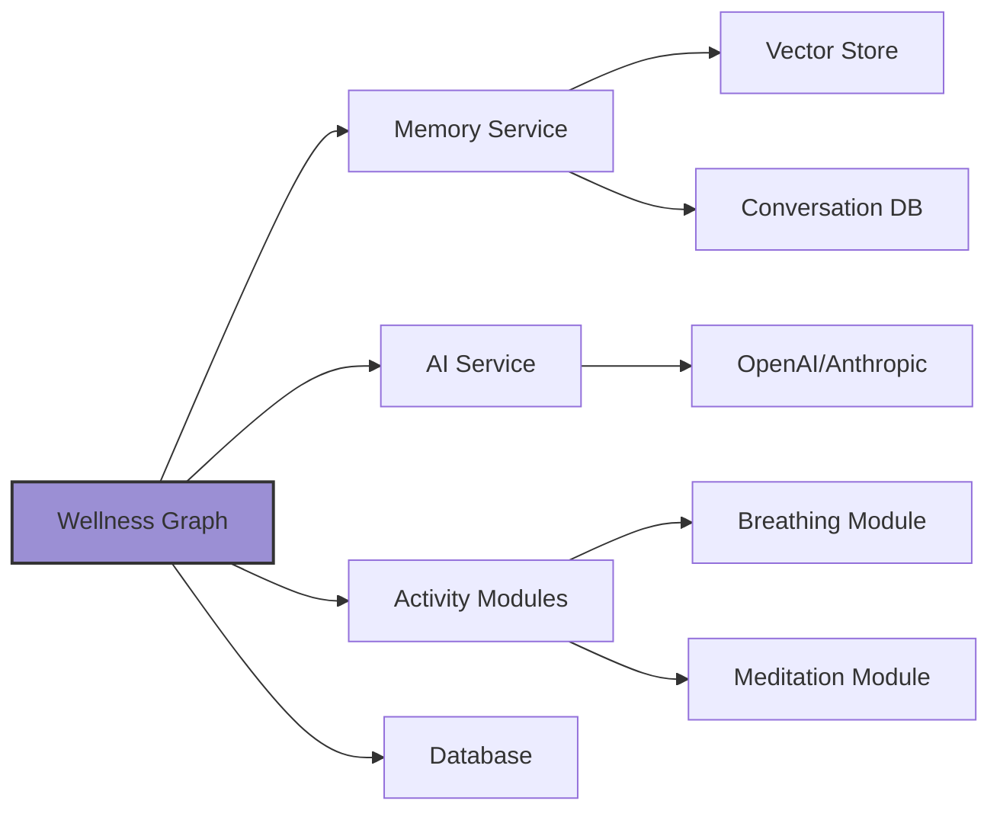

Looking at the wellness.py code, I'll create comprehensive architecture documentation for the Wellness Conversation Graph:

````markdown
---
sidebar_position: 2
title: Wellness Conversation Graph
---

# Wellness Conversation Graph

The Wellness Conversation Graph is the core orchestration layer for Wbot's AI-powered wellness conversations. Built on LangGraph, it manages conversation flow, activity detection, memory integration, and real-time response streaming.

## Overview

The wellness graph implements a sophisticated conversation pipeline that:

- **Retrieves contextual memories** from past conversations for personalized responses
- **Detects wellness activity needs** through LLM-based classification
- **Routes dynamically** to appropriate wellness interventions or general conversation
- **Streams responses** in real-time for better user experience
- **Persists conversations** for future context and personalization

:::info Production Ready
This graph is compiled and deployed via LangGraph Deploy, providing automatic scaling, state persistence, and API endpoints for production use.
:::

## Graph Architecture


````

## Data Flow Architecture



## Key Components

### 1. Graph Builder (`build_graph()`)

The main factory function that constructs the conversation workflow:

```python
def build_graph() -> StateGraph:
    """
    Constructs the wellness conversation graph with activity routing.

    Returns:
        A compiled StateGraph ready for execution by LangGraph Deploy.
    """
    builder = StateGraph(WellnessState)

    # Add all processing nodes
    builder.add_node("retrieve_memories", retrieve_memories)
    builder.add_node("detect_activity", detect_activity_intent)
    builder.add_node("generate_response", generate_response)
    builder.add_node("breathing_exercise", run_breathing_exercise)
    builder.add_node("store_memory", store_memory_node)

    # Define conversation flow
    # ... (edge definitions)

    return builder
```

### 2. Activity Router (`route_activity()`)

The intelligent routing function that directs conversations based on detected wellness needs:

```python
def route_activity(state: WellnessState) -> str:
    """Routes to appropriate activity handler or normal response."""
    activity = state.get("suggested_activity")

    if activity == "breathing":
        return "breathing_exercise"
    # Future expansions:
    # elif activity == "meditation":
    #     return "meditation_guidance"
    # elif activity == "journaling":
    #     return "journaling_prompt"

    return "generate_response"  # Default conversation
```

### 3. Compiled Graph Export

The production-ready graph instance:

```python
# This is the main export used by LangGraph Deploy
graph = build_graph().compile()
```

## Node Network

### Processing Nodes

| Node                 | Purpose                                  | Performance | Dependencies              |
| -------------------- | ---------------------------------------- | ----------- | ------------------------- |
| `retrieve_memories`  | Semantic search for conversation context | ~50ms       | Memory Service, Vector DB |
| `detect_activity`    | LLM classification of wellness needs     | ~200ms      | AI Service (GPT-4o-mini)  |
| `generate_response`  | AI response generation with streaming    | ~1-3s       | AI Service, Context       |
| `breathing_exercise` | Interactive breathing guidance           | Variable    | Activity Module, HITL     |
| `store_memory`       | Conversation persistence                 | ~100ms      | Memory Service, Database  |

### Edge Configuration

```python
# Linear flow with conditional branching
builder.set_entry_point("retrieve_memories")
builder.add_edge("retrieve_memories", "detect_activity")

# Smart routing based on activity detection
builder.add_conditional_edges(
    "detect_activity",
    route_activity,
    {
        "breathing_exercise": "breathing_exercise",
        "generate_response": "generate_response",
    },
)

# All paths converge to memory storage
builder.add_edge("generate_response", "store_memory")
builder.add_edge("breathing_exercise", "store_memory")
builder.add_edge("store_memory", END)
```

## State Management

The graph operates on a shared `WellnessState` that flows through all nodes:

```python
# State fields managed by the graph
class WellnessState(TypedDict):
    messages: list[BaseMessage]           # Conversation history
    user_context: dict                    # User preferences/info
    retrieved_memories: list[dict]        # Retrieved context
    suggested_activity: ActivityType      # Detected activity need
    # Additional fields added by nodes...
```

:::tip State Evolution
Each node can read from and write to the state, enabling rich context passing and conversation continuity across the entire workflow.
:::

## Integration Points

### LangGraph Deploy Integration

The graph is designed for seamless deployment:

```python
# langgraph.json configuration
{
  "graphs": {
    "wellness": "./src/graph/wellness.py:graph"
  },
  "dependencies": ["./requirements.txt"],
  "env": ".env"
}
```

### External Service Integration



### Node Module Dependencies

```python
# Import structure showing integration points
from src.graph.state import WellnessState              # State definition
from src.nodes.breathing_exercise import run_breathing_exercise  # Activity module
from src.nodes.detect_activity import detect_activity_intent    # AI classification
from src.nodes.generate_response import generate_response       # Core AI chat
from src.nodes.retrieve_memories import retrieve_memories       # Memory integration
from src.nodes.store_memory import store_memory_node           # Persistence
```

## Configuration Options

### Graph Compilation Options

```python
# Advanced compilation with checkpointing
from langgraph.checkpoint.memory import MemorySaver

graph = build_graph().compile(
    checkpointer=MemorySaver(),           # State persistence
    interrupt_before=[],                  # Pause points for HITL
    interrupt_after=["breathing_exercise"] # Post-activity confirmation
)
```

### Runtime Configuration

```python
# Execution configuration passed to graph
config = {
    "configurable": {
        "user_id": "user_123",
        "thread_id": "conversation_456",
        "model_name": "gpt-4o-mini",
        "temperature": 0.7,
        "max_tokens": 1000
    }
}

# Execute with configuration
result = await graph.ainvoke(input_state, config=config)
```

### Activity Detection Tuning

```python
# Activity detection sensitivity (in detect_activity node)
ACTIVITY_DETECTION_CONFIG = {
    "breathing_threshold": 0.7,      # Confidence for breathing exercise
    "meditation_threshold": 0.8,     # Future: meditation guidance
    "journaling_threshold": 0.6,     # Future: journaling prompts
    "model_temperature": 0.3         # Lower temp for classification
}
```

## Performance Characteristics

### Execution Timing

```mermaid
gantt
    title Graph Execution Timeline
    dateFormat X
    axisFormat %s

    section Memory
    retrieve_memories    :0, 50

    section Activity
    detect_activity      :50, 250

    section Response
    generate_response    :250, 3250

    section Storage
    store_memory        :3250, 3350
```



### Optimization Strategies

```python
# Performance optimizations implemented
PERFORMANCE_CONFIG = {
    "memory_search_limit": 10,        # Limit retrieved memories
    "max_conversation_history": 20,   # Trim old messages
    "stream_chunk_size": 512,         # Optimal streaming chunks
    "concurrent_node_execution": True # Parallel where possible
}
```

## Future Extensibility

### Planned Activity Nodes

```python
# Future activity routing expansions
def route_activity(state: WellnessState) -> str:
    activity = state.get("suggested_activity")

    if activity == "breathing":
        return "breathing_exercise"
    elif activity == "meditation":
        return "meditation_guidance"      # Planned
    elif activity == "journaling":
        return "journaling_prompt"        # Planned
    elif activity == "mindfulness":
        return "mindfulness_exercise"     # Planned
    elif activity == "sleep":
        return "sleep_guidance"           # Planned

    return "generate_response"
```

### Graph Evolution Patterns

```python
# Extensible graph structure
def build_graph(config: GraphConfig) -> StateGraph:
    """Build graph with configurable features."""
    builder = StateGraph(WellnessState)

    # Core nodes (always present)
    add_core_nodes(builder)

    # Optional feature nodes
    if config.enable_mood_tracking:
        builder.add_node("track_mood", track_mood_node)

    if config.enable_goal_setting:
        builder.add_node("set_goals", goal_setting_node)

    # Dynamic edge construction
    setup_routing(builder, config.enabled_activities)

    return builder
```

## Error Handling and Resilience

### Graph-Level Error Recovery

```python
# Resilient graph execution
async def safe_graph_execution(input_state, config):
    try:
        return await graph.ainvoke(input_state, config)
    except Exception as e:
        # Fallback to simple response generation
        logger.error(f"Graph execution failed: {e}")
        return await fallback_response(input_state)
```

### Node Failure Handling

```python
# Individual node error boundaries
def create_resilient_node(node_func):
    async def wrapper(state: WellnessState) -> WellnessState:
        try:
            return await node_func(state)
        except Exception as e:
            # Log error and return safe state
            logger.error(f"Node {node_func.__name__} failed: {e}")
            return {**state, "node_error": str(e)}
    return wrapper
```

## Monitoring and Observability

### Graph Execution Metrics

```python
# Performance monitoring integration
from src.monitoring import track_graph_execution

@track_graph_execution
async def execute_wellness_graph(input_state, config):
    start_time = time.time()
    result = await graph.ainvoke(input_state, config)

    # Record metrics
    execution_time = time.time() - start_time
    metrics.histogram("graph.execution_time", execution_time)
    metrics.counter("graph.completions", 1)

    return result
```

## Related Documentation

- [Graph State Management](./state-management) - Detailed state schema and lifecycle
- [Graph Nodes](../nodes/) - Individual node implementations and APIs
- [Activity System](../activities/) - Wellness activity detection and execution
- [Memory Integration](../memory/) - Context retrieval and conversation persistence
- [LangGraph Deploy Setup](../../deployment/langgraph-deploy) - Production deployment guide

:::warning Development Notes
This graph is actively developed. When adding new activity types, ensure proper routing logic and error handling are implemented before deployment.
:::

```

This documentation provides a comprehensive overview of the wellness conversation graph, showing its architecture, data flow, key components, and integration points. The documentation is structured for developers who need to understand how the graph orchestrates the entire conversation workflow.
```
