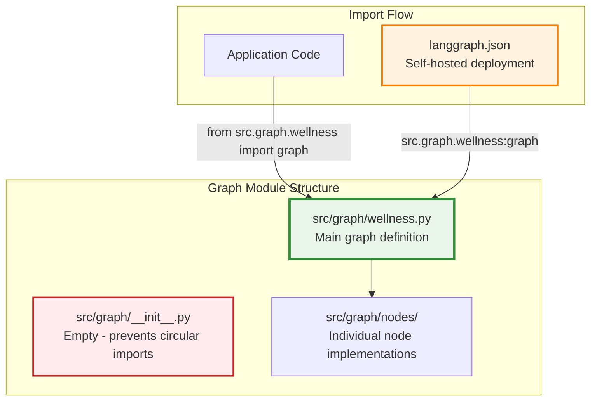
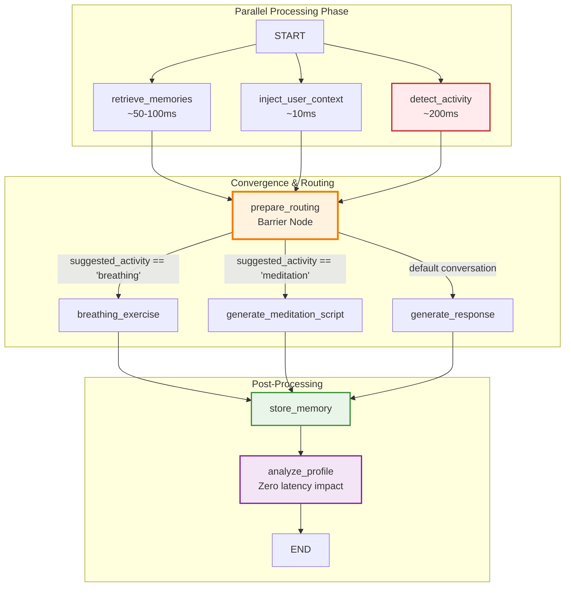
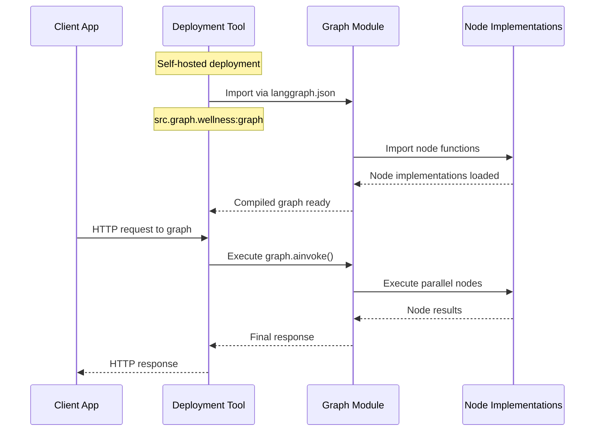
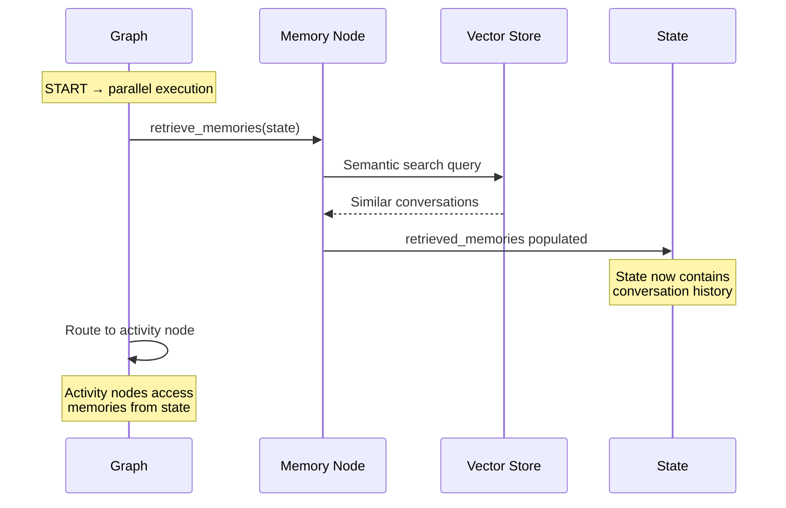

Looking at the provided code, I can see this is the `__init__.py` file for the graph module. Let me update the architecture documentation to include information about this module structure and import patterns.

---

sidebar_position: 1
title: Wellness Graph Architecture

---

# Wellness Graph Architecture

The `wellness.py` module defines Wbot's core conversation orchestration system using LangGraph. This is the main brain of the wellness chatbot, orchestrating parallel processing, activity detection, and memory-enhanced responses through a sophisticated state machine.

## High-Level Overview

The wellness graph serves as the **central orchestrator** for all wellness conversations by:

- **Orchestrating parallel processing** with memory retrieval, user context injection, and activity detection running simultaneously
- **Enabling intelligent routing** based on detected wellness activities (breathing, meditation, etc.)
- **Managing conversation state** through LangGraph's checkpointing system
- **Providing memory-enhanced responses** by retrieving relevant past conversations
- **Coordinating wellness interventions** like guided breathing exercises and personalized meditations

:::tip Performance Design
The graph uses a barrier pattern where parallel nodes converge before routing. Since memory retrieval (~50-100ms) runs in parallel with activity detection (~200ms), memory access adds zero additional latency to the conversation flow.
:::

## Module Structure & Import Patterns

The graph module follows a specific import pattern to avoid circular dependencies between the graph and its node implementations:

```python
# ❌ Don't import from __init__.py (empty to prevent circular imports)
from src.graph import graph  # This will fail

# ✅ Import directly from the wellness module
from src.graph.wellness import graph

# ✅ For production with persistence
from src.graph.wellness import get_compiled_graph
```

### Import Architecture



:::warning Circular Import Prevention
The `__init__.py` file is intentionally empty with `__all__ = []` to prevent circular imports between the graph definition and node implementations. Always import the graph directly from the `wellness` module.
:::

## Graph Architecture Flow



## Key Components & Relationships

### Graph Import Patterns

```python
# Development/Testing Usage
from src.graph.wellness import graph

async def handle_message(message: str, user_id: str):
    """Stateless graph execution for development."""
    result = await graph.ainvoke({
        "messages": [HumanMessage(content=message)],
        "user_id": user_id
    })
    return result

# Production Usage with Persistence
from src.graph.wellness import get_compiled_graph

async def handle_conversation(message: str, user_id: str, thread_id: str):
    """Production graph execution with state persistence."""
    compiled_graph = await get_compiled_graph()

    result = await compiled_graph.ainvoke(
        {"messages": [HumanMessage(content=message)], "user_id": user_id},
        config={"configurable": {"thread_id": thread_id}}
    )
    return result
```

### Self-Hosted Deployment Configuration

For self-hosted deployments using LangGraph Studio or deployment tools, the graph is accessed via the `langgraph.json` configuration:

```json
{
  "dependencies": ["./pyproject.toml"],
  "graphs": {
    "wellness_agent": "./src/graph/wellness.py:graph"
  },
  "env": ".env"
}
```

### Core Graph Builder

```python
def build_graph() -> StateGraph:
    """
    Constructs the wellness conversation graph with parallel execution and barrier.

    Design Principles:
    - Parallel fan-out minimizes latency
    - Barrier ensures all data available before routing
    - Single activity path prevents conflicts
    - Post-response analysis has zero user impact
    """

    builder = StateGraph(WellnessState)

    # Parallel nodes (run simultaneously)
    builder.add_node("retrieve_memories", retrieve_memories)
    builder.add_node("inject_user_context", inject_user_context)
    builder.add_node("detect_activity", detect_activity_intent)

    # Activity nodes (only ONE executes per request)
    builder.add_node("generate_response", generate_response)
    builder.add_node("breathing_exercise", run_breathing_exercise)
    builder.add_node("generate_meditation_script", run_generate_meditation_script)

    # Post-processing nodes
    builder.add_node("store_memory", store_memory_node)
    builder.add_node("analyze_profile", analyze_profile)
    builder.add_node("prepare_routing", prepare_routing)

    return builder
```

### Parallel Processing Nodes

The graph starts with three parallel paths that run simultaneously:

```python
# Memory Retrieval Node (~50-100ms)
async def retrieve_memories(state: WellnessState) -> dict:
    """
    Semantic search through past conversations.

    - Searches vector database for similar conversations
    - Returns top 5 most relevant memory objects
    - Provides context for personalized responses
    """
    query = get_latest_message(state)
    memories = await search_memories(
        query=query.content,
        user_id=state["user_context"]["user_id"],
        limit=5
    )

    return {"retrieved_memories": memories}

# User Context Injection (~10ms)
async def inject_user_context(state: WellnessState) -> dict:
    """
    Populates user profile and preferences.

    - Loads user authentication info
    - Fetches wellness preferences and goals
    - Sets timezone and communication style
    """
    user_data = await load_user_profile(state["user_id"])

    return {"user_context": user_data}

# Activity Detection (~200ms - slowest path)
async def detect_activity_intent(state: WellnessState) -> dict:
    """
    LLM-based classification of wellness activities.

    - Analyzes message for activity signals
    - Classifies as breathing, meditation, or conversation
    - Determines routing destination
    """
    message = get_latest_message(state)
    activity = await classify_wellness_intent(message.content)

    return {"suggested_activity": activity}
```

### Routing Logic

The routing system uses a barrier pattern for decision synchronization:

```python
async def prepare_routing(state: WellnessState) -> dict:
    """
    Barrier node ensuring all parallel paths complete.

    Critical synchronization point:
    - All three parallel nodes must finish
    - State contains memories, user context, and activity classification
    - No state modification - pure synchronization barrier
    """
    # Validation that all required data is present
    assert "retrieved_memories" in state
    assert "user_context" in state
    assert "suggested_activity" in state

    return {}  # No state changes

def route_activity(state: WellnessState) -> str:
    """
    Conditional routing based on detected activity type.

    Routing Decision Tree:
    - breathing → breathing_exercise (interactive HITL)
    - meditation → generate_meditation_script (voice selection + script)
    - journaling → journaling_prompt (future implementation)
    - default → generate_response (normal conversation)
    """
    activity = state.get("suggested_activity")

    activity_routes = {
        "breathing": "breathing_exercise",
        "meditation": "generate_meditation_script",
        "journaling": "journaling_prompt",  # Future feature
    }

    return activity_routes.get(activity, "generate_response")
```

## Integration Points

### Deployment Integration



### Memory System Integration



### Checkpointing Integration

```python
# Self-hosted deployment with persistence
async def get_compiled_graph() -> CompiledStateGraph:
    """
    Production graph with PostgreSQL checkpointing.

    Features:
    - Automatic state persistence after each node
    - Conversation resumption across sessions
    - Idempotent checkpoint table initialization
    - Connection pooling for performance
    """

    global _compiled_graph_with_checkpointer

    if _compiled_graph_with_checkpointer is None:
        # Initialize checkpoint storage
        await setup_checkpointer()

        # Get singleton checkpointer instance
        checkpointer = await get_checkpointer()

        # Compile with persistence
        _compiled_graph_with_checkpointer = build_graph().compile(
            checkpointer=checkpointer
        )

    return _compiled_graph_with_checkpointer

# Usage in production
async def handle_conversation(user_id: str, message: str, thread_id: str):
    """Production conversation handler with state persistence."""

    graph = await get_compiled_graph()

    # State automatically restored and saved
    result = await graph.ainvoke(
        {"messages": [HumanMessage(content=message)]},
        config={"configurable": {"thread_id": thread_id}}
    )

    return result
```

## Configuration Options

### Module Import Configuration

```python
# Environment-specific graph imports
import os
from typing import Union, TYPE_CHECKING

if TYPE_CHECKING:
    from langgraph.graph.state import CompiledStateGraph
    from langgraph.graph import StateGraph

def get_graph() -> Union["StateGraph", "CompiledStateGraph"]:
    """
    Get appropriate graph instance based on environment.

    - Development: Stateless graph for testing
    - Production: Compiled graph with checkpointer
    """

    if os.getenv("ENVIRONMENT") == "production":
        from src.graph.wellness import get_compiled_graph
        return get_compiled_graph()
    else:
        from src.graph.wellness import graph
        return graph
```

### Deployment Configuration

```python
# langgraph.json configuration options
LANGGRAPH_CONFIG = {
    "dependencies": ["./pyproject.toml"],
    "graphs": {
        "wellness_agent": "./src/graph/wellness.py:graph"  # Direct import path
    },
    "env": ".env",
    "dockerfile": "Dockerfile",
    "build_args": {
        "PYTHON_VERSION": "3.11"
    }
}

# Alternative for checkpointed deployment
LANGGRAPH_CONFIG_PERSISTENT = {
    "dependencies": ["./pyproject.toml"],
    "graphs": {
        "wellness_agent": "./src/graph/wellness.py:get_compiled_graph"  # Persistent version
    },
    "env": ".env"
}
```

### Graph Compilation Modes

```python
# Stateless mode (development/testing)
graph_stateless = build_graph().compile()

# Checkpointed mode (production)
graph_production = build_graph().compile(
    checkpointer=AsyncPostgresSaver.from_conn_string(DATABASE_URL)
)

# Import validation
def validate_graph_import():
    """Validate that graph can be imported correctly."""
    try:
        from src.graph.wellness import graph
        assert graph is not None
        print("✅ Graph import successful")

        # Test compilation
        compiled = graph.compile()
        print("✅ Graph compilation successful")

    except ImportError as e:
        print(f"❌ Graph import failed: {e}")
        raise
    except Exception as e:
        print(f"❌ Graph validation failed: {e}")
        raise
```

:::info Development vs Production

- **Development**: Import `graph` directly for stateless testing
- **Production**: Use `get_compiled_graph()` for persistence and resumable conversations
- **Self-hosted**: Configure `langgraph.json` to point to `src.graph.wellness:graph`
  :::

:::warning Production Considerations

- Always use `get_compiled_graph()` for production deployments with state persistence
- Monitor node execution times, especially `detect_activity` (~200ms) which is the critical path
- Configure appropriate timeouts for interactive activities to prevent hanging sessions
- Set up checkpoint table cleanup to manage storage growth over time
- Ensure proper error handling for circular import issues during deployment
  :::
