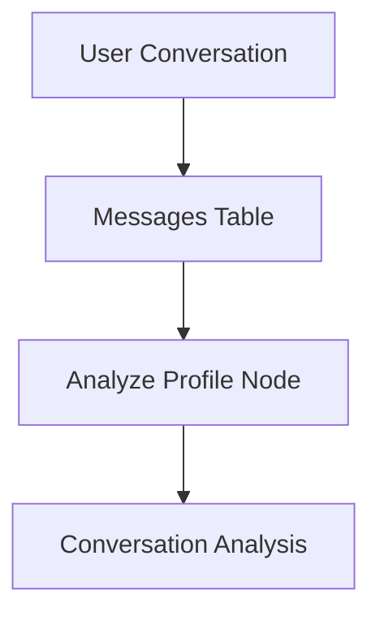

# Database Schema

This document covers the complete database schema for the Wbot wellness chatbot, including user profiling, conversation analysis, and wellness tracking systems.

## Overview

The Wbot database is built on Supabase (PostgreSQL) and uses Row Level Security (RLS) for data isolation. The schema supports:

- **User Management**: Profiles extending Supabase Auth
- **Conversation System**: Messages with AI-powered analysis
- **User Profiling**: Dynamic wellness profiles that evolve with interactions
- **Emotional Tracking**: Time-series emotional data and mood tracking
- **Activity Analytics**: Effectiveness tracking for wellness activities
- **Semantic Memory**: Vector embeddings for context retrieval

## Core Tables

### profiles

Extends Supabase Auth users with application-specific data and wellness preferences.

```sql
CREATE TABLE profiles (
  id UUID PRIMARY KEY REFERENCES auth.users(id) ON DELETE CASCADE,
  display_name TEXT,
  preferences JSONB DEFAULT '{}',
  created_at TIMESTAMPTZ DEFAULT NOW(),
  updated_at TIMESTAMPTZ DEFAULT NOW()
);
```

**Purpose**: Stores user profile information, onboarding preferences, and static wellness settings.

**Key Features**:

- Auto-created via trigger when users sign up
- JSONB preferences store onboarding responses and user settings
- Base for 1:1 relationship with `user_wellness_profiles`

**Preferences Structure**:

```json
{
  "primary_goal": "stress_anxiety",
  "communication_style": "warm",
  "wellness_experience": "beginner",
  "concerns": ["work_stress", "sleep"],
  "preferred_activities": ["breathing", "meditation"]
}
```

**Common Queries**:

```sql
-- Get user profile with preferences
SELECT id, display_name, preferences, created_at
FROM profiles
WHERE id = auth.uid();

-- Update communication preferences
UPDATE profiles
SET preferences = preferences || '{"communication_style": "direct"}'::jsonb
WHERE id = auth.uid();
```

### user_wellness_profiles

Dynamic wellness profiles that evolve based on user interactions and AI analysis.

```sql
CREATE TABLE user_wellness_profiles (
  user_id UUID PRIMARY KEY REFERENCES profiles(id) ON DELETE CASCADE,

  -- Current emotional baseline
  emotional_baseline TEXT CHECK (emotional_baseline IN (
    'very_positive', 'positive', 'neutral', 'stressed', 'anxious', 'struggling'
  )),
  emotional_baseline_updated_at TIMESTAMPTZ,

  -- Engagement patterns
  engagement_trend TEXT CHECK (engagement_trend IN (
    'increasing', 'stable', 'decreasing', 'sporadic'
  )),
  typical_session_length_seconds INTEGER,
  preferred_time_of_day TEXT CHECK (preferred_time_of_day IN (
    'morning', 'afternoon', 'evening', 'night', 'varies'
  )),

  -- Learned preferences (may differ from onboarding)
  actual_communication_style TEXT,
  responds_well_to TEXT[] DEFAULT '{}',

  -- Current focus areas
  current_primary_concern TEXT,
  recurring_topics TEXT[] DEFAULT '{}',
  recurring_triggers TEXT[] DEFAULT '{}',

  -- Progress tracking
  goals_progress JSONB DEFAULT '{}'::JSONB,
  improvements_noted TEXT[] DEFAULT '{}',
  challenges_persisting TEXT[] DEFAULT '{}',

  -- Metrics
  total_conversations INTEGER DEFAULT 0,
  total_activities_completed INTEGER DEFAULT 0,
  total_engagement_minutes INTEGER DEFAULT 0,

  created_at TIMESTAMPTZ DEFAULT NOW(),
  updated_at TIMESTAMPTZ DEFAULT NOW()
);
```

**Purpose**: Maintains a dynamic, AI-updated profile of each user's wellness journey, preferences, and progress.

**Key Features**:

- **1:1 relationship** with profiles (user_id is both PK and FK)
- **Auto-created** when profiles are inserted via trigger
- **AI-updated** by the `analyze_profile` workflow node
- **Progress tracking** for wellness goals with structured JSON

**Goals Progress Structure**:

```json
{
  "stress_anxiety": {
    "score": 0.6,
    "trend": "improving",
    "notes": ["practicing breathing regularly", "better sleep"]
  },
  "self_confidence": {
    "score": 0.3,
    "trend": "stable",
    "notes": ["still struggles with work presentations"]
  }
}
```

**Common Queries**:

```sql
-- Get complete user wellness context
SELECT
  p.preferences,
  wp.*
FROM profiles p
JOIN user_wellness_profiles wp ON p.id = wp.user_id
WHERE p.id = auth.uid();

-- Update emotional baseline after analysis
UPDATE user_wellness_profiles
SET
  emotional_baseline = 'anxious',
  emotional_baseline_updated_at = NOW(),
  recurring_triggers = recurring_triggers || ARRAY['work_deadlines']
WHERE user_id = auth.uid();

-- Track engagement metrics
UPDATE user_wellness_profiles
SET
  total_conversations = total_conversations + 1,
  total_engagement_minutes = total_engagement_minutes + $1,
  last_interaction_at = NOW()
WHERE user_id = auth.uid();
```

### conversations

Organizes related messages into conversation threads with AI analysis triggers.

```sql
CREATE TABLE conversations (
  id UUID PRIMARY KEY DEFAULT gen_random_uuid(),
  user_id UUID NOT NULL REFERENCES profiles(id) ON DELETE CASCADE,
  title TEXT NOT NULL,
  metadata JSONB DEFAULT '{}',
  created_at TIMESTAMPTZ DEFAULT NOW(),
  updated_at TIMESTAMPTZ DEFAULT NOW()
);
```

**Purpose**: Groups messages into coherent conversation sessions for context and analysis.

**Common Queries**:

```sql
-- Get recent conversations with analysis status
SELECT
  c.id,
  c.title,
  c.updated_at,
  COUNT(m.id) as message_count,
  MAX(ca.created_at) as last_analyzed_at
FROM conversations c
LEFT JOIN messages m ON c.id = m.conversation_id
LEFT JOIN conversation_analyses ca ON c.id = ca.conversation_id
WHERE c.user_id = auth.uid()
GROUP BY c.id, c.title, c.updated_at
ORDER BY c.updated_at DESC;
```

### messages

Individual messages within conversations, triggering AI analysis when appropriate.

```sql
CREATE TABLE messages (
  id UUID PRIMARY KEY DEFAULT gen_random_uuid(),
  conversation_id UUID NOT NULL REFERENCES conversations(id) ON DELETE CASCADE,
  role TEXT NOT NULL CHECK (role IN ('user', 'assistant', 'system')),
  content TEXT NOT NULL,
  metadata JSONB DEFAULT '{}',
  created_at TIMESTAMPTZ DEFAULT NOW()
);
```

**Purpose**: Stores conversation content and triggers analysis workflows for user profiling.

### conversation_analyses

AI-generated analysis of conversations with semantic search capabilities.

```sql
CREATE TABLE conversation_analyses (
  id UUID PRIMARY KEY DEFAULT gen_random_uuid(),
  user_id UUID NOT NULL REFERENCES profiles(id) ON DELETE CASCADE,
  conversation_id UUID NOT NULL REFERENCES conversations(id) ON DELETE CASCADE,
  analyzed_up_to_message_id UUID REFERENCES messages(id) ON DELETE SET NULL,

  -- Emotional analysis
  primary_emotion TEXT NOT NULL,
  emotion_intensity REAL CHECK (emotion_intensity >= 0 AND emotion_intensity <= 1),
  emotional_valence REAL CHECK (emotional_valence >= -1 AND emotional_valence <= 1),
  emotional_trajectory TEXT CHECK (emotional_trajectory IN (
    'improving', 'stable', 'declining', 'fluctuating'
  )),

  -- Content analysis
  topics_discussed TEXT[] DEFAULT '{}',
  concerns_raised TEXT[] DEFAULT '{}',
  positive_aspects TEXT[] DEFAULT '{}',
  coping_strategies_mentioned TEXT[] DEFAULT '{}',
  detected_triggers TEXT[] DEFAULT '{}',

  -- Session insights
  conversation_type TEXT CHECK (conversation_type IN (
    'venting', 'seeking_advice', 'checking_in', 'doing_activity',
    'crisis', 'celebration', 'general_chat'
  )),
  engagement_level TEXT CHECK (engagement_level IN ('high', 'medium', 'low')),
  session_quality TEXT CHECK (session_quality IN ('productive', 'neutral', 'difficult')),

  -- AI insights
  follow_up_topics TEXT[] DEFAULT '{}',
  suggested_activities TEXT[] DEFAULT '{}',
  analysis_json JSONB DEFAULT '{}'::JSONB,

  -- Semantic search
  analysis_summary TEXT,
  embedding halfvec(768),

  created_at TIMESTAMPTZ DEFAULT NOW()
);
```

**Purpose**: Stores comprehensive AI analysis of each conversation for user profiling and semantic search.

**Key Features**:

- **Emotional Analysis**: Tracks emotional states and trajectories
- **Content Extraction**: Identifies topics, concerns, and coping strategies
- **Vector Embeddings**: Enables semantic search across conversation history
- **Actionable Insights**: Provides follow-up topics and activity suggestions

:::info Emotional Metrics

- **Intensity**: 0.0 (barely noticeable) to 1.0 (overwhelming)
- **Valence**: -1.0 (very negative) to 1.0 (very positive)
- **Trajectory**: How emotions changed during the conversation
  :::

**Common Queries**:

```sql
-- Get recent analyses for trend tracking
SELECT
  primary_emotion,
  emotion_intensity,
  emotional_valence,
  topics_discussed,
  concerns_raised,
  created_at
FROM conversation_analyses
WHERE user_id = auth.uid()
ORDER BY created_at DESC
LIMIT 10;

-- Find similar past conversations semantically
SELECT
  ca.analysis_summary,
  ca.topics_discussed,
  ca.concerns_raised,
  1 - (ca.embedding <=> $2) as similarity
FROM conversation_analyses ca
WHERE ca.user_id = $1
  AND 1 - (ca.embedding <=> $2) > 0.5
ORDER BY ca.embedding <=> $2
LIMIT 5;
```

### emotional_snapshots

Time-series tracking of emotional states from conversations and activities.

```sql
CREATE TABLE emotional_snapshots (
  id UUID PRIMARY KEY DEFAULT gen_random_uuid(),
  user_id UUID NOT NULL REFERENCES profiles(id) ON DELETE CASCADE,

  -- Context links
  conversation_id UUID REFERENCES conversations(id) ON DELETE SET NULL,
  message_id UUID REFERENCES messages(id) ON DELETE SET NULL,
  activity_type TEXT CHECK (activity_type IN ('breathing', 'meditation', 'journaling', 'grounding')),
  activity_session_id UUID,

  -- Emotional state
  primary_emotion TEXT NOT NULL,
  secondary_emotion TEXT,
  intensity REAL CHECK (intensity >= 0 AND intensity <= 1),
  valence REAL CHECK (valence >= -1 AND valence <= 1),
  arousal REAL CHECK (arousal >= 0 AND arousal <= 1),

  -- Standardized mood rating (1-5)
  mood_rating SMALLINT CHECK (mood_rating BETWEEN 1 AND 5),

  -- Context
  detected_triggers TEXT[] DEFAULT '{}',
  source TEXT NOT NULL CHECK (source IN (
    'conversation', 'activity_before', 'activity_after', 'check_in', 'inferred'
  )),
  confidence REAL CHECK (confidence >= 0 AND confidence <= 1),

  created_at TIMESTAMPTZ DEFAULT NOW()
);
```

**Purpose**: Creates a time-series log of emotional states for pattern analysis and trend tracking.

**Key Features**:

- **Standardized 1-5 mood scale** across all activities
- **Multiple sources**: Conversations, activities, check-ins
- **Psychological model**: Intensity, valence, and arousal dimensions
- **Time-series optimized** with proper indexing

**Mood Scale Standards**:

- **1**: Very low/terrible
- **2**: Low/bad
- **3**: Neutral/okay
- **4**: Good/well
- **5**: Great/excellent

**Common Queries**:

```sql
-- Get emotional trend over time
SELECT
  DATE_TRUNC('day', created_at) as day,
  AVG(mood_rating) as avg_mood,
  AVG(valence) as avg_valence,
  COUNT(*) as snapshots_count
FROM emotional_snapshots
WHERE user_id = auth.uid()
  AND created_at >= NOW() - INTERVAL '30 days'
GROUP BY DATE_TRUNC('day', created_at)
ORDER BY day;

-- Identify recurring triggers
SELECT
  unnest(detected_triggers) as trigger,
  COUNT(*) as frequency,
  AVG(valence) as avg_impact
FROM emotional_snapshots
WHERE user_id = auth.uid()
  AND array_length(detected_triggers, 1) > 0
GROUP BY trigger
ORDER BY frequency DESC;
```

### activity_effectiveness

Aggregated effectiveness metrics for wellness activities per user.

```sql
CREATE TABLE activity_effectiveness (
  id UUID PRIMARY KEY DEFAULT gen_random_uuid(),
  user_id UUID NOT NULL REFERENCES profiles(id) ON DELETE CASCADE,

  -- Activity identification
  activity_type TEXT NOT NULL CHECK (activity_type IN (
    'breathing', 'meditation', 'journaling', 'grounding'
  )),
  technique TEXT, -- e.g., '4_7_8', 'body_scan', 'loving_kindness'

  -- Engagement metrics
  times_started INTEGER DEFAULT 0,
  times_completed INTEGER DEFAULT 0,
  total_duration_seconds INTEGER DEFAULT 0,
  average_duration_seconds INTEGER,

  -- Effectiveness from mood tracking
  mood_improvements INTEGER DEFAULT 0,
  mood_no_change INTEGER DEFAULT 0,
  mood_declines INTEGER DEFAULT 0,
  average_mood_change REAL DEFAULT 0, -- -4 to +4 scale

  -- Context analysis
  effective_contexts TEXT[] DEFAULT '{}',

  -- Composite score (0-100)
  effectiveness_score REAL CHECK (effectiveness_score >= 0 AND effectiveness_score <= 100),

  -- Recommendations
  is_recommended BOOLEAN DEFAULT FALSE,
  recommendation_reason TEXT,

  first_used_at TIMESTAMPTZ,
  last_used_at TIMESTAMPTZ,
  created_at TIMESTAMPTZ DEFAULT NOW(),
  updated_at TIMESTAMPTZ DEFAULT NOW(),

  UNIQUE(user_id, activity_type, technique)
);
```

**Purpose**: Tracks which wellness activities work best for each user based on completion rates and mood improvements.

**Key Features**:

- **Composite effectiveness scoring** combining completion and mood data
- **Technique-specific tracking** (e.g., different breathing techniques)
- **Recommendation engine** identifies most effective activities
- **Context awareness** tracks when techniques work best

**Effectiveness Score Formula**:

```
score = completion_rate * 40 + mood_improvement_rate * 40 + frequency_bonus * 20
```

**Common Queries**:

```sql
-- Get user's most effective activities
SELECT
  activity_type,
  technique,
  effectiveness_score,
  average_mood_change,
  times_completed,
  recommendation_reason
FROM activity_effectiveness
WHERE user_id = auth.uid()
  AND is_recommended = true
ORDER BY effectiveness_score DESC NULLS LAST;

-- Update effectiveness after session
INSERT INTO activity_effectiveness (
  user_id, activity_type, technique,
  times_completed, mood_improvements, average_mood_change,
  last_used_at
) VALUES ($1, $2, $3, 1, 1, $4, NOW())
ON CONFLICT (user_id, activity_type, technique)
DO UPDATE SET
  times_completed = activity_effectiveness.times_completed + 1,
  mood_improvements = activity_effectiveness.mood_improvements + 1,
  average_mood_change = (activity_effectiveness.average_mood_change * activity_effectiveness.times_completed + $4) / (activity_effectiveness.times_completed + 1),
  last_used_at = NOW(),
  updated_at = NOW();
```

## User Profiling System Architecture

The user profiling system creates dynamic, evolving profiles through AI analysis:


