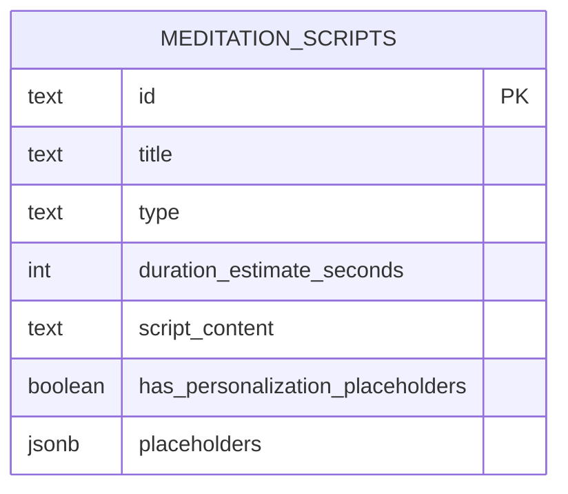

Based on the SQL migration for `meditation_scripts`, I'll generate comprehensive Docusaurus documentation:

````markdown
---
sidebar_position: 3
title: Meditation Scripts Database
description: Database schema for storing personalized meditation scripts
---

# Meditation Scripts Table

## Overview

The `meditation_scripts` table stores structured meditation script templates that support personalization through dynamic placeholders.

## Table Schema

### Columns

| Column                             | Type        | Constraints   | Description                                                    |
| ---------------------------------- | ----------- | ------------- | -------------------------------------------------------------- |
| `id`                               | TEXT        | PRIMARY KEY   | Unique identifier for the meditation script                    |
| `title`                            | TEXT        | NOT NULL      | Human-readable title of the script                             |
| `type`                             | TEXT        | NOT NULL      | Categorization of meditation type (e.g., breathing, body_scan) |
| `duration_estimate_seconds`        | INTEGER     | NOT NULL      | Estimated duration of the meditation script                    |
| `script_content`                   | TEXT        | NOT NULL      | Full text of the meditation script                             |
| `has_personalization_placeholders` | BOOLEAN     | DEFAULT false | Indicates if script supports personalization                   |
| `placeholders`                     | JSONB       | DEFAULT '{}'  | JSON object defining available placeholders                    |
| `language`                         | TEXT        | DEFAULT 'en'  | Language of the meditation script                              |
| `is_active`                        | BOOLEAN     | DEFAULT true  | Whether script is currently available                          |
| `created_at`                       | TIMESTAMPTZ | DEFAULT NOW() | Timestamp of script creation                                   |
| `updated_at`                       | TIMESTAMPTZ | DEFAULT NOW() | Timestamp of last update                                       |

## Entity Relationship Diagram


````

## Row Level Security (RLS)

:::info Security Policy

- Only authenticated users can read active meditation scripts
- Read-only access for all authenticated users
  :::

```sql
CREATE POLICY "Allow authenticated users to read meditation scripts"
  ON meditation_scripts
  FOR SELECT
  TO authenticated
  USING (is_active = true);
```

## Indexing

An index is created on the `type` column to optimize querying:

```sql
CREATE INDEX idx_meditation_scripts_type ON meditation_scripts(type);
```

## Timestamp Management

An auto-update trigger ensures `updated_at` is always current:

```sql
CREATE TRIGGER update_meditation_scripts_updated_at
  BEFORE UPDATE ON meditation_scripts
  FOR EACH ROW
  EXECUTE FUNCTION update_updated_at_column();
```

## Seeded Scripts

The migration includes five pre-configured meditation scripts:

1. Breathing Meditation (5 min)
2. Body Scan Meditation (10 min)
3. Loving Kindness Meditation (8 min)
4. Sleep Meditation (15 min)
5. Anxiety Relief Meditation (7 min)

## Common Queries

### Fetch Active Scripts by Type

```sql
SELECT * FROM meditation_scripts
WHERE type = 'breathing_focus'
AND is_active = true;
```

### Count Scripts with Personalization

```sql
SELECT COUNT(*) as personalizable_scripts
FROM meditation_scripts
WHERE has_personalization_placeholders = true;
```

## Personalization Example

Scripts support dynamic placeholders like `{{USER_NAME}}`:

```javascript
function personalizeScript(script, userData) {
  return script.replace(/{{USER_NAME}}/g, userData.name);
}
```

## Migration Details

- **Version**: 20250108000001
- **Purpose**: Create meditation script repository
- **Created By**: Wbot Team

:::tip Best Practices

- Maintain script diversity
- Regularly update and add new scripts
- Validate placeholder configurations
  :::

## Related Documentation

- [AI Meditation Guide](/ai/meditation) - How meditation scripts are used
- [Web Meditation Components](/web/meditation) - Frontend meditation UI

```

This documentation provides a comprehensive overview of the `meditation_scripts` table, following Docusaurus conventions. It includes:

1. Detailed table schema
2. Mermaid ERD
3. Security policies
4. Indexing strategies
5. Common query examples
6. Personalization mechanism
7. Migration metadata

Would you like me to elaborate on or modify any section?
```
