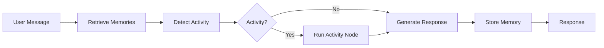

# Wbot Developer Guide

**Wbot** is an AI wellness chatbot built as a monorepo with a React frontend, Python AI backend, and Supabase database. This documentation covers the architecture, API integration, and development patterns.

## Quick Start

```bash
# Install dependencies
pnpm install

# Start all services (web, AI, database, Redis)
pnpm dev:all

# Or start individual services
pnpm dev:web    # Frontend only (port 5173)
pnpm dev:ai     # AI backend only (LangGraph Studio)

# Open http://localhost:5173
```

## Tech Stack

| Layer          | Technology                | Purpose                       |
| -------------- | ------------------------- | ----------------------------- |
| **Frontend**   | TanStack Start + React 19 | File-based routing, SSR, Vite |
| **AI Backend** | LangGraph + LangChain     | Stateful AI workflows         |
| **LLM**        | Claude (Anthropic)        | Primary language model        |
| **Database**   | Supabase (PostgreSQL)     | Auth, data storage, RLS       |
| **Cache**      | Redis                     | Embedding cache for memory    |

## Project Structure

```
wbot/
├── apps/
│   ├── web/              # TanStack Start frontend
│   │   ├── src/
│   │   │   ├── routes/   # File-based routing
│   │   │   ├── components/
│   │   │   └── lib/      # Utilities & clients
│   │   └── vite.config.ts
│   │
│   └── ai/               # Python LangGraph backend
│       ├── src/
│       │   ├── graph/    # LangGraph definitions
│       │   ├── nodes/    # Individual AI nodes
│       │   └── memory/   # Semantic memory system
│       └── pyproject.toml
│
├── packages/
│   ├── shared/           # Shared TypeScript types
│   └── storybook/        # Component stories
│
├── docs/                 # 📖 Documentation + Docusaurus config
│   ├── architecture/     # System design
│   ├── web/              # Frontend docs
│   ├── ai/               # Backend docs
│   ├── database/         # Database docs
│   └── tooling/          # Development tools
│
└── supabase/
    └── migrations/       # SQL migration files
```

## Core Concepts

### The Chat is the Interface

Wbot treats the chat as the **primary interface**. Interactive activities (like breathing exercises) render **inside the chat**, not as separate pages. This creates a seamless, guided experience.

### AI Graph Architecture

The backend uses LangGraph to orchestrate AI responses through a graph of nodes:



### Semantic Memory

Wbot remembers important information from conversations using vector embeddings. This enables personalized, context-aware responses.

## Development Workflow

1. **Start the stack**: `pnpm dev:all`
2. **Make changes**: Edit files in `apps/web` or `apps/ai`
3. **Hot reload**: Both frontend and backend hot-reload on save
4. **Test**: Open http://localhost:5173 in your browser

## Next Steps

- [Architecture Overview](./architecture/overview.md) - Deep dive into system design
- [LangGraph Guide](./ai/langgraph.md) - AI backend implementation
- [Database Schema](./database/schema.md) - Data model documentation
- [ROADMAP](./ROADMAP.md) - Development progress and next steps
