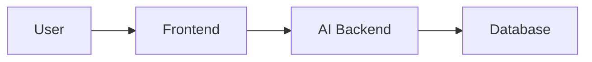
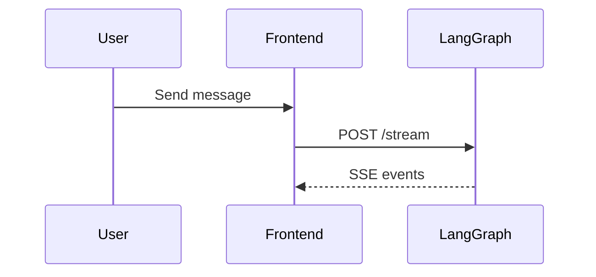

# Docusaurus Documentation Guide

This project uses **Docusaurus 3.9** for its developer documentation. The Docusaurus configuration and all documentation files are located in the `docs/` folder at the project root. Docusaurus is a static site generator optimized for technical documentation with built-in support for MDX, versioning, and search.

## Quick Start

```bash
# Start the docs dev server (port 3001)
pnpm docs

# Build for production
pnpm docs:build

# Preview production build
cd docs && pnpm serve

# Clear cache (useful for troubleshooting)
cd docs && pnpm clear
```

Open http://localhost:3001 to view the documentation site.

## Project Structure

```
docs/
├── intro.md                 # Landing page (slug: /)
├── README.md                # Documentation index
├── ROADMAP.md               # Development roadmap
├── architecture/            # System design docs
│   ├── overview.md
│   └── data-flow.md
├── web/                     # Frontend docs
│   ├── authentication.md
│   ├── ai-client.md
│   ├── activities.md
│   └── supabase.md
├── ai/                      # Backend docs
│   ├── langgraph.md
│   ├── logging.md
│   └── memory.md
├── database/                # Database docs
│   ├── schema.md
│   └── migrations.md
├── tooling/                 # Development tools
│   ├── storybook.md
│   ├── docusaurus.md
│   └── testing.md
├── src/
│   └── css/
│       └── custom.css       # Theme customizations
├── docusaurus.config.ts     # Main configuration
├── sidebars.ts              # Navigation sidebar config
├── tsconfig.json
└── package.json
```

## Writing Documentation

### Frontmatter

Every markdown file should start with YAML frontmatter:

```markdown
---
sidebar_position: 1 # Order in sidebar (lower = higher)
sidebar_label: 'Custom Label' # Override filename in sidebar
slug: /custom-url # Custom URL path
title: 'Page Title' # HTML <title> and heading
description: 'SEO description'
---

# Your Content Here
```

### Common Frontmatter Options

| Option                   | Description                   | Example             |
| ------------------------ | ----------------------------- | ------------------- |
| `sidebar_position`       | Order in sidebar (1, 2, 3...) | `1`                 |
| `sidebar_label`          | Display name in sidebar       | `"Getting Started"` |
| `slug`                   | URL path                      | `/intro` or `/`     |
| `title`                  | Page title                    | `"API Reference"`   |
| `description`            | Meta description for SEO      | `"Learn how to..."` |
| `hide_title`             | Hide the auto-generated title | `true`              |
| `hide_table_of_contents` | Hide the right-side TOC       | `true`              |

## Markdown Features

### Admonitions

Use admonitions to highlight important information:

```markdown
:::note
This is a note - general information.
:::

:::tip
This is a tip - helpful suggestions.
:::

:::info
This is info - contextual details.
:::

:::warning
This is a warning - proceed with caution.
:::

:::danger
This is danger - critical information!
:::
```

Custom titles:

```markdown
:::tip[Pro Tip]
Custom title for your admonition.
:::
```

### Code Blocks

Basic syntax highlighting (Python, TypeScript, SQL, Bash, JSON are configured):

````markdown
```python
def hello_world():
    print("Hello, Wbot!")
```
````

Add a title to code blocks:

````markdown
```typescript title="apps/web/src/lib/ai-client.ts"
export async function streamMessage(conversationId: string, content: string) {
  // Implementation
}
```
````

Highlight specific lines:

````markdown
```python {2,4-5}
def process_message(message):
    memories = retrieve_memories(message)  # highlighted
    activity = detect_activity(message)
    response = generate_response(message, memories)  # highlighted
    store_memory(message, response)  # highlighted
    return response
```
````

### Mermaid Diagrams

This project has Mermaid enabled. Create diagrams directly in markdown:

````markdown

````

Sequence diagrams:

````markdown

````

### Tables

Standard markdown tables:

```markdown
| Feature | Status | Notes               |
| ------- | ------ | ------------------- |
| Chat    | ✅     | Real-time streaming |
| Memory  | ✅     | Vector embeddings   |
| Voice   | 🚧     | In development      |
```

### Tabs (Multi-language Examples)

For code examples in multiple languages, import the Tabs components:

````mdx
import Tabs from '@theme/Tabs';
import TabItem from '@theme/TabItem';

<Tabs>
  <TabItem value="ts" label="TypeScript" default>
    ```typescript const response = await aiClient.streamMessage(id, content); ```
  </TabItem>
  <TabItem value="python" label="Python">
    ```python response = await ai_client.stream_message(id, content) ```
  </TabItem>
</Tabs>
````

### Links

Internal links (relative paths):

```markdown
See the [Architecture Overview](/architecture/overview) for details.

Check out [LangGraph integration](./api-guides/langgraph.md).
```

External links:

```markdown
[Docusaurus Documentation](https://docusaurus.io)
```

### Images

Place images in `static/img/` and reference them:

```markdown

```

## Sidebar Configuration

The sidebar is configured in `sidebars.ts`:

```typescript
const sidebars: SidebarsConfig = {
  docsSidebar: [
    'intro', // References docs/intro.md
    {
      type: 'category',
      label: 'Architecture',
      items: ['architecture/overview', 'architecture/data-flow'],
      collapsed: false, // Expanded by default
    },
    {
      type: 'category',
      label: 'Database',
      items: ['database/schema', 'database/migrations'],
      collapsed: true, // Collapsed by default
    },
  ],
};
```

### Adding a New Section

1. Create markdown files in `docs/`:

```bash
mkdir -p docs/new-section
touch docs/new-section/getting-started.md
touch docs/new-section/advanced.md
```

1. Add frontmatter to each file:

```markdown
---
sidebar_position: 1
---

# Getting Started with New Feature
```

1. Update `sidebars.ts`:

```typescript
{
  type: 'category',
  label: 'New Section',
  items: ['new-section/getting-started', 'new-section/advanced'],
  collapsed: true,
}
```

## Theme Customization

Custom CSS is in `docs/src/css/custom.css`. The theme uses Wbot's wellness color palette:

```css
:root {
  --ifm-color-primary: #4a9d9a; /* Teal primary */
}

[data-theme='dark'] {
  --ifm-color-primary: #5eb0ad; /* Lighter teal for dark mode */
}
```

### Key CSS Variables

| Variable                      | Purpose             |
| ----------------------------- | ------------------- |
| `--ifm-color-primary`         | Primary brand color |
| `--ifm-font-family-base`      | Body text font      |
| `--ifm-font-family-monospace` | Code block font     |
| `--ifm-code-font-size`        | Code font size      |

## Configuration Reference

The main config is in `docs/docusaurus.config.ts`:

```typescript
const config: Config = {
  title: 'Wbot Documentation',
  tagline: 'AI Wellness Chatbot Developer Guide',

  // Docs served at root (/) instead of /docs
  presets: [
    [
      'classic',
      {
        docs: {
          routeBasePath: '/',
          sidebarPath: './sidebars.ts',
        },
        blog: false,
      },
    ],
  ],

  // Mermaid diagrams enabled
  markdown: { mermaid: true },
  themes: ['@docusaurus/theme-mermaid'],

  // Syntax highlighting languages
  themeConfig: {
    prism: {
      additionalLanguages: ['python', 'bash', 'sql', 'json'],
    },
  },
};
```

## Best Practices

### 1. Write for Developers

- Lead with code examples
- Show real file paths from the codebase
- Include copy-pasteable commands

### 2. Use Consistent Structure

```markdown
# Page Title

Brief introduction (1-2 sentences).

## Overview/Context

Explain the "why" before the "how".

## Implementation

Code examples with explanations.

## Common Issues

Troubleshooting tips.

## Next Steps

Links to related documentation.
```

### 3. Keep Documentation Updated

- Update docs when code changes
- Reference actual file paths: `apps/web/src/lib/ai-client.ts`
- Use Mermaid for diagrams (easier to update than images)

### 4. Cross-Reference

Link to related pages to help readers navigate:

```markdown
For authentication details, see [Authentication Guide](/integration/authentication).
```

## Troubleshooting

### Hot Reload Not Working

```bash
# Clear the cache
cd docs && pnpm clear

# Restart dev server
pnpm docs
```

### Build Errors

Check for broken links (configured to throw on broken links):

```bash
# Build will fail on broken internal links
pnpm docs:build
```

### Mermaid Diagrams Not Rendering

Ensure the theme is properly configured in `docs/docusaurus.config.ts`:

```typescript
markdown: { mermaid: true },
themes: ['@docusaurus/theme-mermaid'],
```

## Deployment

The docs can be deployed to any static hosting:

```bash
# Build static files
pnpm docs:build

# Output is in docs/build/
```

Common deployment targets:

- **Vercel**: Auto-deploys from git
- **GitHub Pages**: Use `docusaurus deploy`
- **Netlify**: Connect to repository

## Resources

- [Docusaurus Documentation](https://docusaurus.io/docs)
- [MDX Documentation](https://mdxjs.com/)
- [Mermaid Diagram Syntax](https://mermaid.js.org/intro/)
- [Prism Supported Languages](https://prismjs.com/#supported-languages)
