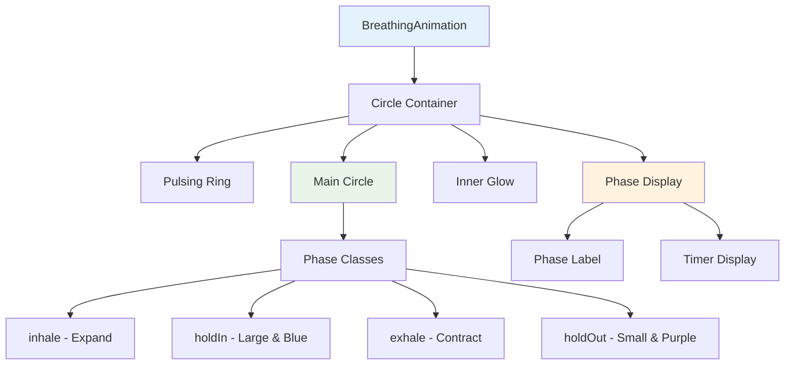

# BreathingAnimation Component

The `BreathingAnimation` component provides a visual representation of breathing exercises within the Wbot wellness chatbot interface. It displays an animated circle that expands and contracts in sync with breathing phases, accompanied by calming color transitions and visual feedback.

:::info Related Documentation
This component works with the [LangGraph AI Backend](/ai/langgraph) to provide a complete guided breathing experience.
:::

## Component Purpose

The `BreathingAnimation` component serves as the primary visual element for breathing exercises and should be used when:

- **Guiding breathing exercises** - provides visual rhythm for inhale/exhale cycles
- **Creating calming interfaces** - smooth animations help reduce user anxiety
- **Accessibility support** - respects user's reduced motion preferences
- **Real-time feedback** - shows current phase and remaining time

## Props Interface

```tsx
interface BreathingAnimationProps {
  /** Current breathing phase */
  phase: BreathingPhase;

  /** Progress through current phase (0-1) */
  progress: number;

  /** Duration of current phase in seconds */
  duration: number;

  /** Whether the breathing exercise is currently active */
  isActive: boolean;
}

type BreathingPhase = 'inhale' | 'holdIn' | 'exhale' | 'holdOut';
```

### Prop Details

| Prop       | Type             | Required | Description                                                         |
| ---------- | ---------------- | -------- | ------------------------------------------------------------------- |
| `phase`    | `BreathingPhase` | ✅       | Current breathing phase - determines animation direction and colors |
| `progress` | `number`         | ✅       | Progress through current phase (0-1) - used for countdown timer     |
| `duration` | `number`         | ✅       | Duration of current phase in seconds - controls animation timing    |
| `isActive` | `boolean`        | ✅       | Whether exercise is active - controls idle vs animated state        |

## Usage Examples

### Basic Usage

```tsx
import { BreathingAnimation } from '@/components/breathing/BreathingAnimation';

function BasicBreathingExercise() {
  const [phase, setPhase] = useState<BreathingPhase>('inhale');
  const [progress, setProgress] = useState(0);
  const [isActive, setIsActive] = useState(false);

  return (
    <div className="breathing-container">
      <BreathingAnimation phase={phase} progress={progress} duration={4} isActive={isActive} />

      <button onClick={() => setIsActive(!isActive)}>
        {isActive ? 'Pause' : 'Start'} Breathing
      </button>
    </div>
  );
}
```

### Advanced Usage with Custom Timing

```tsx
import { BreathingAnimation } from '@/components/breathing/BreathingAnimation';
import { useBreathingTimer } from '@/hooks/useBreathingTimer';

function AdvancedBreathingExercise() {
  const { phase, progress, duration, isActive, startExercise, pauseExercise, resetExercise } =
    useBreathingTimer({
      technique: 'box', // 4-4-4-4 pattern
      cycles: 5,
    });

  return (
    <div className="advanced-breathing">
      {/* Main animation */}
      <BreathingAnimation
        phase={phase}
        progress={progress}
        duration={duration}
        isActive={isActive}
      />

      {/* Exercise controls */}
      <div className="breathing-controls">
        <button onClick={startExercise}>Start</button>
        <button onClick={pauseExercise}>Pause</button>
        <button onClick={resetExercise}>Reset</button>
      </div>

      {/* Additional information */}
      <div className="breathing-info">
        <p>Phase: {phase}</p>
        <p>Progress: {Math.round(progress * 100)}%</p>
        <p>Time remaining: {Math.ceil(duration * (1 - progress))}s</p>
      </div>
    </div>
  );
}
```

### Integration with Breathing Exercise Node

```tsx
import { BreathingAnimation } from '@/components/breathing/BreathingAnimation';
import { useChatContext } from '@/contexts/ChatContext';

function ChatBreathingExercise({ exerciseData }: { exerciseData: any }) {
  const { sendMessage } = useChatContext();
  const [exerciseState, setExerciseState] = useState({
    phase: 'inhale' as BreathingPhase,
    progress: 0,
    isActive: false,
  });

  const handleExerciseComplete = async () => {
    // Report completion back to the AI
    await sendMessage({
      type: 'exercise_completion',
      data: {
        exerciseType: 'breathing',
        technique: exerciseData.technique.name,
        completedCycles: exerciseState.completedCycles,
        userFeedback: 'completed',
      },
    });
  };

  return (
    <div className="chat-breathing-exercise">
      <h3>{exerciseData.technique.name}</h3>
      <p>{exerciseData.instructions.introduction}</p>

      <BreathingAnimation
        phase={exerciseState.phase}
        progress={exerciseState.progress}
        duration={exerciseData.technique.durations[0]} // Current phase duration
        isActive={exerciseState.isActive}
      />

      <div className="exercise-instructions">
        {exerciseData.instructions.steps.map((step: string, index: number) => (
          <p key={index}>{step}</p>
        ))}
      </div>

      {exerciseData.safety_notes && (
        <div className="safety-notes">
          {exerciseData.safety_notes.map((note: string, index: number) => (
            <p key={index} className="safety-note">
              ⚠️ {note}
            </p>
          ))}
        </div>
      )}
    </div>
  );
}
```

## Component Architecture



## Styling and Customization

### CSS Module Structure

The component uses CSS modules with the following key classes:

```css
/* Main container */
.circleContainer {
  position: relative;
  display: flex;
  align-items: center;
  justify-content: center;
  /* Respects user's motion preferences */
}

/* Breathing circle states */
.breathCircle {
  width: 120px;
  height: 120px;
  border-radius: 50%;
  transition-property: transform, background, box-shadow;
  /* Smooth transitions between phases */
}

/* Phase-specific styles */
.circleInhale {
  transform: scale(1.3);
  background: radial-gradient(circle, #4fc3f7, #29b6f6);
}

.circleExhale {
  transform: scale(0.8);
  background: radial-gradient(circle, #ab47bc, #8e24aa);
}

/* Accessibility support */
@media (prefers-reduced-motion: reduce) {
  .breathCircle {
    transition: none;
  }

  .breathRing {
    animation: none;
  }
}
```

### Customization Options

#### 1. Custom Color Schemes

```tsx
// Override CSS custom properties
const customColors = {
  '--breathing-inhale-primary': '#4caf50',
  '--breathing-inhale-secondary': '#66bb6a',
  '--breathing-exhale-primary': '#ff7043',
  '--breathing-exhale-secondary': '#ff5722',
};

<div style={customColors}>
  <BreathingAnimation {...props} />
</div>;
```

#### 2. Size Variations

```css
/* Small variant */
.breathCircle.small {
  width: 80px;
  height: 80px;
}

/* Large variant */
.breathCircle.large {
  width: 200px;
  height: 200px;
}
```

#### 3. Animation Timing Customization

```tsx
// The component automatically calculates timing based on duration prop
// For custom timing functions per phase:
const PHASE_TIMING_FUNCTIONS = {
  inhale: 'ease-in',
  holdIn: 'linear',
  exhale: 'ease-out',
  holdOut: 'linear',
};
```

## Accessibility Features

:::tip Accessibility
The component includes built-in accessibility features:
:::

- **Reduced Motion Support** - Respects `prefers-reduced-motion` setting
- **ARIA Labels** - Provides descriptive labels for screen readers
- **Semantic Roles** - Uses `role="img"` for the animated circle
- **Live Announcements** - Phase changes announced to assistive technology

```tsx
// Accessibility attributes in the component
<div
  className={circleClass}
  style={transitionStyle}
  role="img"
  aria-label={
    isActive
      ? `${PHASE_LABELS[phase]}: ${String(timeDisplay)} seconds remaining`
      : 'Breathing exercise ready'
  }
/>
```

## Performance Considerations

:::warning Performance Notes

- CSS transforms are used instead of changing width/height for better performance
- Transition timing is optimized to complete before phase changes
- Memoization prevents unnecessary re-renders
  :::

The component uses several performance optimizations:

```tsx
// Memoized calculations prevent unnecessary re-renders
const circleClass = useMemo(() => {
  if (!isActive) {
    return `${styles.breathCircle} ${styles.circleIdle}`;
  }
  return `${styles.breathCircle} ${PHASE_CLASSES[phase]}`;
}, [isActive, phase]);

const transitionStyle = useMemo(() => {
  if (!isActive) {
    return { transitionDuration: '0.5s' };
  }
  const animationDuration = Math.max(0.5, duration * 0.9);
  return {
    transitionDuration: `${String(animationDuration)}s`,
    transitionTimingFunction: PHASE_TIMING_FUNCTIONS[phase],
  };
}, [isActive, duration, phase]);
```

## Storybook Stories

:::info Storybook
View interactive examples and test different states in Storybook at:
`/storybook/?path=/story/wellness-breathinganimation`
:::

Example Storybook stories:

```tsx
// BreathingAnimation.stories.tsx
export default {
  title: 'Wellness/BreathingAnimation',
  component: BreathingAnimation,
  argTypes: {
    phase: {
      control: { type: 'select' },
      options: ['inhale', 'holdIn', 'exhale', 'holdOut'],
    },
    progress: {
      control: { type: 'range', min: 0, max: 1, step: 0.1 },
    },
    duration: {
      control: { type: 'number', min: 1, max: 10 },
    },
    isActive: {
      control: { type: 'boolean' },
    },
  },
};

export const Default = {
  args: {
    phase: 'inhale',
    progress: 0.5,
    duration: 4,
    isActive: true,
  },
};

export const InhalePhase = {
  args: {
    phase: 'inhale',
    progress: 0.3,
    duration: 4,
    isActive: true,
  },
};

export const ExhalePhase = {
  args: {
    phase: 'exhale',
    progress: 0.7,
    duration: 4,
    isActive: true,
  },
};

export const Idle = {
  args: {
    phase: 'inhale',
    progress: 0,
    duration: 4,
    isActive: false,
  },
};
```

## Related Components

- **[AI Client](./ai-client)** - Integration with LangGraph for activity triggering
- **[Meditation Components](./meditation)** - Related meditation activity components
- **[LangGraph Backend](/ai/langgraph)** - Backend processing for activities
