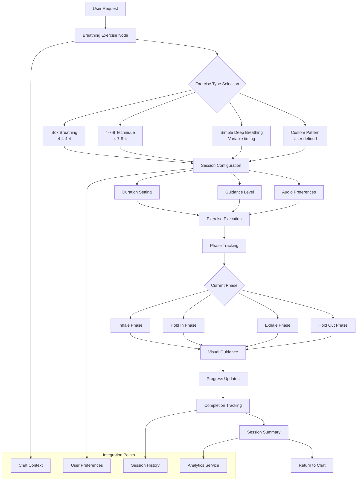
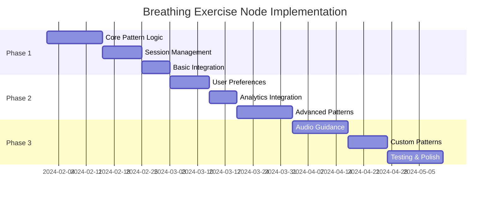

# Breathing Exercise Node

The Breathing Exercise Node is a wellness component designed to guide users through various breathing exercises, including box breathing (4-4-4-4), the 4-7-8 technique, and simple deep breathing exercises. This node will be part of the broader activities feature in the Wbot AI wellness system.

:::warning Implementation Status
This node is currently a **PLACEHOLDER** and will be implemented when the activities feature is built. The documentation below represents the planned architecture and functionality.
:::

## Overview

The breathing exercise node will provide guided breathing sessions to help users with:

- Stress reduction and relaxation
- Anxiety management
- Improved focus and mindfulness
- Sleep preparation
- General wellness routines



## Planned Architecture

### Core Components

#### 1. Exercise Runner (`run_breathing_exercise`)

The main entry point for breathing exercise sessions:

```python
# Planned implementation structure
async def run_breathing_exercise(
    exercise_type: str,
    duration: int = 300,  # 5 minutes default
    pattern: Optional[Dict[str, int]] = None,
    user_preferences: Optional[Dict] = None
) -> Dict[str, Any]:
    """
    Execute a guided breathing exercise session.

    Args:
        exercise_type: Type of breathing exercise ('box', '4-7-8', 'deep', 'custom')
        duration: Total session duration in seconds
        pattern: Custom breathing pattern timing
        user_preferences: User-specific settings and preferences

    Returns:
        Dictionary containing session results and metrics
    """
    pass
```

#### 2. Exercise Patterns

Predefined breathing patterns for different techniques:

```python
# Planned breathing patterns
BREATHING_PATTERNS = {
    'box': {
        'inhale': 4,
        'hold_in': 4,
        'exhale': 4,
        'hold_out': 4,
        'description': 'Box breathing for stress relief and focus'
    },
    '4-7-8': {
        'inhale': 4,
        'hold_in': 7,
        'exhale': 8,
        'hold_out': 2,
        'description': '4-7-8 technique for relaxation and sleep'
    },
    'deep': {
        'inhale': 5,
        'hold_in': 2,
        'exhale': 6,
        'hold_out': 1,
        'description': 'Simple deep breathing for general wellness'
    }
}
```

#### 3. Session Management

```python
class BreathingSession:
    """Manages individual breathing exercise sessions."""

    def __init__(
        self,
        pattern: Dict[str, int],
        total_duration: int,
        guidance_level: str = 'normal'
    ):
        self.pattern = pattern
        self.total_duration = total_duration
        self.guidance_level = guidance_level
        self.start_time = None
        self.cycles_completed = 0
        self.current_phase = 'inhale'

    async def start_session(self) -> None:
        """Initialize and start the breathing session."""
        pass

    async def update_phase(self) -> Dict[str, Any]:
        """Update current breathing phase and return status."""
        pass

    def get_session_summary(self) -> Dict[str, Any]:
        """Generate summary of completed session."""
        pass
```

## Integration Points

### 1. Chat System Integration

```python
# Integration with main chat flow
from src.core.chat_manager import ChatManager
from src.nodes.breathing_exercise import run_breathing_exercise

async def handle_breathing_request(
    chat_manager: ChatManager,
    user_message: str
) -> str:
    """Handle user requests for breathing exercises."""

    # Parse user intent and preferences
    exercise_config = await parse_breathing_request(user_message)

    # Start breathing exercise
    session_result = await run_breathing_exercise(**exercise_config)

    # Return appropriate response
    return format_breathing_response(session_result)
```

### 2. User Preferences Integration

```python
# User preference storage and retrieval
class BreathingPreferences:
    """Manage user preferences for breathing exercises."""

    @staticmethod
    async def get_user_preferences(user_id: str) -> Dict[str, Any]:
        """Retrieve user's breathing exercise preferences."""
        return {
            'preferred_pattern': 'box',
            'default_duration': 300,
            'audio_guidance': True,
            'visual_guidance': True,
            'reminder_frequency': 'daily'
        }

    @staticmethod
    async def update_preferences(
        user_id: str,
        preferences: Dict[str, Any]
    ) -> None:
        """Update user's breathing exercise preferences."""
        pass
```

### 3. Analytics Integration

```python
# Session analytics and tracking
from src.services.analytics import AnalyticsService

async def track_breathing_session(
    user_id: str,
    session_data: Dict[str, Any]
) -> None:
    """Track breathing exercise session for analytics."""

    analytics = AnalyticsService()

    await analytics.track_event(
        user_id=user_id,
        event_type='breathing_exercise_completed',
        event_data={
            'exercise_type': session_data['pattern_name'],
            'duration': session_data['total_duration'],
            'cycles_completed': session_data['cycles_completed'],
            'completion_rate': session_data['completion_percentage'],
            'user_rating': session_data.get('user_rating'),
            'timestamp': session_data['completed_at']
        }
    )
```

## Configuration Options

### Environment Configuration

```python
# Planned configuration options
BREATHING_EXERCISE_CONFIG = {
    'max_session_duration': 1800,  # 30 minutes
    'min_session_duration': 60,    # 1 minute
    'default_pattern': 'box',
    'enable_audio_guidance': True,
    'enable_haptic_feedback': True,
    'session_timeout': 3600,       # 1 hour
    'analytics_enabled': True
}
```

### Pattern Customization

```python
# Custom pattern validation
def validate_breathing_pattern(pattern: Dict[str, int]) -> bool:
    """Validate custom breathing pattern timing."""
    required_phases = ['inhale', 'hold_in', 'exhale', 'hold_out']

    if not all(phase in pattern for phase in required_phases):
        return False

    if any(duration < 1 or duration > 15 for duration in pattern.values()):
        return False

    return True
```

## Planned Features

### Core Functionality

- [x] Module structure and entry point
- [ ] Basic breathing pattern implementation
- [ ] Session management and timing
- [ ] Phase progression logic
- [ ] User preference handling
- [ ] Session completion tracking

### Advanced Features

- [ ] Custom pattern creation
- [ ] Audio guidance integration
- [ ] Visual guidance coordination
- [ ] Progress tracking and analytics
- [ ] Reminder system integration
- [ ] Multi-language support

### Integration Features

- [ ] Chat context preservation
- [ ] User preference persistence
- [ ] Session history storage
- [ ] Analytics event tracking
- [ ] Notification system integration

:::info Development Notes
This node will be implemented as part of the broader activities feature development. The architecture above provides the foundation for a comprehensive breathing exercise system that integrates seamlessly with the Wbot wellness platform.
:::

## Related Documentation

- [BreathingAnimation Component](/components/breathing-animation) - Visual component for breathing guidance
- [Activities System](/features/activities) - Broader activities feature architecture
- [Chat Integration](/integration/chat) - Chat system integration patterns
- [User Preferences](/features/user-preferences) - User preference management
- [Analytics Service](/services/analytics) - Analytics and tracking integration

## Implementation Timeline


