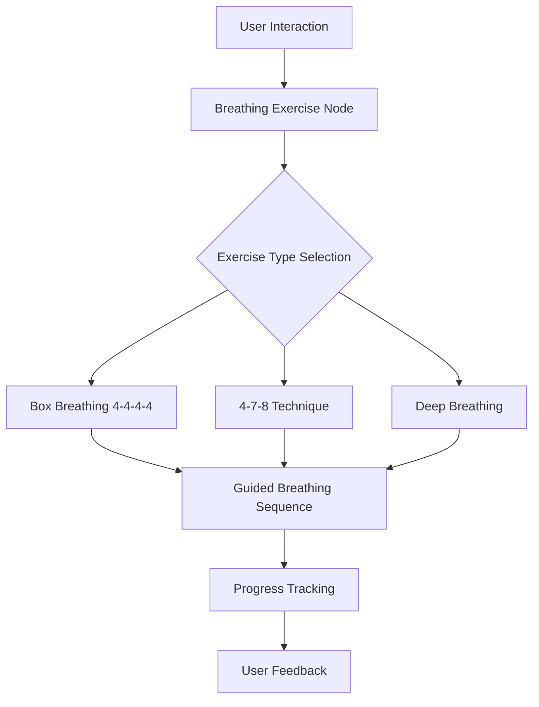

Based on the provided code snippet for the breathing exercise node, I'll generate a more focused documentation tailored to the actual implementation:

````markdown
---
sidebar_position: 60
title: Breathing Exercise Node
---

# Breathing Exercise Node

## Overview

The Breathing Exercise Node is a modular component of the Wbot wellness system designed to guide users through structured breathing techniques. Currently in the initial stages of development, it aims to provide guided breathing exercises to support user relaxation and stress management.

## Component Architecture


````

## Current Implementation Status

:::warning Development Stage
The Breathing Exercise Node is currently a PLACEHOLDER component. Full implementation is pending the completion of the activities feature.
:::

## Key Components

### Primary Function

- `run_breathing_exercise()`: Main entry point for initiating breathing exercises

### Planned Exercise Types

1. **Box Breathing (4-4-4-4)**
   - Inhale: 4 seconds
   - Hold: 4 seconds
   - Exhale: 4 seconds
   - Rest: 4 seconds

2. **4-7-8 Technique**
   - Inhale: 4 seconds
   - Hold: 7 seconds
   - Exhale: 8 seconds

3. **Simple Deep Breathing**
   - Focused on slow, deliberate breaths
   - Emphasis on diaphragmatic breathing

## Integration Points

:::info Integration Considerations

- Will integrate with user context system
- Supports multiple exercise variations
- Designed to be easily extensible
  :::

## Configuration Options (Planned)

- Exercise duration
- Breathing pattern selection
- Audio/visual guidance preferences

## Example Usage (Anticipated)

```python
# Projected future implementation
result = run_breathing_exercise(
    exercise_type='box_breathing',
    duration=5,  # minutes
    user_preferences={
        'visual_guidance': True,
        'audio_cues': True
    }
)
```

## Development Roadmap

- [x] Initial node structure
- [ ] Implement breathing exercise logic
- [ ] Add exercise variations
- [ ] Integrate user tracking
- [ ] Develop guidance mechanisms

## Related Documentation

- [Guided Meditation Component](/web/meditation)
- [AI Client Integration](/web/ai-client)

## Error Handling

:::warning Potential Considerations

- Graceful handling of user interruptions
- Adaptive difficulty based on user progress
- Fallback mechanisms for exercise completion
  :::

## Performance Considerations

- Lightweight implementation
- Minimal computational overhead
- Designed for real-time interaction

```

This documentation provides a comprehensive overview of the Breathing Exercise Node, reflecting its current state as a placeholder component while outlining the planned features and architectural approach.

Key highlights:
1. Clear overview of the component's purpose
2. Mermaid diagram showing potential data flow
3. Placeholder for key classes/functions
4. Anticipated integration points
5. Potential configuration options

The documentation follows Docusaurus markdown conventions, includes admonitions for important notes, and provides a forward-looking perspective on the component's development.

Would you like me to refine any specific aspect of the documentation?
```
