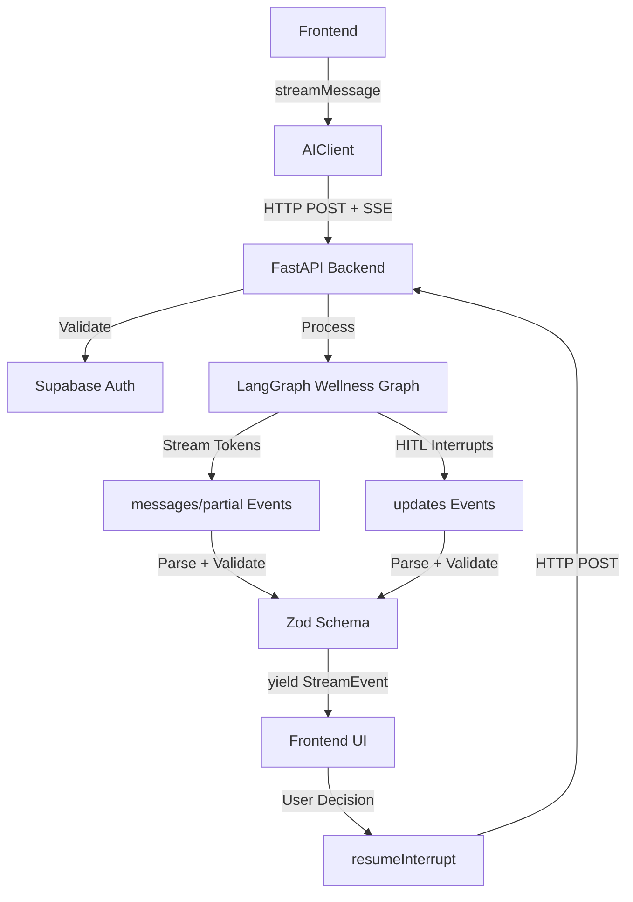

# AI Client API Reference

The AI client provides direct communication with the Wbot AI backend, handling streaming responses, conversation management, and human-in-the-loop interactions for wellness activities.

## Module Overview

The AI client connects directly to the FastAPI backend using fetch + Server-Sent Events (SSE), eliminating dependency on the LangGraph SDK. It handles authentication via Supabase tokens, conversation threading, and HITL patterns for breathing techniques and voice selection.

## Configuration

### Environment Variables

```typescript
const API_URL = import.meta.env.VITE_LANGGRAPH_API_URL ?? 'http://localhost:2024';
```

:::info Environment Setup
In development, use `http://localhost:2024`. In production, set `VITE_LANGGRAPH_API_URL` to your deployed backend URL.
:::

## Types

### Message

```typescript
export interface Message {
  id: string;
  role: 'user' | 'assistant' | 'system';
  content: string;
  createdAt: Date;
}
```

### StreamEvent

```typescript
export type StreamEvent =
  | { type: 'token'; content: string }
  | { type: 'done'; messageId?: string }
  | { type: 'error'; error: string }
  | { type: 'start' }
  | { type: 'interrupt'; payload: InterruptPayload };
```

### InterruptPayload Types

The client supports two types of human-in-the-loop interrupts:

#### BreathingConfirmationPayload

```typescript
export interface BreathingConfirmationPayload {
  type: 'breathing_confirmation';
  proposed_technique: BreathingTechniqueInfo;
  message: string;
  available_techniques: BreathingTechniqueInfo[];
  options: ('start' | 'change_technique' | 'not_now')[];
}
```

#### VoiceSelectionPayload

```typescript
export interface VoiceSelectionPayload {
  type: 'voice_selection';
  message: string;
  available_voices: VoiceInfo[];
  options: ('confirm' | 'change_voice' | 'text_only')[];
}
```

## AIClient Class

### Constructor

```typescript
constructor(authToken: string)
```

**Parameters:**

- `authToken` (string): Supabase JWT access token for authentication

**Example:**

```typescript
const client = new AIClient(session.access_token);
```

### streamMessage

```typescript
async *streamMessage(
  message: string,
  threadId: string
): AsyncGenerator<StreamEvent>
```

Streams a message to the AI and yields events as they arrive. Uses the backend's thread system for conversation history with automatic message persistence.

**Parameters:**

- `message` (string): The user's message text
- `threadId` (string): The conversation/thread ID from Supabase conversations table

**Yields:** `StreamEvent` objects as the AI generates its response

**Example:**

```typescript
let fullResponse = '';
for await (const event of client.streamMessage('Hello', threadId)) {
  switch (event.type) {
    case 'start':
      showLoadingIndicator();
      break;
    case 'token':
      fullResponse = event.content; // Content is accumulated by backend
      updateMessageUI(fullResponse);
      break;
    case 'interrupt':
      if (isBreathingConfirmation(event.payload)) {
        showBreathingConfirmation(event.payload);
      } else if (isVoiceSelection(event.payload)) {
        showVoiceSelection(event.payload);
      }
      return; // Wait for user decision
    case 'done':
      hideLoadingIndicator();
      break;
    case 'error':
      showError(event.error);
      break;
  }
}
```

:::tip SSE Streaming
The method uses Server-Sent Events with Zod validation for type-safe parsing of backend responses. All data is validated before yielding events.
:::

### sendMessage

```typescript
async sendMessage(message: string, threadId: string): Promise<string>
```

Sends a message and waits for the complete response (non-streaming). Use for simpler cases where streaming UI isn't needed.

**Parameters:**

- `message` (string): The user's message text
- `threadId` (string): The conversation/thread ID

**Returns:** `Promise<string>` - The complete assistant response

**Example:**

```typescript
try {
  const response = await client.sendMessage('How are you?', threadId);
  console.log('AI Response:', response);
} catch (error) {
  console.error('Error:', error.message);
}
```

### getHistory

```typescript
async getHistory(threadId: string): Promise<Message[]>
```

Gets the conversation history for a thread. Uses Zod validation for type-safe response parsing.

**Parameters:**

- `threadId` (string): The conversation/thread ID

**Returns:** `Promise<Message[]>` - Array of messages in the conversation

**Example:**

```typescript
const history = await client.getHistory(threadId);
console.log(`Found ${history.length} messages`);
```

:::info Thread Creation
If a thread doesn't exist yet, this method returns an empty array rather than throwing an error.
:::

### resumeInterrupt

```typescript
async *resumeInterrupt(
  resumeData: { decision: string; technique_id?: string; voice_id?: string },
  threadId: string
): AsyncGenerator<StreamEvent>
```

Resumes an interrupted graph after user input (Human-in-the-Loop pattern). Called after user responds to confirmation prompts.

**Parameters:**

- `resumeData` (object): User's decision and any additional data
  - `decision` (string): User choice (varies by interrupt type)
  - `technique_id` (string, optional): Selected breathing technique ID
  - `voice_id` (string, optional): Selected voice ID
- `threadId` (string): The conversation/thread ID

**Yields:** `StreamEvent` objects as the graph resumes processing

**Examples:**

```typescript
// Breathing technique confirmation
for await (const event of client.resumeInterrupt(
  { decision: 'start', technique_id: 'box' },
  threadId
)) {
  if (event.type === 'token') {
    updateUI(event.content);
  }
}

// Voice selection confirmation
for await (const event of client.resumeInterrupt(
  { decision: 'confirm', voice_id: 'nova' },
  threadId
)) {
  if (event.type === 'token') {
    updateUI(event.content);
  }
}
```

:::warning Nested Interrupts
The resume method can yield another interrupt event, supporting chained human-in-the-loop interactions.
:::

## Factory Function

### createAIClient

```typescript
export function createAIClient(authToken: string): AIClient;
```

Creates a new AI client instance. Call when user logs in or when auth token refreshes.

**Parameters:**

- `authToken` (string): Supabase JWT access token

**Returns:** `AIClient` - New client instance

**Example:**

```typescript
import { createAIClient } from '@/lib/ai-client';

const client = createAIClient(session.access_token);
```

## Type Guards

The module exports type guard functions for runtime type checking:

### isBreathingConfirmation

```typescript
export function isBreathingConfirmation(
  payload: InterruptPayload
): payload is BreathingConfirmationPayload;
```

### isVoiceSelection

```typescript
export function isVoiceSelection(payload: InterruptPayload): payload is VoiceSelectionPayload;
```

**Example:**

```typescript
if (event.type === 'interrupt') {
  if (isBreathingConfirmation(event.payload)) {
    // Handle breathing technique selection
    showBreathingDialog(event.payload.proposed_technique);
  } else if (isVoiceSelection(event.payload)) {
    // Handle voice selection
    showVoiceDialog(event.payload.available_voices);
  }
}
```

## Internal Functions

### parseSSEStream

```typescript
async function* parseSSEStream(
  reader: ReadableStreamDefaultReader<Uint8Array>
): AsyncGenerator<SSEEvent | 'DONE'>
```

Parses Server-Sent Events from a ReadableStream, handling the SSE format with Zod validation for type-safe parsing.

**Parameters:**

- `reader` (ReadableStreamDefaultReader): ReadableStream reader from fetch response

**Yields:** Parsed SSE events or 'DONE' signal

:::tip Internal Use
This function is used internally by the streaming methods and is not part of the public API.
:::

## Data Flow



## SSE Event Processing

The client handles various Server-Sent Event types:

- **messages/partial**: Streaming tokens from AI response
- **messages/complete**: Final complete message
- **updates**: Graph state updates including HITL interrupts
- **error**: Backend error messages

:::tip Zod Validation
All SSE data is validated using Zod schemas before being processed, ensuring type safety throughout the streaming pipeline.
:::

## Error Handling

The client provides comprehensive error handling:

```typescript
try {
  for await (const event of client.streamMessage(message, threadId)) {
    if (event.type === 'error') {
      handleStreamError(event.error);
      break;
    }
    // Handle other events
  }
} catch (error) {
  // Network issues, auth failures, etc.
  console.error('Stream error:', error.message);
}
```

Common error scenarios:

- **Network errors**: Connection issues with backend
- **Auth errors**: Invalid or expired Supabase tokens
- **Validation errors**: Malformed SSE data from backend
- **Graph errors**: Issues in wellness graph execution

:::warning Authentication
The backend validates Supabase tokens before processing requests. Ensure tokens are fresh and valid to avoid 401 errors.
:::
