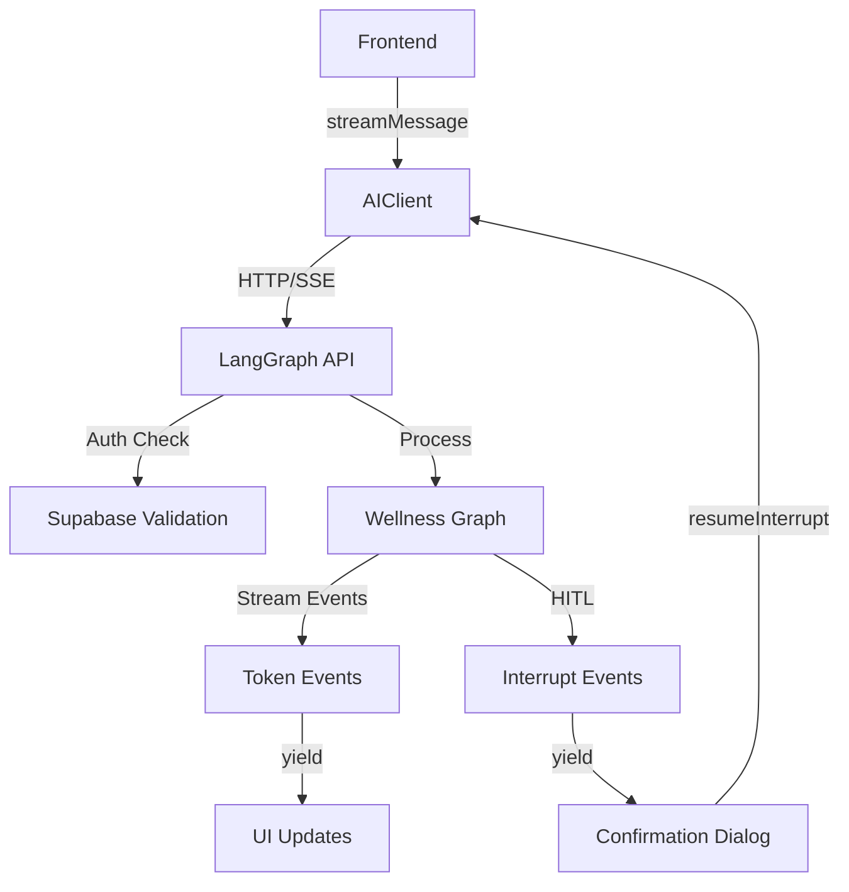

# AI Client API Reference

The AI client provides direct communication with the LangGraph backend, handling streaming responses, conversation management, and human-in-the-loop interactions for breathing confirmations.

## Module Overview

The AI client connects directly to LangGraph Deploy using the LangGraph SDK, eliminating intermediate server hops for reduced latency. It handles WebSocket/SSE connections, automatic reconnection, and conversation threading with Supabase authentication.

## Configuration

### Environment Variables

```typescript
// LangGraph Deploy URL
const LANGGRAPH_URL = import.meta.env.VITE_LANGGRAPH_API_URL ?? 'http://localhost:2024';

// Graph name from langgraph.json
const GRAPH_NAME = 'wellness';
```

:::info Environment Setup
In development, use `http://localhost:2024`. In production, set `VITE_LANGGRAPH_API_URL` to your LangGraph Cloud URL.
:::

## Types

### Message

```typescript
export interface Message {
  id: string;
  role: 'user' | 'assistant' | 'system';
  content: string;
  createdAt: Date;
}
```

### BreathingTechniqueInfo

```typescript
export interface BreathingTechniqueInfo {
  id: string;
  name: string;
  description: string;
  durations: [number, number, number, number]; // [inhale, hold, exhale, hold]
  recommended_cycles: number;
  best_for: string[];
}
```

### BreathingConfirmationPayload

```typescript
export interface BreathingConfirmationPayload {
  type: 'breathing_confirmation';
  proposed_technique: BreathingTechniqueInfo;
  message: string;
  available_techniques: BreathingTechniqueInfo[];
  options: ('start' | 'change_technique' | 'not_now')[];
}
```

### StreamEvent

```typescript
export type StreamEvent =
  | { type: 'token'; content: string }
  | { type: 'done'; messageId?: string }
  | { type: 'error'; error: string }
  | { type: 'start' }
  | { type: 'interrupt'; payload: BreathingConfirmationPayload };
```

## AIClient Class

### Constructor

```typescript
constructor(authToken: string)
```

**Parameters:**

- `authToken` (string): Supabase JWT access token for authentication

**Example:**

```typescript
const client = new AIClient(session.access_token);
```

### streamMessage

```typescript
async *streamMessage(
  message: string,
  threadId: string
): AsyncGenerator<StreamEvent>
```

Streams a message to the AI and yields events as they arrive using LangGraph's thread system for conversation history.

**Parameters:**

- `message` (string): The user's message text
- `threadId` (string): The conversation/thread ID from Supabase conversations table

**Yields:** `StreamEvent` objects as the AI generates its response

**Example:**

```typescript
let fullResponse = '';
for await (const event of client.streamMessage('Hello', threadId)) {
  switch (event.type) {
    case 'start':
      showLoadingIndicator();
      break;
    case 'token':
      fullResponse += event.content;
      updateMessageUI(fullResponse);
      break;
    case 'interrupt':
      showBreathingConfirmation(event.payload);
      return; // Wait for user decision
    case 'done':
      hideLoadingIndicator();
      break;
    case 'error':
      showError(event.error);
      break;
  }
}
```

:::tip Streaming Architecture
The method uses LangGraph's streaming modes (`messages` and `updates`) to handle both token-by-token responses and graph events like breathing confirmations.
:::

### sendMessage

```typescript
async sendMessage(message: string, threadId: string): Promise<string>
```

Sends a message and waits for the complete response (non-streaming).

**Parameters:**

- `message` (string): The user's message text
- `threadId` (string): The conversation/thread ID

**Returns:** `Promise<string>` - The complete assistant response

**Example:**

```typescript
try {
  const response = await client.sendMessage('How are you?', threadId);
  console.log('AI Response:', response);
} catch (error) {
  console.error('Error:', error.message);
}
```

### getHistory

```typescript
async getHistory(threadId: string): Promise<Message[]>
```

Gets the conversation history for a thread from LangGraph's state.

**Parameters:**

- `threadId` (string): The conversation/thread ID

**Returns:** `Promise<Message[]>` - Array of messages in the conversation

**Example:**

```typescript
const history = await client.getHistory(threadId);
console.log(`Found ${history.length} messages`);
```

### resumeInterrupt

```typescript
async *resumeInterrupt(
  resumeData: { decision: string; technique_id?: string },
  threadId: string
): AsyncGenerator<StreamEvent>
```

Resumes an interrupted graph after user input (Human-in-the-Loop pattern). Called after user responds to breathing technique confirmation.

**Parameters:**

- `resumeData` (object): User's decision and optional technique selection
  - `decision` (string): User choice ('start', 'change_technique', 'not_now')
  - `technique_id` (string, optional): Selected breathing technique ID
- `threadId` (string): The conversation/thread ID

**Yields:** `StreamEvent` objects as the graph resumes processing

**Example:**

```typescript
// User confirmed to start box breathing
for await (const event of client.resumeInterrupt(
  { decision: 'start', technique_id: 'box' },
  threadId
)) {
  if (event.type === 'token') {
    updateUI(event.content);
  }
}
```

## Factory Function

### createAIClient

```typescript
export function createAIClient(authToken: string): AIClient;
```

Creates a new AI client instance. Call when user logs in or auth token refreshes.

**Parameters:**

- `authToken` (string): Supabase JWT access token

**Returns:** `AIClient` - New client instance

**Example:**

```typescript
import { createAIClient } from '@/lib/ai-client';

const client = createAIClient(session.access_token);
```

## Data Flow



## Content Filtering

The client automatically filters internal LLM responses:

- **Technique IDs**: `['box', 'relaxing_478', 'coherent', 'deep_calm']`
- **Activity Detection**: JSON containing `"detected_activity"` and `"confidence"`

:::warning Filtered Content
Internal LLM responses like technique selection tokens are filtered from the stream to prevent showing system messages to users.
:::

## Error Handling

The client handles various error scenarios:

```typescript
try {
  for await (const event of client.streamMessage(message, threadId)) {
    // Handle events
  }
} catch (error) {
  // Network issues, auth failures, etc.
  console.error('Stream error:', error.message);
}
```

Common error types:

- **Network errors**: Connection issues with LangGraph
- **Auth errors**: Invalid or expired Supabase tokens
- **Graph errors**: Issues in the wellness graph execution
