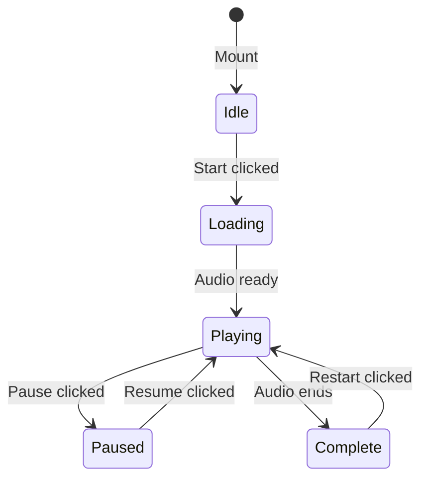

# Guided Meditation Component

The `GuidedMeditation` component provides an interactive guided meditation experience within the chat interface, allowing users to play pre-recorded meditation audio with playback controls.

## Overview

```
apps/web/src/components/GuidedMeditation/
├── GuidedMeditation.tsx       # Main component
├── GuidedMeditation.module.css # Styles
├── MeditationPlayer.tsx       # Audio player UI
├── useMeditationAudio.ts      # Audio playback hook
├── types.ts                   # TypeScript types
├── techniques.ts              # Track definitions
└── index.ts                   # Exports
```

## Usage

The component is rendered inline within chat messages when the AI suggests a meditation:

```tsx
import { GuidedMeditation } from '../../components/GuidedMeditation';

// In ChatPage MessageBubble:
if (parsedContent?.hasActivity && parsedContent.activity?.activity === 'meditation') {
  const activity = parsedContent.activity;

  return (
    <GuidedMeditation
      track={activity.track}
      introduction={activity.introduction}
      onComplete={handleComplete}
      onStop={handleStop}
    />
  );
}
```

## Component Props

### GuidedMeditation

| Prop            | Type                                    | Required | Description                      |
| --------------- | --------------------------------------- | -------- | -------------------------------- |
| `track`         | `MeditationTrack`                       | Yes      | The meditation track to play     |
| `introduction`  | `string`                                | No       | AI introduction text             |
| `onComplete`    | `(data: MeditationSessionData) => void` | No       | Called when meditation completes |
| `onStop`        | `(data: MeditationSessionData) => void` | No       | Called when user stops early     |
| `enableAmbient` | `boolean`                               | No       | Enable ambient background sounds |

### MeditationTrack Type

```typescript
interface MeditationTrack {
  id: string; // Unique identifier
  name: string; // Display name
  type: MeditationType; // Category
  durationSeconds: number; // Total duration
  durationPreset: 'short' | 'medium' | 'long';
  description: string; // Track description
  audioUrl: string; // Audio file URL
  narrator?: string; // Optional narrator name
  language: string; // Language code (e.g., 'en')
  bestFor: string[]; // Use cases
  attribution?: string; // CC license attribution
}
```

## Component States

The component has four main states:

1. **Idle**: Shows track info and start button
2. **Loading**: Audio is loading/buffering
3. **Playing**: Audio is playing with visual indicator
4. **Complete**: Shows completion message



## useMeditationAudio Hook

The `useMeditationAudio` hook manages HTML5 Audio playback:

```typescript
const {
  state, // MeditationState (playbackState, currentTime, duration, progress)
  volume, // Current volume (0-1)
  play, // Start playback
  pause, // Pause playback
  stop, // Stop and reset
  seek, // Seek to position (0-1)
  setVolume, // Set volume (0-1)
} = useMeditationAudio({
  audioUrl: track.audioUrl,
  initialVolume: 0.8,
  onEnded: handleComplete,
  onTimeUpdate: handleProgress,
});
```

## Available Tracks

Tracks are defined in `techniques.ts` and sourced from UCLA MARC:

| Track ID           | Name                      | Duration | Type            |
| ------------------ | ------------------------- | -------- | --------------- |
| `body_scan_short`  | Body Scan (Short)         | 3 min    | body_scan       |
| `body_scan_medium` | Body Scan                 | 9 min    | body_scan       |
| `breathing_focus`  | Breathing Meditation      | 5 min    | breathing_focus |
| `loving_kindness`  | Loving Kindness           | 9 min    | loving_kindness |
| `anxiety_relief`   | Working with Difficulties | 7 min    | anxiety_relief  |

## Audio Hosting

Audio files are hosted on Supabase Storage in the `meditation-audio` bucket:

```
{SUPABASE_URL}/storage/v1/object/public/meditation-audio/{filename}
```

See [Meditation Audio Setup](/meditation-audio-setup) for upload instructions.

## Styling

The component uses CSS Modules with CSS variables from the design system:

- `--color-wellness-lavender`: Primary meditation color
- `--color-wellness-sage`: Secondary meditation color
- Breathing animation for visual indicator during playback
- Progress bar with seekable thumb

## Session Data

When a meditation completes or is stopped, session data is returned:

```typescript
interface MeditationSessionData {
  trackId: string; // Track that was played
  listenedDuration: number; // Seconds listened
  totalDuration: number; // Track total duration
  completedFully: boolean; // Whether finished naturally
  stoppedAtPercent?: number; // Percentage if stopped early
}
```

## Accessibility

- Play/Pause/Stop buttons with aria-labels
- Progress slider with ARIA attributes
- Volume slider with ARIA attributes
- Supports `prefers-reduced-motion` for animations

## Testing

Unit tests are located in `__tests__/`:

```bash
# Run meditation component tests
pnpm test GuidedMeditation

# Run with coverage
pnpm test:coverage
```
