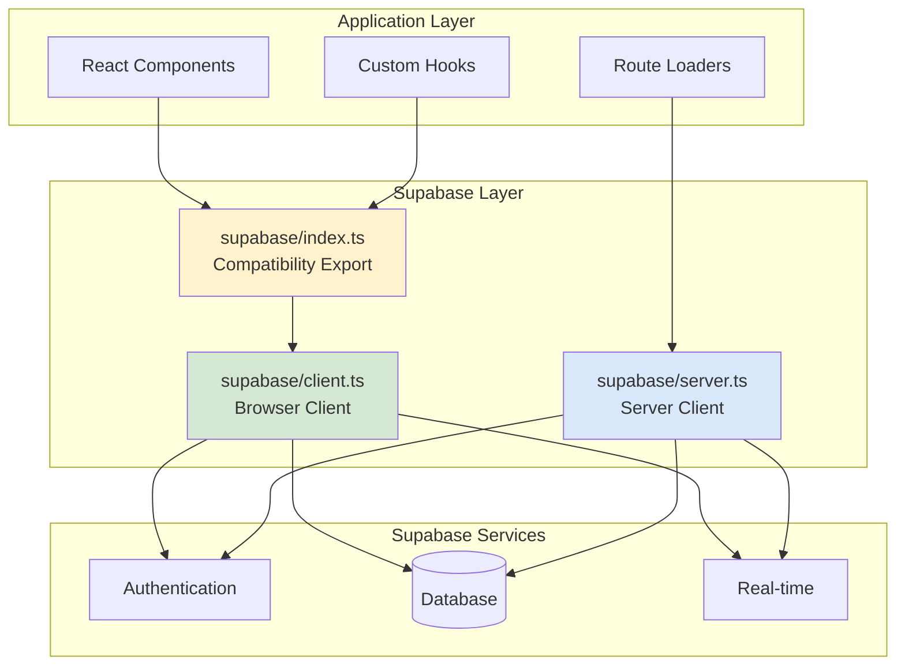

# Supabase Client

Backward compatibility export module that re-exports the browser Supabase client for existing imports.

## Module Overview

This module serves as a compatibility layer that re-exports the browser Supabase client. The actual client implementations have been moved to separate files for better organization and environment-specific handling.

:::info Architecture Change
The actual Supabase client implementations are now located in:

- `./supabase/client.ts` - Browser client (for components, hooks)
- `./supabase/server.ts` - Server client (for route loaders, server functions)

This file maintains backward compatibility for existing imports.
:::

## API Reference

### `supabase`

The default browser Supabase client instance configured for client-side usage.

**Type:**

```typescript
const supabase: TypedSupabaseClient;
```

**Example:**

```typescript
import { supabase } from '@/lib/supabase';

async function fetchUserProfile(userId: string) {
  const { data, error } = await supabase.from('profiles').select('*').eq('id', userId).single();

  if (error) {
    throw new Error(`Failed to fetch profile: ${error.message}`);
  }

  return data;
}
```

### `createClient()`

Factory function for creating a new Supabase client instance with custom configuration.

**Signature:**

```typescript
createClient(
  supabaseUrl: string,
  supabaseKey: string,
  options?: SupabaseClientOptions
): TypedSupabaseClient
```

**Parameters:**

- `supabaseUrl` (`string`) - The Supabase project URL
- `supabaseKey` (`string`) - The Supabase anon/public API key
- `options` (`SupabaseClientOptions`, optional) - Additional client configuration options

**Returns:**

- `TypedSupabaseClient` - Configured Supabase client instance

**Example:**

```typescript
import { createClient } from '@/lib/supabase';

// Create client with custom options
const customClient = createClient(
  process.env.NEXT_PUBLIC_SUPABASE_URL!,
  process.env.NEXT_PUBLIC_SUPABASE_ANON_KEY!,
  {
    auth: {
      persistSession: true,
      autoRefreshToken: true,
    },
  }
);

async function authenticateUser(email: string, password: string) {
  const { data, error } = await customClient.auth.signInWithPassword({
    email,
    password,
  });

  return { user: data.user, error };
}
```

## Type Exports

### `Session`

User session type from Supabase Auth.

```typescript
import type { Session } from '@/lib/supabase';

function useAuthSession(): Session | null {
  const [session, setSession] = useState<Session | null>(null);

  useEffect(() => {
    supabase.auth.getSession().then(({ data: { session } }) => {
      setSession(session);
    });
  }, []);

  return session;
}
```

### `User`

User type from Supabase Auth.

```typescript
import type { User } from '@/lib/supabase';

function UserProfile({ user }: { user: User }) {
  return (
    <div className="user-profile">
      <h2>Welcome, {user.email}</h2>
      <p>User ID: {user.id}</p>
      <p>Last Sign In: {new Date(user.last_sign_in_at!).toLocaleString()}</p>
    </div>
  );
}
```

## Migration Guide

:::warning Migration Notice
If you're importing from this module, consider migrating to the specific client imports for better clarity:

**Old way:**

```typescript
import { supabase } from '@/lib/supabase';
```

**New way (recommended):**

```typescript
// For browser/client-side code
import { supabase } from '@/lib/supabase/client';

// For server-side code
import { createServerClient } from '@/lib/supabase/server';
```

:::

## Common Usage Patterns

### Authentication Flow

```typescript
import { supabase, type Session, type User } from '@/lib/supabase';

class AuthService {
  async signIn(email: string, password: string) {
    const { data, error } = await supabase.auth.signInWithPassword({
      email,
      password,
    });

    if (error) {
      throw new Error(error.message);
    }

    return data;
  }

  async signOut() {
    const { error } = await supabase.auth.signOut();
    if (error) {
      throw new Error(error.message);
    }
  }

  onAuthStateChange(callback: (session: Session | null) => void) {
    return supabase.auth.onAuthStateChange((event, session) => {
      callback(session);
    });
  }
}

export const authService = new AuthService();
```

### Database Operations

```typescript
import { supabase } from '@/lib/supabase';

// Create a new conversation
async function createConversation(userId: string, title: string) {
  const { data, error } = await supabase
    .from('conversations')
    .insert({
      user_id: userId,
      title,
      created_at: new Date().toISOString(),
      updated_at: new Date().toISOString(),
    })
    .select()
    .single();

  if (error) {
    throw new Error(`Failed to create conversation: ${error.message}`);
  }

  return data;
}

// Query with filters and ordering
async function getUserConversations(userId: string) {
  const { data, error } = await supabase
    .from('conversations')
    .select(
      `
      id,
      title,
      created_at,
      updated_at,
      messages (count)
    `
    )
    .eq('user_id', userId)
    .order('updated_at', { ascending: false });

  if (error) {
    throw new Error(`Failed to fetch conversations: ${error.message}`);
  }

  return data;
}
```

### Real-time Subscriptions

```typescript
import { supabase } from '@/lib/supabase';

function useLiveMessages(conversationId: string) {
  const [messages, setMessages] = useState([]);

  useEffect(() => {
    const channel = supabase
      .channel(`messages:${conversationId}`)
      .on(
        'postgres_changes',
        {
          event: 'INSERT',
          schema: 'public',
          table: 'messages',
          filter: `conversation_id=eq.${conversationId}`,
        },
        (payload) => {
          setMessages((prev) => [...prev, payload.new]);
        }
      )
      .subscribe();

    return () => {
      supabase.removeChannel(channel);
    };
  }, [conversationId]);

  return messages;
}
```

## Architecture Diagram



## Related Documentation

:::info Related Documentation

- [AI Client](./ai-client) - Message processing with AI responses
- [Authentication](./authentication) - User authentication setup
- [Database Schema](/database/schema) - Supabase table structures
- [Architecture Overview](/architecture/overview) - System architecture

:::
