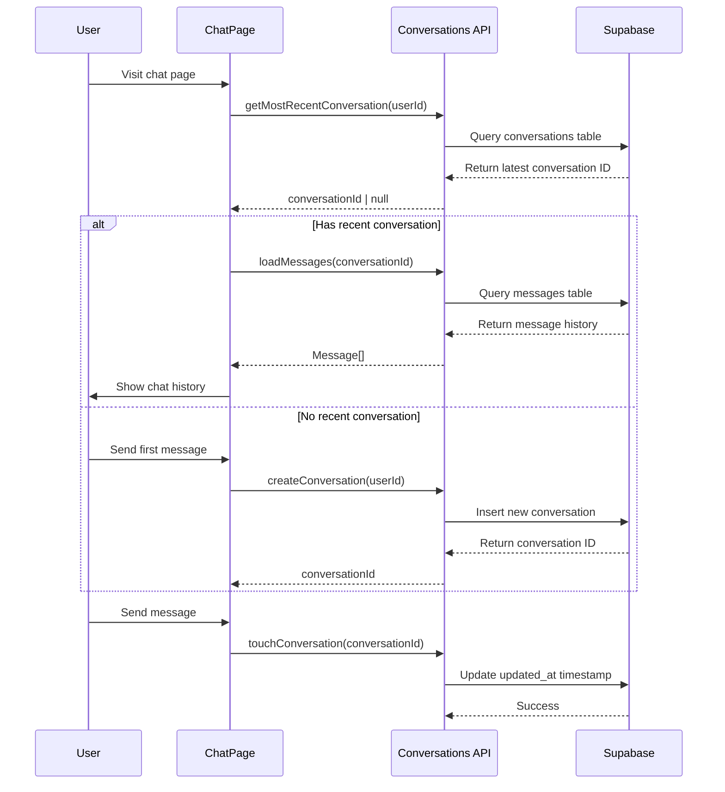

# Conversations API

Conversation management helpers for Supabase that provide functions for creating, loading, and managing conversations.

## Module Overview

This module provides the core conversation persistence layer for the Wbot frontend. It handles conversation lifecycle operations including creation, message loading, and timestamp updates to maintain conversation ordering.

## API Reference

### `createConversation()`

Creates a new conversation for the authenticated user.

**Signature:**

```typescript
createConversation(userId: string): Promise<string>
```

**Parameters:**

- `userId` (`string`) - The authenticated user's ID

**Returns:**

- `Promise<string>` - The new conversation's UUID

**Example:**

```typescript
import { createConversation } from '@/lib/conversations';

async function startNewChat() {
  const userId = session.user.id;
  const conversationId = await createConversation(userId);

  // Navigate to the new conversation
  navigate(`/chat/${conversationId}`);
}
```

### `getMostRecentConversation()`

Gets the most recent conversation for a user. Used on page load to auto-restore the last conversation.

**Signature:**

```typescript
getMostRecentConversation(userId: string): Promise<string | null>
```

**Parameters:**

- `userId` (`string`) - The authenticated user's ID

**Returns:**

- `Promise<string | null>` - The conversation ID, or `null` if no conversations exist

**Example:**

```typescript
import { getMostRecentConversation } from '@/lib/conversations';

async function loadLastConversation() {
  const userId = session.user.id;
  const conversationId = await getMostRecentConversation(userId);

  if (conversationId) {
    // Auto-load the most recent conversation
    setActiveConversation(conversationId);
  } else {
    // Show welcome screen for new users
    setShowWelcome(true);
  }
}
```

### `loadMessages()`

Loads all messages for a conversation in chronological order.

**Signature:**

```typescript
loadMessages(conversationId: string): Promise<Message[]>
```

**Parameters:**

- `conversationId` (`string`) - The conversation UUID

**Returns:**

- `Promise<Message[]>` - Array of messages in chronological order

**Message Type:**

```typescript
interface Message {
  id: string;
  role: 'user' | 'assistant' | 'system';
  content: string;
  createdAt: Date;
}
```

**Example:**

```typescript
import { loadMessages } from '@/lib/conversations';

async function restoreConversation(conversationId: string) {
  const messages = await loadMessages(conversationId);

  // Restore chat history
  setMessages(messages);

  // Scroll to bottom
  scrollToBottom();
}
```

### `touchConversation()`

Updates a conversation's `updated_at` timestamp to keep it at the top of the "most recent" list.

**Signature:**

```typescript
touchConversation(conversationId: string): Promise<void>
```

**Parameters:**

- `conversationId` (`string`) - The conversation UUID

**Returns:**

- `Promise<void>` - Resolves when the timestamp is updated

**Example:**

```typescript
import { touchConversation } from '@/lib/conversations';

async function sendMessage(conversationId: string, content: string) {
  // Save the message to the database
  await saveMessage(conversationId, 'user', content);

  // Update conversation timestamp
  await touchConversation(conversationId);

  // Get AI response...
}
```

## Usage in ChatPage

Here's how the conversations module integrates with the main chat interface:

```typescript
import {
  createConversation,
  getMostRecentConversation,
  loadMessages,
  touchConversation
} from '@/lib/conversations';

function ChatPage() {
  const [conversationId, setConversationId] = useState<string | null>(null);
  const [messages, setMessages] = useState<Message[]>([]);

  // Load most recent conversation on mount
  useEffect(() => {
    async function initializeChat() {
      if (!session?.user?.id) return;

      const recentId = await getMostRecentConversation(session.user.id);

      if (recentId) {
        setConversationId(recentId);
        const history = await loadMessages(recentId);
        setMessages(history);
      }
    }

    initializeChat();
  }, [session]);

  // Start a new conversation
  async function handleNewConversation() {
    if (!session?.user?.id) return;

    const newId = await createConversation(session.user.id);
    setConversationId(newId);
    setMessages([]);
  }

  // Send a message
  async function handleSendMessage(content: string) {
    if (!conversationId) return;

    // Add user message to UI
    const userMessage: Message = {
      id: crypto.randomUUID(),
      role: 'user',
      content,
      createdAt: new Date(),
    };

    setMessages(prev => [...prev, userMessage]);

    // Update conversation timestamp
    await touchConversation(conversationId);

    // Get AI response...
  }

  return (
    // Chat UI...
  );
}
```

## Data Flow



## Error Handling

:::warning Error Handling
All functions in this module log errors to the console and either throw or return `null`. Always wrap calls in try-catch blocks:

```typescript
try {
  const conversationId = await createConversation(userId);
  // Handle success
} catch (error) {
  console.error('Failed to create conversation:', error);
  // Show user-friendly error message
  toast.error('Unable to start new conversation');
}
```

:::

## Database Schema

The conversations module expects these Supabase tables:

```sql
-- Conversations table
create table conversations (
  id uuid primary key default gen_random_uuid(),
  user_id uuid references auth.users(id) on delete cascade,
  title text,
  created_at timestamptz default now(),
  updated_at timestamptz default now()
);

-- Messages table
create table messages (
  id uuid primary key default gen_random_uuid(),
  conversation_id uuid references conversations(id) on delete cascade,
  role text check (role in ('user', 'assistant', 'system')),
  content text not null,
  created_at timestamptz default now()
);
```

:::tip Related Documentation

- [Supabase Client](./supabase-client) - Database connection and authentication
- [AI Client](./ai-client) - Message processing and AI responses
- [Database Schema](/docs/architecture/database) - Complete database structure
  :::
