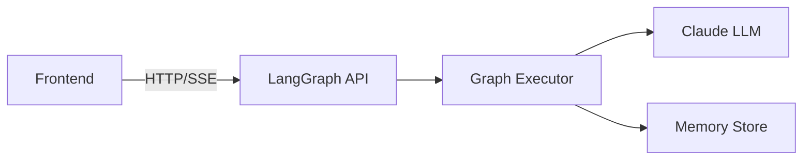

# LangGraph API Guide

The AI backend uses LangGraph for stateful, graph-based AI workflows. The frontend communicates with it via the LangGraph SDK.

## Architecture



## Frontend Client

The `AIClient` class in `apps/web/src/lib/ai-client.ts` wraps the LangGraph SDK:

```typescript
import { Client } from '@langchain/langgraph-sdk';

export class AIClient {
  private client: Client;

  constructor() {
    this.client = new Client({
      apiUrl: import.meta.env.VITE_LANGGRAPH_API_URL,
    });
  }

  async streamMessage(
    conversationId: string,
    content: string,
    userContext: UserContext
  ): Promise<AsyncGenerator<StreamEvent>> {
    const thread = await this.getOrCreateThread(conversationId);

    return this.client.runs.stream(thread.id, 'wellness', {
      input: {
        messages: [{ role: 'user', content }],
        user_context: userContext,
      },
      streamMode: 'messages',
    });
  }
}
```

## Streaming Responses

Messages stream via Server-Sent Events (SSE):

```typescript
// ChatPage.tsx
const stream = await aiClient.streamMessage(conversationId, message, userContext);

let fullResponse = '';

for await (const event of stream) {
  if (event.event === 'messages/partial') {
    // Incremental token update
    const lastMessage = event.data.at(-1);
    if (lastMessage?.role === 'assistant') {
      fullResponse = lastMessage.content;
      setMessages((prev) => updateLastMessage(prev, fullResponse));
    }
  }
}

// Save complete response to Supabase
await saveMessage(conversationId, 'assistant', fullResponse);
```

## Event Types

The stream emits different event types:

| Event               | Description                 |
| ------------------- | --------------------------- |
| `messages/partial`  | Incremental message updates |
| `messages/complete` | Final message state         |
| `updates`           | Graph state updates         |
| `end`               | Stream completed            |

### Handling Events

```typescript
for await (const event of stream) {
  switch (event.event) {
    case 'messages/partial':
      // Update UI with partial response
      handlePartialMessage(event.data);
      break;

    case 'messages/complete':
      // Final message received
      handleCompleteMessage(event.data);
      break;

    case 'end':
      // Stream finished
      handleStreamEnd();
      break;
  }
}
```

## Thread Management

LangGraph uses "threads" to maintain conversation state:

```typescript
class AIClient {
  private threadCache = new Map<string, string>();

  async getOrCreateThread(conversationId: string): Promise<Thread> {
    // Check cache first
    const cachedThreadId = this.threadCache.get(conversationId);
    if (cachedThreadId) {
      return this.client.threads.get(cachedThreadId);
    }

    // Create new thread
    const thread = await this.client.threads.create({
      metadata: { conversation_id: conversationId },
    });

    this.threadCache.set(conversationId, thread.id);
    return thread;
  }
}
```

## User Context

Pass user context to personalize responses:

```typescript
interface UserContext {
  user_id: string;
  display_name?: string;
  preferences?: Record<string, unknown>;
  conversation_id: string;
}

// Include in stream request
await aiClient.streamMessage(conversationId, message, {
  user_id: user.id,
  display_name: user.display_name,
  preferences: user.preferences,
  conversation_id: conversationId,
});
```

## Activity Responses

When the AI triggers an activity, it returns structured data:

```typescript
interface ActivityResponse {
  type: 'activity';
  activity: 'breathing' | 'meditation' | 'journaling';
  status: 'ready' | 'in_progress' | 'complete';
  // Activity-specific data
  technique?: BreathingTechnique;
  introduction?: string;
}
```

### Parsing Activities

````typescript
// parseActivity.ts
import { z } from 'zod';

const activitySchema = z.object({
  type: z.literal('activity'),
  activity: z.enum(['breathing', 'meditation', 'journaling']),
  status: z.enum(['ready', 'in_progress', 'complete']),
  technique: breathingTechniqueSchema.optional(),
  introduction: z.string().optional(),
});

export function parseActivity(content: string): ActivityResponse | null {
  try {
    const match = content.match(/```json\n([\s\S]*?)\n```/);
    if (!match) return null;

    const data = JSON.parse(match[1]);
    return activitySchema.parse(data);
  } catch {
    return null;
  }
}
````

## Error Handling

```typescript
try {
  const stream = await aiClient.streamMessage(conversationId, message, userContext);

  for await (const event of stream) {
    // Handle events...
  }
} catch (error) {
  if (error instanceof NetworkError) {
    // Handle connection issues
    showRetryPrompt();
  } else if (error instanceof RateLimitError) {
    // Handle rate limiting
    showRateLimitMessage();
  } else {
    // Generic error
    console.error('AI Error:', error);
    showErrorMessage('Something went wrong. Please try again.');
  }
}
```

## Environment Variables

Frontend configuration:

```bash
# apps/web/.env
VITE_LANGGRAPH_API_URL=http://localhost:2024
```

Backend configuration:

```bash
# apps/ai/.env
ANTHROPIC_API_KEY=sk-ant-...
SUPABASE_URL=http://localhost:54321
SUPABASE_SERVICE_KEY=...
```
