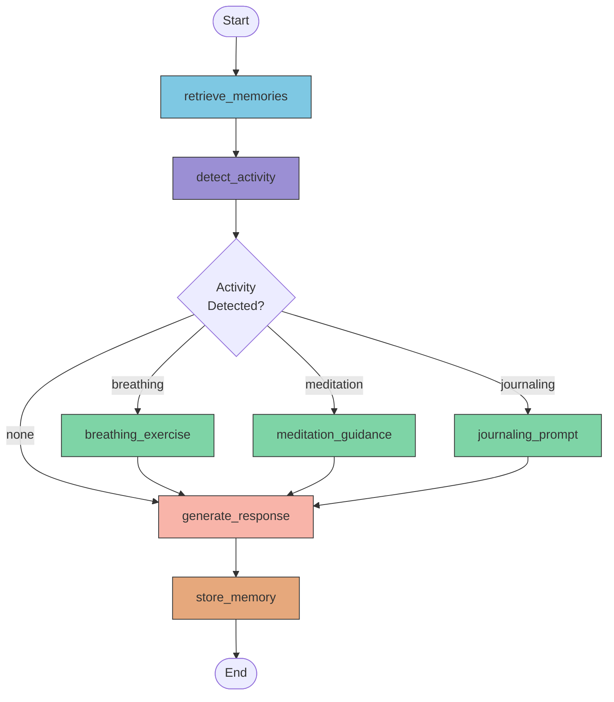
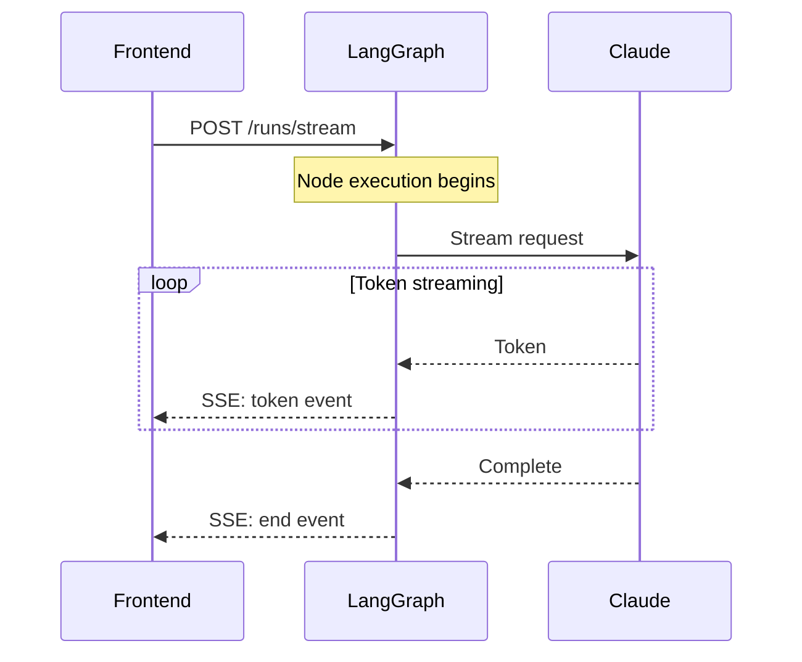
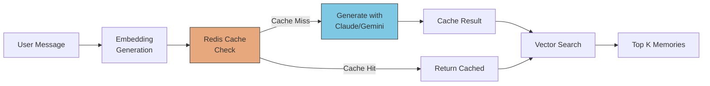

# Data Flow

This document details how data flows through the Wbot system, from user input to AI response.

## LangGraph Node Flow

The AI backend processes messages through a series of nodes:



## Node Descriptions

### retrieve_memories

Fetches relevant context from the semantic memory store:

```python
# retrieve_memories/node.py
async def retrieve_memories(state: WellnessState) -> dict:
    # Get embedding for current message
    query_embedding = await get_embedding(state["last_message"])

    # Find similar memories
    memories = await memory_store.search(
        query_embedding,
        user_id=state["user_id"],
        limit=5
    )

    return {"memories": memories}
```

### detect_activity

Analyzes the message to determine if an activity is appropriate:

```python
# detect_activity/node.py
async def detect_activity(state: WellnessState) -> dict:
    # Use Claude to detect activity intent
    result = await llm.invoke(
        system=ACTIVITY_DETECTION_PROMPT,
        messages=state["messages"]
    )

    return {
        "detected_activity": result.activity,  # "breathing" | "meditation" | None
        "activity_params": result.params
    }
```

### Activity Nodes

Each activity has its own node that generates structured output:

```python
# breathing_exercise/node.py
async def breathing_exercise(state: WellnessState) -> dict:
    technique = select_technique(state["activity_params"])

    return {
        "activity_response": {
            "type": "activity",
            "activity": "breathing",
            "technique": technique,
            "introduction": generate_introduction(technique)
        }
    }
```

### generate_response

Creates the final response using Claude:

```python
# generate_response/node.py
async def generate_response(state: WellnessState) -> dict:
    # Include memories as context
    system = build_system_prompt(state["memories"])

    # Stream the response
    async for chunk in llm.astream(
        system=system,
        messages=state["messages"]
    ):
        yield {"response_chunk": chunk}
```

### store_memory

Persists important information for future conversations:

```python
# store_memory/node.py
async def store_memory(state: WellnessState) -> dict:
    # Extract memorable facts from the conversation
    facts = await extract_facts(state["messages"])

    for fact in facts:
        await memory_store.add(
            user_id=state["user_id"],
            content=fact.content,
            embedding=await get_embedding(fact.content)
        )

    return {}
```

## State Management

The graph maintains state across nodes:

```python
# state.py
class WellnessState(TypedDict):
    # Input
    messages: list[Message]
    user_id: str
    conversation_id: str

    # Retrieved context
    memories: list[Memory]
    user_context: dict

    # Activity routing
    detected_activity: str | None
    activity_params: dict

    # Output
    activity_response: dict | None
    response_chunks: list[str]
```

## Streaming Architecture

Responses stream to the frontend via SSE:



### Frontend Handling

```typescript
// ai-client.ts
async *streamMessage(conversationId: string, content: string) {
  const response = await fetch('/api/stream', {
    method: 'POST',
    body: JSON.stringify({ conversationId, content }),
  });

  const reader = response.body.getReader();
  const decoder = new TextDecoder();

  while (true) {
    const { done, value } = await reader.read();
    if (done) break;

    const events = parseSSE(decoder.decode(value));
    for (const event of events) {
      yield event;
    }
  }
}
```

## Memory System Architecture



### Embedding Cache

Redis caches embeddings to reduce API calls:

```python
# memory/cache.py
async def get_embedding(text: str) -> list[float]:
    cache_key = f"emb:{hash(text)}"

    # Check cache first
    cached = await redis.get(cache_key)
    if cached:
        return json.loads(cached)

    # Generate new embedding
    embedding = await embeddings_model.embed(text)

    # Cache for 24 hours
    await redis.set(cache_key, json.dumps(embedding), ex=86400)

    return embedding
```

## Error Handling

Errors are handled at each layer:

| Layer     | Strategy                                 |
| --------- | ---------------------------------------- |
| Frontend  | Error boundaries, retry logic            |
| LangGraph | Node-level try/catch, fallback responses |
| Database  | RLS denies, transaction rollback         |
| LLM       | Rate limit handling, timeout recovery    |
