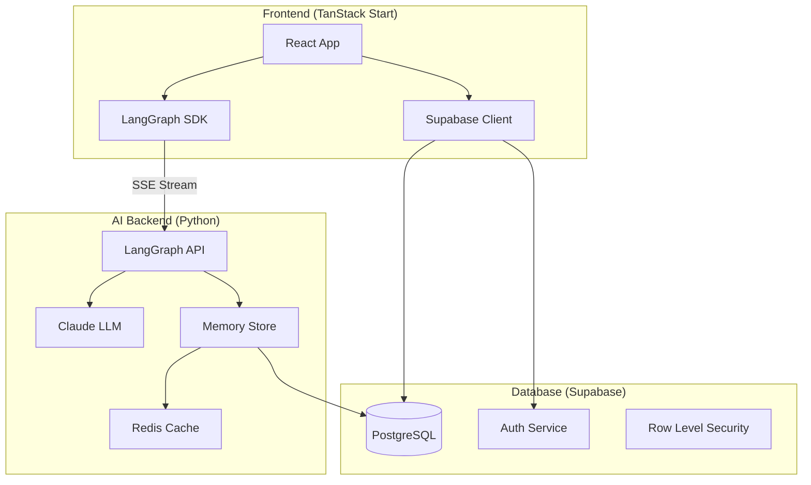
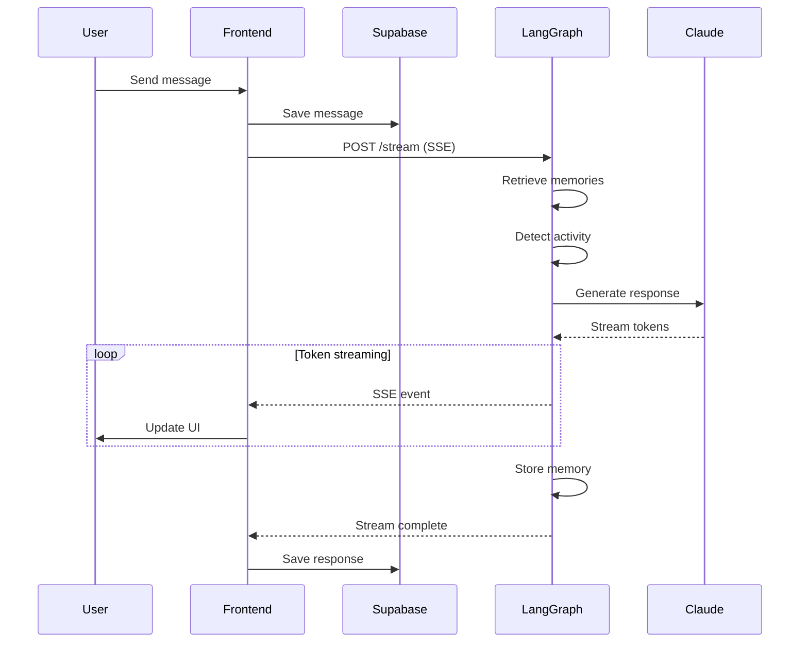
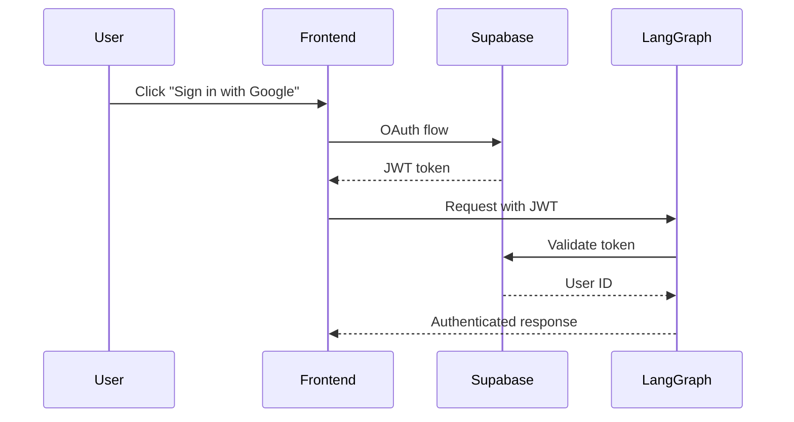

# Architecture Overview

Wbot uses a modern, distributed architecture with clear separation between frontend, AI backend, and database layers.

## System Diagram



## Component Responsibilities

### Frontend (TanStack Start)

The web application handles:

- **Authentication**: Supabase Auth with Google OAuth
- **Chat UI**: Real-time message display with streaming
- **Activity Rendering**: Interactive components (breathing, journaling)
- **Conversation Management**: CRUD operations via Supabase

**Key Files:**

- `apps/web/src/routes/` - File-based routing
- `apps/web/src/components/pages/ChatPage/` - Main chat interface
- `apps/web/src/lib/ai-client.ts` - LangGraph SDK wrapper

### AI Backend (LangGraph)

The Python backend orchestrates AI workflows:

- **Graph Execution**: Stateful node-based processing
- **LLM Integration**: Claude API calls with streaming
- **Memory System**: Semantic retrieval and storage
- **Activity Detection**: Routing to specialized nodes

**Key Files:**

- `apps/ai/src/graph/wellness.py` - Main graph definition
- `apps/ai/src/nodes/` - Individual processing nodes
- `apps/ai/src/memory/` - Embedding and storage

### Database (Supabase)

PostgreSQL database with:

- **Row Level Security**: Per-user data isolation
- **Auth Integration**: JWT-based authentication
- **Real-time**: Websocket subscriptions (future)

## Request Flow

A typical chat interaction flows through these stages:



## Data Flow Details

### 1. User Sends Message

```typescript
// ChatPage.tsx
const handleSubmit = async (content: string) => {
  // Save to Supabase first
  await saveMessage(conversationId, 'user', content);

  // Then stream from AI
  const stream = await aiClient.streamMessage(conversationId, content);
  // ...
};
```

### 2. AI Processes Message

```python
# wellness.py - Graph definition
graph.add_edge(START, "retrieve_memories")
graph.add_edge("retrieve_memories", "detect_activity")
graph.add_conditional_edges("detect_activity", route_activity)
graph.add_edge("generate_response", "store_memory")
graph.add_edge("store_memory", END)
```

### 3. Response Streams Back

The AI response streams via Server-Sent Events (SSE):

```typescript
// ai-client.ts
for await (const event of stream) {
  if (event.type === 'token') {
    onToken(event.data); // Update UI incrementally
  }
}
```

## Security Architecture

### Authentication Flow



### Row Level Security

All database tables use RLS policies:

```sql
-- Users can only see their own data
CREATE POLICY "Users can view own conversations"
  ON conversations FOR SELECT
  USING (auth.uid() = user_id);
```

## Scalability Considerations

| Component  | Scaling Strategy               |
| ---------- | ------------------------------ |
| Frontend   | Static deployment (Vercel)     |
| AI Backend | LangGraph Cloud (auto-scaling) |
| Database   | Supabase managed PostgreSQL    |
| Cache      | Redis (can be clustered)       |

## Environment Requirements

- **Node.js**: >= 20
- **Python**: >= 3.11
- **pnpm**: 9.15.1
- **Docker**: For local Supabase and Redis
