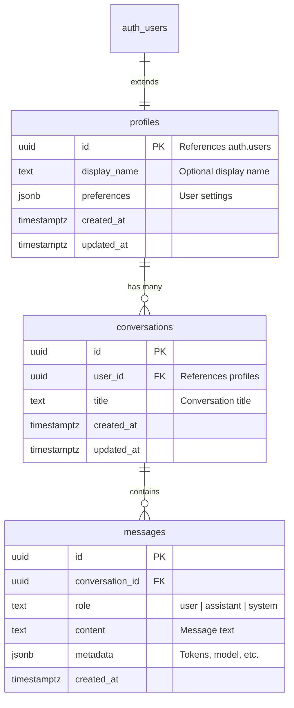

# Database Schema

Wbot uses Supabase (PostgreSQL) for data storage with Row Level Security (RLS) for per-user data isolation.

## Entity Relationship Diagram



## Tables

### profiles

Extends Supabase Auth users with application-specific data.

| Column         | Type        | Default | Description                              |
| -------------- | ----------- | ------- | ---------------------------------------- |
| `id`           | UUID        | -       | Primary key, references `auth.users(id)` |
| `display_name` | TEXT        | NULL    | User's chosen display name               |
| `preferences`  | JSONB       | `{}`    | User preferences (theme, notifications)  |
| `created_at`   | TIMESTAMPTZ | `NOW()` | When profile was created                 |
| `updated_at`   | TIMESTAMPTZ | `NOW()` | Last modification time                   |

**Triggers:**

- `on_auth_user_created`: Auto-creates profile when user signs up
- `profiles_updated_at`: Auto-updates `updated_at` on modification

### conversations

Stores wellness chat sessions.

| Column       | Type        | Default             | Description               |
| ------------ | ----------- | ------------------- | ------------------------- |
| `id`         | UUID        | `gen_random_uuid()` | Primary key               |
| `user_id`    | UUID        | -                   | Foreign key to profiles   |
| `title`      | TEXT        | NULL                | Conversation title        |
| `created_at` | TIMESTAMPTZ | `NOW()`             | When conversation started |
| `updated_at` | TIMESTAMPTZ | `NOW()`             | Last activity time        |

**Indexes:**

- `idx_conversations_user_id`: Fast user lookup
- `idx_conversations_updated_at`: Sort by recent activity

### messages

Individual chat messages within conversations.

| Column            | Type        | Default             | Description                      |
| ----------------- | ----------- | ------------------- | -------------------------------- |
| `id`              | UUID        | `gen_random_uuid()` | Primary key                      |
| `conversation_id` | UUID        | -                   | Foreign key to conversations     |
| `role`            | TEXT        | -                   | `user`, `assistant`, or `system` |
| `content`         | TEXT        | -                   | Message text content             |
| `metadata`        | JSONB       | `{}`                | Additional data (see below)      |
| `created_at`      | TIMESTAMPTZ | `NOW()`             | When message was sent            |

**Metadata Examples:**

```json
{
  "model": "claude-3-opus",
  "tokens_used": 150,
  "latency_ms": 1234,
  "tools_called": ["breathing_exercise"]
}
```

**Indexes:**

- `idx_messages_conversation_id`: Find messages by conversation
- `idx_messages_conversation_created`: Chronological ordering

**Triggers:**

- `on_message_created`: Updates parent conversation's `updated_at`

## Row Level Security

All tables have RLS enabled. Users can only access their own data.

### profiles Policies

```sql
-- Users can view their own profile
CREATE POLICY "Users can view own profile"
  ON profiles FOR SELECT
  USING (auth.uid() = id);

-- Users can update their own profile
CREATE POLICY "Users can update own profile"
  ON profiles FOR UPDATE
  USING (auth.uid() = id);

-- Users can insert their own profile
CREATE POLICY "Users can insert own profile"
  ON profiles FOR INSERT
  WITH CHECK (auth.uid() = id);
```

### conversations Policies

```sql
-- Users can CRUD their own conversations
CREATE POLICY "Users can view own conversations"
  ON conversations FOR SELECT
  USING (auth.uid() = user_id);

CREATE POLICY "Users can create own conversations"
  ON conversations FOR INSERT
  WITH CHECK (auth.uid() = user_id);

CREATE POLICY "Users can update own conversations"
  ON conversations FOR UPDATE
  USING (auth.uid() = user_id);

CREATE POLICY "Users can delete own conversations"
  ON conversations FOR DELETE
  USING (auth.uid() = user_id);
```

### messages Policies

Messages inherit access from their parent conversation:

```sql
-- Users can access messages in their own conversations
CREATE POLICY "Users can view messages in own conversations"
  ON messages FOR SELECT
  USING (
    conversation_id IN (
      SELECT id FROM conversations
      WHERE user_id = auth.uid()
    )
  );
```

## TypeScript Types

Generated types are available in `packages/shared`:

```typescript
// packages/shared/src/types/database.ts
export interface Profile {
  id: string;
  display_name: string | null;
  preferences: Record<string, unknown>;
  created_at: string;
  updated_at: string;
}

export interface Conversation {
  id: string;
  user_id: string;
  title: string | null;
  created_at: string;
  updated_at: string;
}

export interface Message {
  id: string;
  conversation_id: string;
  role: 'user' | 'assistant' | 'system';
  content: string;
  metadata: Record<string, unknown>;
  created_at: string;
}
```

Regenerate types after schema changes:

```bash
pnpm db:generate-types
```

## Common Queries

### Get user's conversations (most recent first)

```typescript
const { data } = await supabase
  .from('conversations')
  .select('*')
  .order('updated_at', { ascending: false });
```

### Get messages for a conversation

```typescript
const { data } = await supabase
  .from('messages')
  .select('*')
  .eq('conversation_id', conversationId)
  .order('created_at', { ascending: true });
```

### Create a new conversation with first message

```typescript
// Transaction-like pattern
const { data: conversation } = await supabase
  .from('conversations')
  .insert({ user_id: userId, title: 'New Chat' })
  .select()
  .single();

const { data: message } = await supabase
  .from('messages')
  .insert({
    conversation_id: conversation.id,
    role: 'user',
    content: userMessage,
  })
  .select()
  .single();
```
