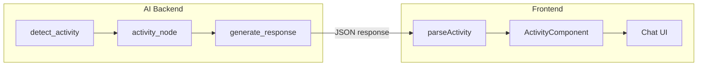

# Adding Interactive Activities

This guide explains how to add new interactive activities to Wbot, like breathing exercises or meditation guidance.

## Architecture Overview

Activities have components on both the frontend and backend:



## Step 1: Create Backend Node

Create a new node in `apps/ai/src/nodes/`:

```python
# apps/ai/src/nodes/gratitude_journal/node.py
from src.logging_config import NodeLogger
from src.graph.state import WellnessState

logger = NodeLogger("gratitude_journal")

PROMPTS = [
    "What's one small thing that brought you joy today?",
    "Who is someone you're grateful for, and why?",
    "What's a challenge you faced that taught you something?",
]

async def gratitude_journal(state: WellnessState) -> dict:
    """Generate a gratitude journaling prompt."""
    logger.node_start()

    # Select a prompt based on context
    prompt = select_prompt(state)

    activity_response = {
        "type": "activity",
        "activity": "gratitude",
        "status": "ready",
        "prompt": prompt,
        "introduction": "Let's take a moment to reflect on gratitude.",
    }

    logger.info("Generated gratitude prompt", prompt_preview=prompt[:50])
    logger.node_end()

    return {"activity_response": activity_response}
```

## Step 2: Register Node in Graph

Update the graph definition:

```python
# apps/ai/src/graph/wellness.py
from src.nodes.gratitude_journal.node import gratitude_journal

# Add the node
graph.add_node("gratitude_journal", gratitude_journal)

# Update routing
def route_activity(state: WellnessState) -> str:
    activity = state.get("detected_activity")

    if activity == "breathing":
        return "breathing_exercise"
    elif activity == "meditation":
        return "meditation_guidance"
    elif activity == "gratitude":
        return "gratitude_journal"  # New route
    else:
        return "generate_response"

# Add edges
graph.add_conditional_edges("detect_activity", route_activity)
graph.add_edge("gratitude_journal", "generate_response")
```

## Step 3: Update Activity Detection

Add the new activity to the detection prompt:

```python
# apps/ai/src/nodes/detect_activity/prompts.py
DETECTION_PROMPT = """
Analyze the user's message and determine if an activity would be helpful.

Available activities:
- breathing: For stress, anxiety, or when user needs to calm down
- meditation: For mindfulness, focus, or relaxation
- journaling: For processing thoughts or emotions
- gratitude: For shifting perspective or improving mood  # New!

Return the activity type or "none" if conversation should continue normally.
"""
```

## Step 4: Create Frontend Component

Create the activity component:

```tsx
// apps/web/src/components/GratitudeJournal/GratitudeJournal.tsx
import { useState } from 'react';
import styles from './GratitudeJournal.module.css';

interface GratitudeJournalProps {
  prompt: string;
  introduction: string;
  onComplete?: (response: string) => void;
}

export function GratitudeJournal({ prompt, introduction, onComplete }: GratitudeJournalProps) {
  const [response, setResponse] = useState('');
  const [isSubmitted, setIsSubmitted] = useState(false);

  const handleSubmit = () => {
    setIsSubmitted(true);
    onComplete?.(response);
  };

  if (isSubmitted) {
    return (
      <div className={styles.container}>
        <div className={styles.completion}>
          <span className={styles.icon}>✨</span>
          <p>Thank you for sharing. Gratitude helps shift our perspective.</p>
        </div>
      </div>
    );
  }

  return (
    <div className={styles.container}>
      <p className={styles.introduction}>{introduction}</p>
      <p className={styles.prompt}>{prompt}</p>
      <textarea
        className={styles.textarea}
        value={response}
        onChange={(e) => setResponse(e.target.value)}
        placeholder="Write your thoughts here..."
        rows={4}
      />
      <button className={styles.button} onClick={handleSubmit} disabled={!response.trim()}>
        Share
      </button>
    </div>
  );
}
```

## Step 5: Update Activity Parser

Add parsing for the new activity type:

```typescript
// apps/web/src/lib/parseActivity.ts
import { z } from 'zod';

const gratitudeActivitySchema = z.object({
  type: z.literal('activity'),
  activity: z.literal('gratitude'),
  status: z.enum(['ready', 'in_progress', 'complete']),
  prompt: z.string(),
  introduction: z.string(),
});

const activitySchema = z.discriminatedUnion('activity', [
  breathingActivitySchema,
  meditationActivitySchema,
  gratitudeActivitySchema, // Add new schema
]);
```

## Step 6: Render in Chat

Update the chat message renderer:

```tsx
// apps/web/src/components/pages/ChatPage/ChatPage.tsx
import { GratitudeJournal } from '@/components/GratitudeJournal/GratitudeJournal';

function renderMessageContent(message: Message) {
  const activity = parseActivity(message.content);

  if (!activity) {
    return <p>{message.content}</p>;
  }

  switch (activity.activity) {
    case 'breathing':
      return <BreathingExercise {...activity} />;

    case 'gratitude':
      return (
        <GratitudeJournal
          prompt={activity.prompt}
          introduction={activity.introduction}
          onComplete={handleGratitudeComplete}
        />
      );

    default:
      return <p>{message.content}</p>;
  }
}
```

## Step 7: Add Storybook Stories

Document the component in Storybook:

```tsx
// packages/storybook/stories/interactive/GratitudeJournal.stories.tsx
import type { Meta, StoryObj } from '@storybook/react';
import { GratitudeJournal } from '@/components/GratitudeJournal/GratitudeJournal';

const meta: Meta<typeof GratitudeJournal> = {
  title: 'Interactive/GratitudeJournal',
  component: GratitudeJournal,
  parameters: {
    layout: 'centered',
  },
};

export default meta;

export const Default: StoryObj<typeof GratitudeJournal> = {
  args: {
    prompt: "What's one small thing that brought you joy today?",
    introduction: "Let's take a moment to reflect on gratitude.",
  },
};
```

## Checklist

When adding a new activity:

- [ ] Create backend node in `apps/ai/src/nodes/`
- [ ] Register node in `apps/ai/src/graph/wellness.py`
- [ ] Update activity detection prompts
- [ ] Create frontend component in `apps/web/src/components/`
- [ ] Add CSS module styles
- [ ] Update `parseActivity.ts` with Zod schema
- [ ] Update chat renderer to handle new activity
- [ ] Add Storybook stories
- [ ] Test end-to-end flow
