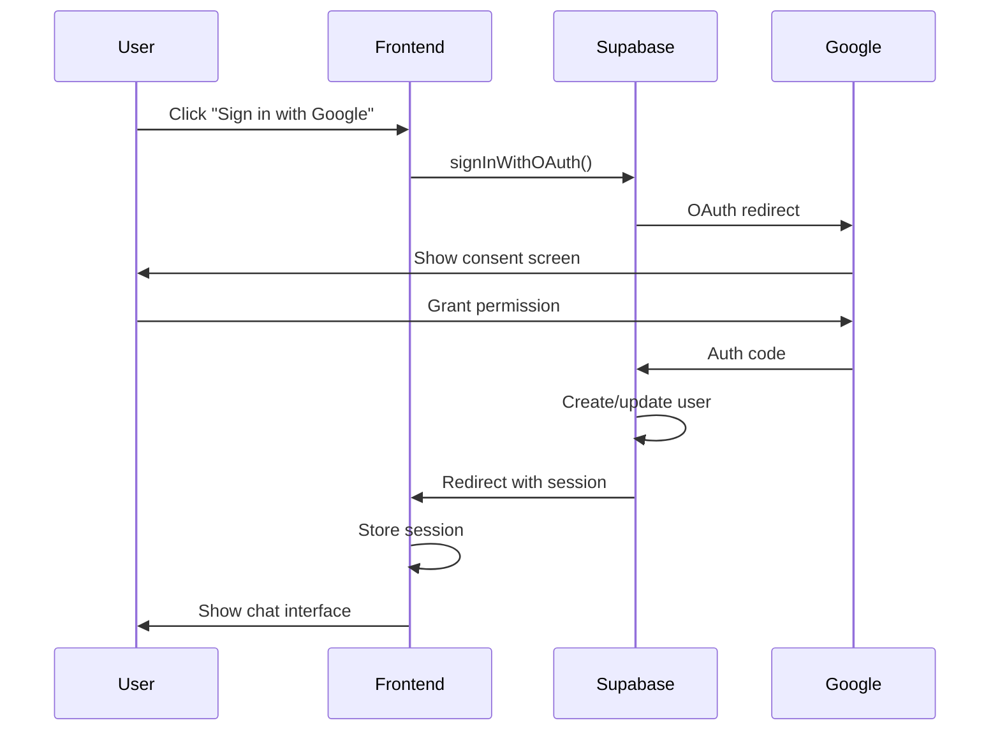

# Authentication

Wbot uses Supabase Auth with Google OAuth for user authentication.

## Auth Flow



## Implementation

### Sign In Button

```tsx
// components/SignInButton.tsx
import { supabase } from '@/lib/supabase';

export function SignInButton() {
  const handleSignIn = async () => {
    const { error } = await supabase.auth.signInWithOAuth({
      provider: 'google',
      options: {
        redirectTo: `${window.location.origin}/auth/callback`,
      },
    });

    if (error) {
      console.error('Sign in error:', error);
    }
  };

  return <button onClick={handleSignIn}>Sign in with Google</button>;
}
```

### Auth Callback Route

```tsx
// routes/auth/callback.tsx
import { createFileRoute, redirect } from '@tanstack/react-router';
import { supabase } from '@/lib/supabase';

export const Route = createFileRoute('/auth/callback')({
  loader: async () => {
    // Exchange code for session
    const { error } = await supabase.auth.exchangeCodeForSession(window.location.href);

    if (error) {
      throw redirect({ to: '/login', search: { error: error.message } });
    }

    throw redirect({ to: '/chat' });
  },
});
```

### Protected Routes

```tsx
// routes/chat.tsx
import { createFileRoute, redirect } from '@tanstack/react-router';
import { supabase } from '@/lib/supabase';

export const Route = createFileRoute('/chat')({
  beforeLoad: async () => {
    const {
      data: { session },
    } = await supabase.auth.getSession();

    if (!session) {
      throw redirect({ to: '/' });
    }

    return { session };
  },
  component: ChatPage,
});
```

## Session Management

### Getting Current User

```typescript
// Get session
const {
  data: { session },
} = await supabase.auth.getSession();

// Get user
const {
  data: { user },
} = await supabase.auth.getUser();
```

### Auth State Changes

```typescript
// Subscribe to auth changes
useEffect(() => {
  const {
    data: { subscription },
  } = supabase.auth.onAuthStateChange((event, session) => {
    switch (event) {
      case 'SIGNED_IN':
        // User signed in
        setUser(session?.user ?? null);
        break;

      case 'SIGNED_OUT':
        // User signed out
        setUser(null);
        break;

      case 'TOKEN_REFRESHED':
        // Token was refreshed
        break;
    }
  });

  return () => subscription.unsubscribe();
}, []);
```

### Sign Out

```typescript
async function handleSignOut() {
  await supabase.auth.signOut();
  // Redirect handled by onAuthStateChange
}
```

## Profile Creation

Profiles are auto-created via database trigger when a user signs up:

```sql
-- 001_profiles.sql
CREATE OR REPLACE FUNCTION public.handle_new_user()
RETURNS TRIGGER AS $$
BEGIN
  INSERT INTO public.profiles (id)
  VALUES (NEW.id);
  RETURN NEW;
END;
$$ LANGUAGE plpgsql SECURITY DEFINER;

CREATE TRIGGER on_auth_user_created
  AFTER INSERT ON auth.users
  FOR EACH ROW EXECUTE FUNCTION public.handle_new_user();
```

## AI Backend Auth

The AI backend validates JWTs from the frontend:

```python
# apps/ai/src/utils/auth.py
from supabase import create_client

def validate_token(token: str) -> dict:
    """Validate JWT and return user data."""
    supabase = create_client(
        os.environ["SUPABASE_URL"],
        os.environ["SUPABASE_SERVICE_KEY"]
    )

    # Verify the JWT
    user = supabase.auth.get_user(token)

    if not user:
        raise AuthError("Invalid token")

    return {
        "user_id": user.id,
        "email": user.email,
    }
```

## Security Considerations

1. **Never expose service key**: `SUPABASE_SERVICE_KEY` is server-only
2. **Use RLS**: All tables have Row Level Security enabled
3. **Validate tokens**: Always verify JWTs on the backend
4. **HTTPS only**: Use HTTPS in production
